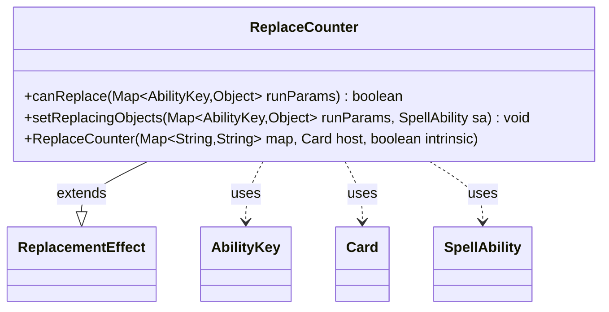

---
aliases:
  - ReplaceCounter
tags:
  - java/class
  - module/forge-game
  - pkg/forge/game/replacement
fqn: forge.game.replacement.ReplaceCounter
package: forge.game.replacement
module: forge-game
kind: Class
---

# ReplaceCounter

**Package:** `forge.game.replacement`   **Module:** `forge-game`   **Kind:** Class



## Relationships
**Extends:**
- [[forge.game.replacement.ReplacementEffect|ReplacementEffect]]
**Uses:**
- [[forge.game.ability.AbilityKey|AbilityKey]]
- [[forge.game.card.Card|Card]]
- [[forge.game.spellability.SpellAbility|SpellAbility]]

## Design Description

The ReplaceCounter class implements a replacement effect that intercepts counter-related game events in the Forge MTG engine. As a concrete subclass of ReplacementEffect, it overrides `canReplace` to test incoming run parameters—the affected card, triggering spell ability, and cause—against the effect's configured "ValidCard," "ValidSA," and "ValidCause" filters, returning true only when every specified constraint matches. Its `setReplacingObjects` method then exposes the affected object under the `AbilityKey.Card` slot so dependent abilities can reference it. Collaborating through the `AbilityKey`-keyed parameter map, it relies on the inherited `matchesValidParam` machinery rather than custom matching logic, keeping the subclass a thin, declarative specialization driven by the script-supplied map passed to its constructor.

## Source
`forge-game/src/main/java/forge/game/replacement/ReplaceCounter.java`

```java
/*
 * Forge: Play Magic: the Gathering.
 * Copyright (C) 2011  Forge Team
 *
 * This program is free software: you can redistribute it and/or modify
 * it under the terms of the GNU General Public License as published by
 * the Free Software Foundation, either version 3 of the License, or
 * (at your option) any later version.
 * 
 * This program is distributed in the hope that it will be useful,
 * but WITHOUT ANY WARRANTY; without even the implied warranty of
 * MERCHANTABILITY or FITNESS FOR A PARTICULAR PURPOSE.  See the
 * GNU General Public License for more details.
 * 
 * You should have received a copy of the GNU General Public License
 * along with this program.  If not, see <http://www.gnu.org/licenses/>.
 */
package forge.game.replacement;

import java.util.Map;

import forge.game.ability.AbilityKey;
import forge.game.card.Card;
import forge.game.spellability.SpellAbility;

/** 
 * TODO: Write javadoc for this type.
 *
 */
public class ReplaceCounter extends ReplacementEffect {

    /**
     * Instantiates a new replace gain life.
     *
     * @param map the map
     * @param host the host
     */
    public ReplaceCounter(Map<String, String> map, Card host, boolean intrinsic) {
        super(map, host, intrinsic);
    }

    /* (non-Javadoc)
     * @see forge.card.replacement.ReplacementEffect#canReplace(java.util.HashMap)
     */
    @Override
    public boolean canReplace(Map<AbilityKey, Object> runParams) {
        if (!matchesValidParam("ValidCard", runParams.get(AbilityKey.Affected))) {
            return false;
        }
        if (!matchesValidParam("ValidSA", runParams.get(AbilityKey.SpellAbility))) {
            return false;
        }
        if (!matchesValidParam("ValidCause", runParams.get(AbilityKey.Cause))) {
            return false;
        }
        return true;
    }

    /* (non-Javadoc)
     * @see forge.card.replacement.ReplacementEffect#setReplacingObjects(java.util.HashMap, forge.card.spellability.SpellAbility)
     */
    @Override
    public void setReplacingObjects(Map<AbilityKey, Object> runParams, SpellAbility sa) {
        sa.setReplacingObject(AbilityKey.Card, runParams.get(AbilityKey.Affected));
    }

}
```

## Python
`forge/game/replacement/ReplaceCounter.py`

```python
package forge.game.replacement

from typing import Map

from forge.game.replacement.ReplacementEffect import ReplacementEffect
from forge.game.ability.AbilityKey import AbilityKey
from forge.game.card.Card import Card
from forge.game.spellability.SpellAbility import SpellAbility


class ReplaceCounter(ReplacementEffect):
    """
    TODO: Write javadoc for this type.
    """

    def __init__(self, map: dict[str, str], host: Card, intrinsic: bool):
        """
        Instantiates a new replace gain life.

        :param map: the map
        :param host: the host
        """
        super().__init__(map, host, intrinsic)

    def canReplace(self, runParams: dict[AbilityKey, object]) -> bool:
        if not self.matchesValidParam("ValidCard", runParams.get(AbilityKey.Affected)):
            return False
        if not self.matchesValidParam("ValidSA", runParams.get(AbilityKey.SpellAbility)):
            return False
        if not self.matchesValidParam("ValidCause", runParams.get(AbilityKey.Cause)):
            return False
        return True

    def setReplacingObjects(self, runParams: dict[AbilityKey, object], sa: SpellAbility) -> None:
        sa.setReplacingObject(AbilityKey.Card, runParams.get(AbilityKey.Affected))
```
