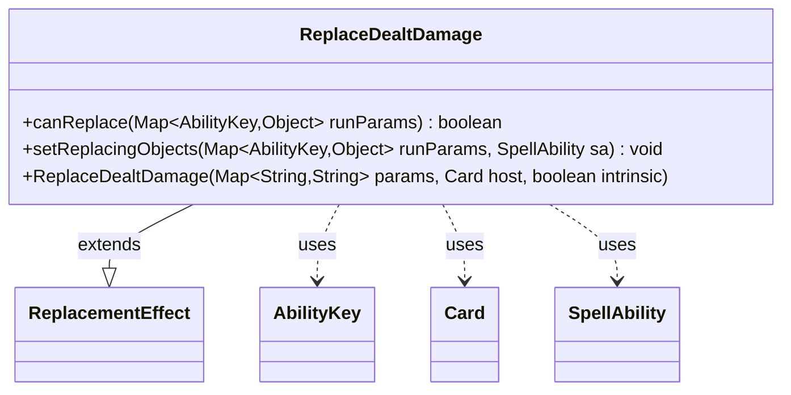

---
aliases:
  - ReplaceDealtDamage
tags:
  - java/class
  - module/forge-game
  - pkg/forge/game/replacement
fqn: forge.game.replacement.ReplaceDealtDamage
package: forge.game.replacement
module: forge-game
kind: Class
---

# ReplaceDealtDamage

**Package:** `forge.game.replacement` &nbsp; **Module:** `forge-game` &nbsp; **Kind:** Class



## Relationships
**Extends:**
- [[forge.game.replacement.ReplacementEffect|ReplacementEffect]]
**Uses:**
- [[forge.game.ability.AbilityKey|AbilityKey]]
- [[forge.game.card.Card|Card]]
- [[forge.game.spellability.SpellAbility|SpellAbility]]

## Design Description

ReplaceDealtDamage is a concrete replacement effect that intercepts damage-dealing events, allowing the engine to substitute or redirect how damage is applied. As a subclass of ReplacementEffect, it overrides the framework's two extension points: canReplace gates whether the effect fires by testing the affected object against the rule's ValidCard parameter, and setReplacingObjects exposes the affected object back to the resolving SpellAbility under the AbilityKey.Card slot so downstream effects can reference it.

The class collaborates with AbilityKey to read and write typed entries in the run-parameter map, with Card as its host context, and with SpellAbility as the carrier of replacement state. Its minimal footprint reflects a data-driven design intent: behavior is configured through the inherited params map rather than hard-coded, letting card scripts declare matching conditions while the base class supplies the surrounding replacement machinery.

## Source
`forge-game/src/main/java/forge/game/replacement/ReplaceDealtDamage.java`

```java
package forge.game.replacement;

import java.util.Map;

import forge.game.ability.AbilityKey;
import forge.game.card.Card;
import forge.game.spellability.SpellAbility;

/**
 * TODO: Write javadoc for this type.
 *
 */
public class ReplaceDealtDamage extends ReplacementEffect {

    /**
     * Instantiates a new replace tap.
     *
     * @param params the params
     * @param host the host
     */
    public ReplaceDealtDamage(final Map<String, String> params, final Card host, final boolean intrinsic) {
        super(params, host, intrinsic);
    }

    /* (non-Javadoc)
     * @see forge.card.replacement.ReplacementEffect#canReplace(java.util.HashMap)
     */
    @Override
    public boolean canReplace(Map<AbilityKey, Object> runParams) {
        if (!matchesValidParam("ValidCard", runParams.get(AbilityKey.Affected))) {
            return false;
        }

        return true;
    }

    /* (non-Javadoc)
     * @see forge.card.replacement.ReplacementEffect#setReplacingObjects(java.util.HashMap, forge.card.spellability.SpellAbility)
     */
    @Override
    public void setReplacingObjects(Map<AbilityKey, Object> runParams, SpellAbility sa) {
        sa.setReplacingObject(AbilityKey.Card, runParams.get(AbilityKey.Affected));
    }

}
```

## Python
`forge/game/replacement/ReplaceDealtDamage.py`

```python
from forge.game.replacement.ReplacementEffect import ReplacementEffect
from forge.game.ability.AbilityKey import AbilityKey
from forge.game.card.Card import Card
from forge.game.spellability.SpellAbility import SpellAbility


# TODO: Write javadoc for this type.
#
class ReplaceDealtDamage(ReplacementEffect):

    # Instantiates a new replace tap.
    #
    # @param params the params
    # @param host the host
    def __init__(self, params: dict[str, str], host: Card, intrinsic: bool):
        super().__init__(params, host, intrinsic)

    # (non-Javadoc)
    # @see forge.card.replacement.ReplacementEffect#canReplace(java.util.HashMap)
    def canReplace(self, runParams: dict[AbilityKey, object]) -> bool:
        if not self.matchesValidParam("ValidCard", runParams.get(AbilityKey.Affected)):
            return False

        return True

    # (non-Javadoc)
    # @see forge.card.replacement.ReplacementEffect#setReplacingObjects(java.util.HashMap, forge.card.spellability.SpellAbility)
    def setReplacingObjects(self, runParams: dict[AbilityKey, object], sa: SpellAbility) -> None:
        sa.setReplacingObject(AbilityKey.Card, runParams.get(AbilityKey.Affected))
```
