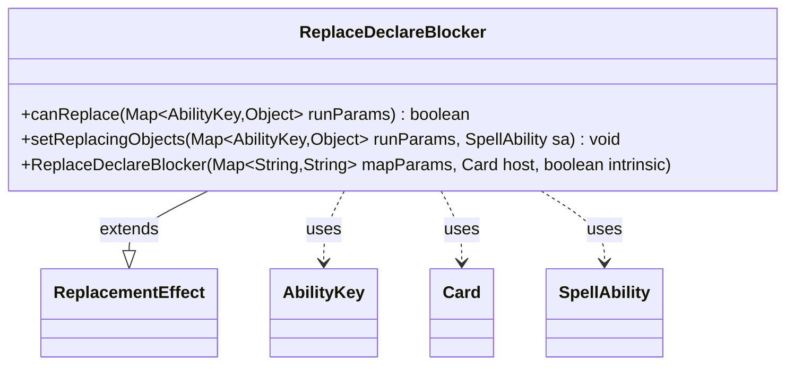

---
aliases:
  - ReplaceDeclareBlocker
tags:
  - java/class
  - module/forge-game
  - pkg/forge/game/replacement
fqn: forge.game.replacement.ReplaceDeclareBlocker
package: forge.game.replacement
module: forge-game
kind: Class
---

# ReplaceDeclareBlocker

**Package:** `forge.game.replacement` &nbsp; **Module:** `forge-game` &nbsp; **Kind:** Class



## Relationships
**Extends:**
- [[forge.game.replacement.ReplacementEffect|ReplacementEffect]]
**Uses:**
- [[forge.game.ability.AbilityKey|AbilityKey]]
- [[forge.game.card.Card|Card]]
- [[forge.game.spellability.SpellAbility|SpellAbility]]

## Design Description

ReplaceDeclareBlocker is a concrete replacement effect that intercepts the declare-blockers step, allowing card abilities to alter who declares blockers (for example, forcing an opponent to decide). Extending the abstract ReplacementEffect base class, it supplies the two hooks the replacement machinery requires: canReplace gates the effect by matching the affected player against the "ValidPlayer" parameter, and setReplacingObjects populates the resulting SpellAbility with the relevant participants. It collaborates with AbilityKey to read and write typed entries in the run-parameter map, with Card as its host, and with SpellAbility as the trigger context. Notably, it distinguishes the DefendingPlayer (the affected player) from the Player who actually declares blockers, keyed separately so downstream effects can redirect blocking-declaration control independently.

## Source
`forge-game/src/main/java/forge/game/replacement/ReplaceDeclareBlocker.java`

```java
package forge.game.replacement;

import java.util.Map;

import forge.game.ability.AbilityKey;
import forge.game.card.Card;
import forge.game.spellability.SpellAbility;

public class ReplaceDeclareBlocker extends ReplacementEffect {

    public ReplaceDeclareBlocker(final Map<String, String> mapParams, final Card host, final boolean intrinsic) {
        super(mapParams, host, intrinsic);
    }

    @Override
    public boolean canReplace(Map<AbilityKey, Object> runParams) {
        if (!matchesValidParam("ValidPlayer", runParams.get(AbilityKey.Affected))) {
            return false;
        }
        return true;
    }

    @Override
    public void setReplacingObjects(Map<AbilityKey, Object> runParams, SpellAbility sa) {
        sa.setReplacingObject(AbilityKey.DefendingPlayer, runParams.get(AbilityKey.Affected));
        // Here the Player is the one who would declare blockers (may be changed by some Card's effect)
        sa.setReplacingObject(AbilityKey.Player, runParams.get(AbilityKey.Player));
    }
}
```

## Python
`forge/game/replacement/ReplaceDeclareBlocker.py`

```python
from forge.game.replacement.ReplacementEffect import ReplacementEffect
from forge.game.ability.AbilityKey import AbilityKey
from forge.game.card.Card import Card
from forge.game.spellability.SpellAbility import SpellAbility


class ReplaceDeclareBlocker(ReplacementEffect):

    def __init__(self, mapParams: dict[str, str], host: Card, intrinsic: bool):
        super().__init__(mapParams, host, intrinsic)

    def canReplace(self, runParams: dict[AbilityKey, object]) -> bool:
        if not self.matchesValidParam("ValidPlayer", runParams.get(AbilityKey.Affected)):
            return False
        return True

    def setReplacingObjects(self, runParams: dict[AbilityKey, object], sa: SpellAbility) -> None:
        sa.setReplacingObject(AbilityKey.DefendingPlayer, runParams.get(AbilityKey.Affected))
        # Here the Player is the one who would declare blockers (may be changed by some Card's effect)
        sa.setReplacingObject(AbilityKey.Player, runParams.get(AbilityKey.Player))
```
