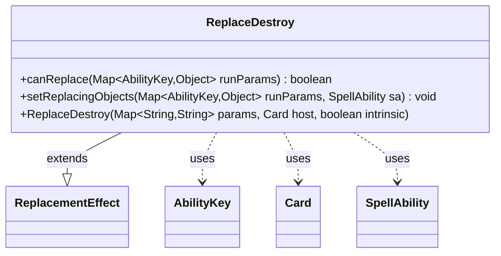

---
aliases:
  - ReplaceDestroy
tags:
  - java/class
  - module/forge-game
  - pkg/forge/game/replacement
fqn: forge.game.replacement.ReplaceDestroy
package: forge.game.replacement
module: forge-game
kind: Class
---

# ReplaceDestroy

**Package:** `forge.game.replacement`   **Module:** `forge-game`   **Kind:** Class



## Relationships
**Extends:**
- [[forge.game.replacement.ReplacementEffect|ReplacementEffect]]
**Uses:**
- [[forge.game.ability.AbilityKey|AbilityKey]]
- [[forge.game.card.Card|Card]]
- [[forge.game.spellability.SpellAbility|SpellAbility]]

## Design Description

ReplaceDestroy is a concrete replacement effect that intercepts attempts to destroy a card, allowing the game engine to substitute alternative behavior—most notably regeneration shields. Extending `ReplacementEffect`, it supplies the two hooks the replacement framework requires: `canReplace`, which gates the effect by matching the `ValidCard` and `ValidCause` parameters against the affected card and triggering cause, and `setReplacingObjects`, which binds the affected card and cause into the resolving `SpellAbility`.

Its notable design intent is the regeneration special case: when configured with a `Regeneration` parameter, it additionally verifies the card can be shielded, the runtime flagged a regeneration event, and creatures still have positive toughness—so lethal-damage destruction isn't wrongly replaced. It collaborates with `Card` and the `AbilityKey`-keyed `runParams` map that carries the engine's contextual event data.

## Source
`forge-game/src/main/java/forge/game/replacement/ReplaceDestroy.java`

```java
/*
 * Forge: Play Magic: the Gathering.
 * Copyright (C) 2011  Forge Team
 *
 * This program is free software: you can redistribute it and/or modify
 * it under the terms of the GNU General Public License as published by
 * the Free Software Foundation, either version 3 of the License, or
 * (at your option) any later version.
 * 
 * This program is distributed in the hope that it will be useful,
 * but WITHOUT ANY WARRANTY; without even the implied warranty of
 * MERCHANTABILITY or FITNESS FOR A PARTICULAR PURPOSE.  See the
 * GNU General Public License for more details.
 * 
 * You should have received a copy of the GNU General Public License
 * along with this program.  If not, see <http://www.gnu.org/licenses/>.
 */
package forge.game.replacement;

import java.util.Map;

import forge.game.ability.AbilityKey;
import forge.game.card.Card;
import forge.game.spellability.SpellAbility;

/** 
 * TODO: Write javadoc for this type.
 *
 */
public class ReplaceDestroy extends ReplacementEffect {

    /**
     * Instantiates a new replace discard.
     *
     * @param params the params
     * @param host the host
     */
    public ReplaceDestroy(final Map<String, String> params, final Card host, final boolean intrinsic) {
        super(params, host, intrinsic);
    }

    /* (non-Javadoc)
     * @see forge.card.replacement.ReplacementEffect#canReplace(java.util.HashMap)
     */
    @Override
    public boolean canReplace(Map<AbilityKey, Object> runParams) {
        if (!matchesValidParam("ValidCard", runParams.get(AbilityKey.Affected))) {
            return false;
        }

        // extra check for Regeneration
        if (hasParam("Regeneration")) {
            Card card = (Card) runParams.get(AbilityKey.Affected);
            if (!runParams.containsKey(AbilityKey.Regeneration) || !(Boolean)runParams.get(AbilityKey.Regeneration)) {
                return false;
            }
            if (!card.canBeShielded()) {
                return false;
            }
            if (card.isCreature()) {
                if (card.getNetToughness() <= 0)
                    return false;
            }
        }
        if (!matchesValidParam("ValidCause", runParams.get(AbilityKey.Cause))) {
            return false;
        }

        return true;
    }

    /* (non-Javadoc)
     * @see forge.card.replacement.ReplacementEffect#setReplacingObjects(java.util.HashMap, forge.card.spellability.SpellAbility)
     */
    @Override
    public void setReplacingObjects(Map<AbilityKey, Object> runParams, SpellAbility sa) {
        sa.setReplacingObject(AbilityKey.Card, runParams.get(AbilityKey.Affected));
        sa.setReplacingObjectsFrom(runParams, AbilityKey.Cause);
    }

}
```

## Python
`forge/game/replacement/ReplaceDestroy.py`

```python
/*
 * Forge: Play Magic: the Gathering.
 * Copyright (C) 2011  Forge Team
 *
 * This program is free software: you can redistribute it and/or modify
 * it under the terms of the GNU General Public License as published by
 * the Free Software Foundation, either version 3 of the License, or
 * (at your option) any later version.
 *
 * This program is distributed in the hope that it will be useful,
 * but WITHOUT ANY WARRANTY; without even the implied warranty of
 * MERCHANTABILITY or FITNESS FOR A PARTICULAR PURPOSE.  See the
 * GNU General Public License for more details.
 *
 * You should have received a copy of the GNU General Public License
 * along with this program.  If not, see <http://www.gnu.org/licenses/>.
 */

from typing import Map

from forge.game.ability.AbilityKey import AbilityKey
from forge.game.card.Card import Card
from forge.game.spellability.SpellAbility import SpellAbility
from forge.game.replacement.ReplacementEffect import ReplacementEffect


# TODO: Write javadoc for this type.
class ReplaceDestroy(ReplacementEffect):

    def __init__(self, params: dict[str, str], host: Card, intrinsic: bool):
        """Instantiates a new replace discard.

        :param params: the params
        :param host: the host
        """
        super().__init__(params, host, intrinsic)

    def canReplace(self, runParams: dict[AbilityKey, object]) -> bool:
        if not self.matchesValidParam("ValidCard", runParams.get(AbilityKey.Affected)):
            return False

        # extra check for Regeneration
        if self.hasParam("Regeneration"):
            card = runParams.get(AbilityKey.Affected)
            if AbilityKey.Regeneration not in runParams or not bool(runParams.get(AbilityKey.Regeneration)):
                return False
            if not card.canBeShielded():
                return False
            if card.isCreature():
                if card.getNetToughness() <= 0:
                    return False
        if not self.matchesValidParam("ValidCause", runParams.get(AbilityKey.Cause)):
            return False

        return True

    def setReplacingObjects(self, runParams: dict[AbilityKey, object], sa: SpellAbility) -> None:
        sa.setReplacingObject(AbilityKey.Card, runParams.get(AbilityKey.Affected))
        sa.setReplacingObjectsFrom(runParams, AbilityKey.Cause)
```
