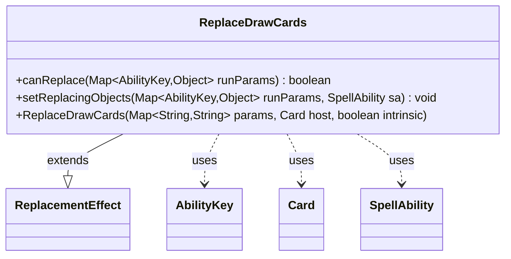

---
aliases:
  - ReplaceDrawCards
tags:
  - java/class
  - module/forge-game
  - pkg/forge/game/replacement
fqn: forge.game.replacement.ReplaceDrawCards
package: forge.game.replacement
module: forge-game
kind: Class
---

# ReplaceDrawCards

**Package:** `forge.game.replacement` &nbsp; **Module:** `forge-game` &nbsp; **Kind:** Class



## Relationships
**Extends:**
- [[forge.game.replacement.ReplacementEffect|ReplacementEffect]]
**Uses:**
- [[forge.game.ability.AbilityKey|AbilityKey]]
- [[forge.game.card.Card|Card]]
- [[forge.game.spellability.SpellAbility|SpellAbility]]

## Design Description

ReplaceDrawCards is a concrete replacement effect that intercepts card-draw events, allowing a card's scripted "Number" and "ValidPlayer" parameters to modify or substitute the normal drawing of cards. As a subclass of ReplacementEffect, it supplies the two hooks the replacement framework requires: canReplace, which gates the effect by validating the affected player and optionally comparing the draw count against a scripted operator/operand expression (via Expressions.compare), and setReplacingObjects, which records the affected Player and Number onto the triggering SpellAbility so downstream resolution can reference them. It collaborates with AbilityKey as the typed lookup keys into the runtime parameter map, Card as the effect's host, and SpellAbility as the carrier of replacement context. The design favors data-driven configuration, reading thresholds and comparators from the card script's parameter map rather than hardcoding behavior, which keeps the class reusable across any draw-replacement card.

## Source
`forge-game/src/main/java/forge/game/replacement/ReplaceDrawCards.java`

```java
/*
 * Forge: Play Magic: the Gathering.
 * Copyright (C) 2011  Forge Team
 *
 * This program is free software: you can redistribute it and/or modify
 * it under the terms of the GNU General Public License as published by
 * the Free Software Foundation, either version 3 of the License, or
 * (at your option) any later version.
 * 
 * This program is distributed in the hope that it will be useful,
 * but WITHOUT ANY WARRANTY; without even the implied warranty of
 * MERCHANTABILITY or FITNESS FOR A PARTICULAR PURPOSE.  See the
 * GNU General Public License for more details.
 * 
 * You should have received a copy of the GNU General Public License
 * along with this program.  If not, see <http://www.gnu.org/licenses/>.
 */
package forge.game.replacement;

import java.util.Map;

import forge.game.ability.AbilityKey;
import forge.game.card.Card;
import forge.game.spellability.SpellAbility;
import forge.util.Expressions;

/** 
 * TODO: Write javadoc for this type.
 *
 */
public class ReplaceDrawCards extends ReplacementEffect {

    /**
     * Instantiates a new replace draw.
     *
     * @param params the params
     * @param host the host
     */
    public ReplaceDrawCards(final Map<String, String> params, final Card host, final boolean intrinsic) {
        super(params, host, intrinsic);
    }

    /* (non-Javadoc)
     * @see forge.card.replacement.ReplacementEffect#canReplace(java.util.HashMap)
     */
    @Override
    public boolean canReplace(Map<AbilityKey, Object> runParams) {
        if (!matchesValidParam("ValidPlayer", runParams.get(AbilityKey.Affected))) {
            return false;
        }
        if (hasParam("Number")) {
            final int n = (Integer)runParams.get(AbilityKey.Number);
            String comparator = getParam("Number");
            final String operator = comparator.substring(0, 2);
            final int operandValue = Integer.parseInt(comparator.substring(2));
            if (!Expressions.compare(n, operator, operandValue)) {
                return false;
            }
        }

        return true;
    }

    /* (non-Javadoc)
     * @see forge.card.replacement.ReplacementEffect#setReplacingObjects(java.util.HashMap, forge.card.spellability.SpellAbility)
     */
    @Override
    public void setReplacingObjects(Map<AbilityKey, Object> runParams, SpellAbility sa) {
        sa.setReplacingObject(AbilityKey.Player, runParams.get(AbilityKey.Affected));
        sa.setReplacingObject(AbilityKey.Number, runParams.get(AbilityKey.Number));
    }
}
```

## Python
`forge/game/replacement/ReplaceDrawCards.py`

```python
from forge.game.ability.AbilityKey import AbilityKey
from forge.game.card.Card import Card
from forge.game.spellability.SpellAbility import SpellAbility
from forge.util.Expressions import Expressions
from forge.game.replacement.ReplacementEffect import ReplacementEffect


# TODO: Write javadoc for this type.
class ReplaceDrawCards(ReplacementEffect):

    def __init__(self, params: dict[str, str], host: Card, intrinsic: bool):
        """Instantiates a new replace draw.

        :param params: the params
        :param host: the host
        """
        super().__init__(params, host, intrinsic)

    def canReplace(self, runParams: dict[AbilityKey, object]) -> bool:
        if not self.matchesValidParam("ValidPlayer", runParams.get(AbilityKey.Affected)):
            return False
        if self.hasParam("Number"):
            n = runParams.get(AbilityKey.Number)
            comparator = self.getParam("Number")
            operator = comparator[0:2]
            operandValue = int(comparator[2:])
            if not Expressions.compare(n, operator, operandValue):
                return False

        return True

    def setReplacingObjects(self, runParams: dict[AbilityKey, object], sa: SpellAbility) -> None:
        sa.setReplacingObject(AbilityKey.Player, runParams.get(AbilityKey.Affected))
        sa.setReplacingObject(AbilityKey.Number, runParams.get(AbilityKey.Number))
```
