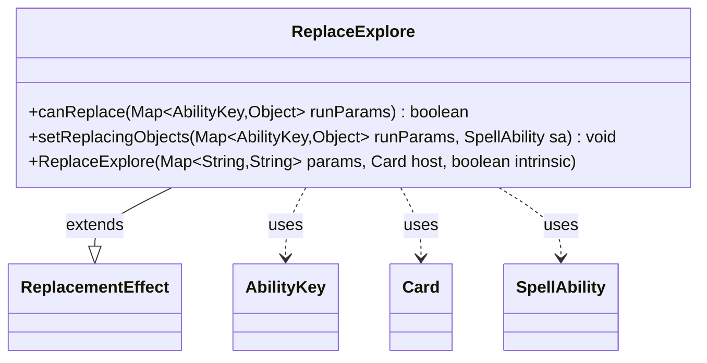

---
aliases:
  - ReplaceExplore
tags:
  - java/class
  - module/forge-game
  - pkg/forge/game/replacement
fqn: forge.game.replacement.ReplaceExplore
package: forge.game.replacement
module: forge-game
kind: Class
---

# ReplaceExplore

**Package:** `forge.game.replacement` &nbsp; **Module:** `forge-game` &nbsp; **Kind:** Class



## Relationships
**Extends:**
- [[forge.game.replacement.ReplacementEffect|ReplacementEffect]]
**Uses:**
- [[forge.game.ability.AbilityKey|AbilityKey]]
- [[forge.game.card.Card|Card]]
- [[forge.game.spellability.SpellAbility|SpellAbility]]

## Design Description

ReplaceExplore is a replacement effect that implements Magic's "explore" keyword action, intercepting game events to substitute the appropriate card as the object being explored. As a concrete subclass of ReplacementEffect, it supplies the two hooks the replacement framework drives: canReplace gates activation by testing the affected object against the effect's "ValidExplorer" parameter via the inherited matchesValidParam, and setReplacingObjects binds the affected object to the SpellAbility under AbilityKey.Card so downstream resolution can reference it. Communication flows through the engine's AbilityKey-to-Object run-parameter maps rather than direct typed calls, reflecting the data-driven design that lets card scripts configure replacement behavior declaratively. The class itself is deliberately minimal, delegating construction and shared lifecycle concerns to its supertype.

## Source
`forge-game/src/main/java/forge/game/replacement/ReplaceExplore.java`

```java
package forge.game.replacement;

import forge.game.ability.AbilityKey;
import forge.game.card.Card;
import forge.game.spellability.SpellAbility;

import java.util.Map;

public class ReplaceExplore extends ReplacementEffect {

    public ReplaceExplore(final Map<String, String> params, final Card host, final boolean intrinsic) {
        super(params, host, intrinsic);
    }

    @Override
    public boolean canReplace(Map<AbilityKey, Object> runParams) {
        if (!matchesValidParam("ValidExplorer", runParams.get(AbilityKey.Affected))) {
            return false;
        }
        return true;
    }

    @Override
    public void setReplacingObjects(Map<AbilityKey, Object> runParams, SpellAbility sa) {
        sa.setReplacingObject(AbilityKey.Card, runParams.get(AbilityKey.Affected));
    }
}
```

## Python
`forge/game/replacement/ReplaceExplore.py`

```python
from forge.game.ability.AbilityKey import AbilityKey
from forge.game.card.Card import Card
from forge.game.spellability.SpellAbility import SpellAbility
from forge.game.replacement.ReplacementEffect import ReplacementEffect


class ReplaceExplore(ReplacementEffect):

    def __init__(self, params: dict[str, str], host: Card, intrinsic: bool):
        super().__init__(params, host, intrinsic)

    def canReplace(self, runParams: dict[AbilityKey, object]) -> bool:
        if not self.matchesValidParam("ValidExplorer", runParams.get(AbilityKey.Affected)):
            return False
        return True

    def setReplacingObjects(self, runParams: dict[AbilityKey, object], sa: SpellAbility) -> None:
        sa.setReplacingObject(AbilityKey.Card, runParams.get(AbilityKey.Affected))
```
