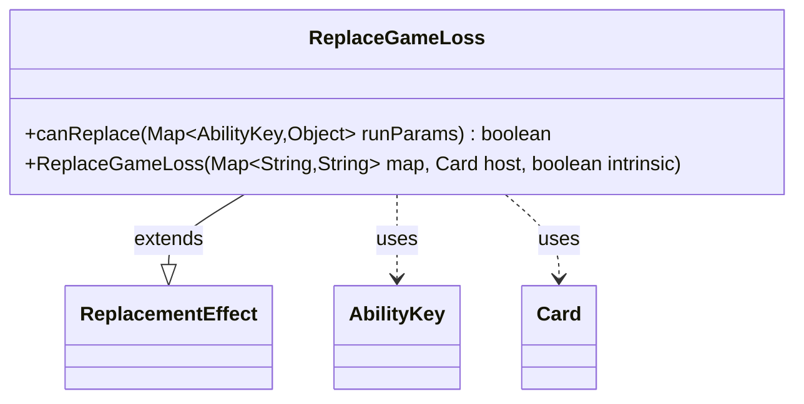

---
aliases:
  - ReplaceGameLoss
tags:
  - java/class
  - module/forge-game
  - pkg/forge/game/replacement
fqn: forge.game.replacement.ReplaceGameLoss
package: forge.game.replacement
module: forge-game
kind: Class
---

# ReplaceGameLoss

**Package:** `forge.game.replacement` &nbsp; **Module:** `forge-game` &nbsp; **Kind:** Class



## Relationships
**Extends:**
- [[forge.game.replacement.ReplacementEffect|ReplacementEffect]]
**Uses:**
- [[forge.game.ability.AbilityKey|AbilityKey]]
- [[forge.game.card.Card|Card]]

## Source
`forge-game/src/main/java/forge/game/replacement/ReplaceGameLoss.java`

```java
    package forge.game.replacement;

    import java.util.Map;

import forge.game.ability.AbilityKey;
import forge.game.card.Card;

/** 
 * TODO: Write javadoc for this type.
 *
 */
public class ReplaceGameLoss extends ReplacementEffect {

    /**
     * Instantiates a new replace game loss.
     *
     * @param map the map
     * @param host the host
     */
    public ReplaceGameLoss(Map<String, String> map, Card host, boolean intrinsic) {
        super(map, host, intrinsic);
    }

    /* (non-Javadoc)
     * @see forge.card.replacement.ReplacementEffect#canReplace(java.util.HashMap)
     */
    @Override
    public boolean canReplace(Map<AbilityKey, Object> runParams) {
        if (!matchesValidParam("ValidPlayer", runParams.get(AbilityKey.Affected))) {
            return false;
        }

        if (!matchesValidParam("ValidLoseReason", runParams.get(AbilityKey.LoseReason))) {
            return false;
        }

        return true;
    }

}
```
