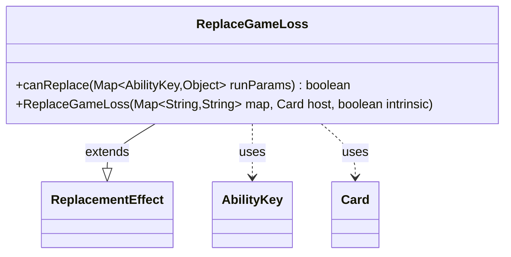

---
aliases:
  - ReplaceGameLoss
tags:
  - java/class
  - module/forge-game
  - pkg/forge/game/replacement
fqn: forge.game.replacement.ReplaceGameLoss
package: forge.game.replacement
module: forge-game
kind: Class
---

# ReplaceGameLoss

**Package:** `forge.game.replacement` &nbsp; **Module:** `forge-game` &nbsp; **Kind:** Class



## Relationships
**Extends:**
- [[forge.game.replacement.ReplacementEffect|ReplacementEffect]]
**Uses:**
- [[forge.game.ability.AbilityKey|AbilityKey]]
- [[forge.game.card.Card|Card]]

## Design Description

Repleplace effect that intercepts a player's loss of the game when the loss's reason and affected player satisfy the effect's filters.

ReplaceGameLoss is a concrete `ReplacementEffect` that conditionally intercepts a player's game-loss event. As a leaf in the replacement-effect hierarchy, it overrides `canReplace` to test the incoming run parameters against its configured filters: the affected player must match the `ValidPlayer` criterion and the loss cause must match `ValidLoseReason`, both resolved through `AbilityKey` lookups (`Affected` and `LoseReason`). Its constructor simply forwards the parameter map, host `Card`, and intrinsic flag to the superclass, delegating all actual replacement behavior and leaving this subclass responsible only for the applicability check. The design keeps matching logic data-driven via the shared `matchesValidParam` helper, letting card scripts specify which losses and players the effect guards.

## Source
`forge-game/src/main/java/forge/game/replacement/ReplaceGameLoss.java`

```java
    package forge.game.replacement;

    import java.util.Map;

import forge.game.ability.AbilityKey;
import forge.game.card.Card;

/** 
 * TODO: Write javadoc for this type.
 *
 */
public class ReplaceGameLoss extends ReplacementEffect {

    /**
     * Instantiates a new replace game loss.
     *
     * @param map the map
     * @param host the host
     */
    public ReplaceGameLoss(Map<String, String> map, Card host, boolean intrinsic) {
        super(map, host, intrinsic);
    }

    /* (non-Javadoc)
     * @see forge.card.replacement.ReplacementEffect#canReplace(java.util.HashMap)
     */
    @Override
    public boolean canReplace(Map<AbilityKey, Object> runParams) {
        if (!matchesValidParam("ValidPlayer", runParams.get(AbilityKey.Affected))) {
            return false;
        }

        if (!matchesValidParam("ValidLoseReason", runParams.get(AbilityKey.LoseReason))) {
            return false;
        }

        return true;
    }

}
```

## Python
`forge/game/replacement/ReplaceGameLoss.py`

````python
The port is below.

```python
from forge.game.replacement.ReplacementEffect import ReplacementEffect
from forge.game.ability.AbilityKey import AbilityKey
from forge.game.card.Card import Card


# TODO: Write javadoc for this type.
class ReplaceGameLoss(ReplacementEffect):

    def __init__(self, map: dict[str, str], host: Card, intrinsic: bool):
        super().__init__(map, host, intrinsic)

    def canReplace(self, runParams: dict[AbilityKey, object]) -> bool:
        if not self.matchesValidParam("ValidPlayer", runParams.get(AbilityKey.Affected)):
            return False

        if not self.matchesValidParam("ValidLoseReason", runParams.get(AbilityKey.LoseReason)):
            return False

        return True
````
