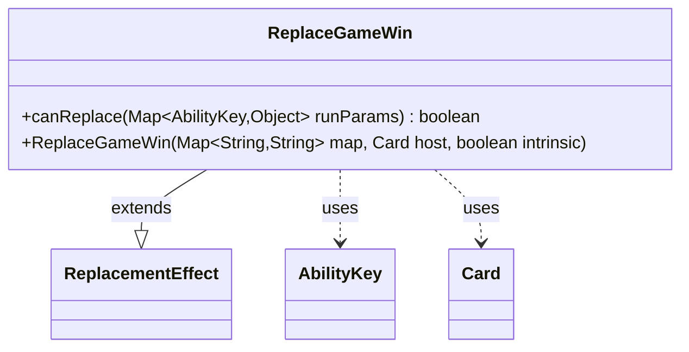

---
aliases:
  - ReplaceGameWin
tags:
  - java/class
  - module/forge-game
  - pkg/forge/game/replacement
fqn: forge.game.replacement.ReplaceGameWin
package: forge.game.replacement
module: forge-game
kind: Class
---

# ReplaceGameWin

**Package:** `forge.game.replacement` &nbsp; **Module:** `forge-game` &nbsp; **Kind:** Class



## Relationships
**Extends:**
- [[forge.game.replacement.ReplacementEffect|ReplacementEffect]]
**Uses:**
- [[forge.game.ability.AbilityKey|AbilityKey]]
- [[forge.game.card.Card|Card]]

## Design Description

ReplaceGameWin is a concrete replacement effect that intercepts game-win events, allowing card abilities to alter or prevent a player from winning the game. As a subclass of `ReplacementEffect`, it plugs into Forge's replacement-effect framework by overriding `canReplace`, which the engine consults to decide whether this effect applies to a given event. Its sole gating logic checks the run parameters' `Affected` key against a `ValidPlayer` restriction, so the effect triggers only for the matching player.

The class is deliberately minimal: it adds no new state, delegating construction to its superclass and relying on inherited machinery for the actual replacement behavior. It collaborates with `AbilityKey` to read typed values from the runtime parameter map and with `Card` as the host object supplied at construction, reflecting Forge's data-driven, script-configured approach where each replacement type contributes only its specific applicability test.

## Source
`forge-game/src/main/java/forge/game/replacement/ReplaceGameWin.java`

```java
package forge.game.replacement;

import java.util.Map;

import forge.game.ability.AbilityKey;
import forge.game.card.Card;

public class ReplaceGameWin extends ReplacementEffect {

    public ReplaceGameWin(Map<String, String> map, Card host, boolean intrinsic) {
        super(map, host, intrinsic);
    }

    /* (non-Javadoc)
     * @see forge.card.replacement.ReplacementEffect#canReplace(java.util.HashMap)
     */
    @Override
    public boolean canReplace(Map<AbilityKey, Object> runParams) {
        if (!matchesValidParam("ValidPlayer", runParams.get(AbilityKey.Affected))) {
            return false;
        }

        return true;
    }

}
```

## Python
`forge/game/replacement/ReplaceGameWin.py`

```python
from typing import Map

from forge.game.ability.AbilityKey import AbilityKey
from forge.game.card.Card import Card
from forge.game.replacement.ReplacementEffect import ReplacementEffect


class ReplaceGameWin(ReplacementEffect):

    def __init__(self, map: dict[str, str], host: Card, intrinsic: bool):
        super().__init__(map, host, intrinsic)

    # (non-Javadoc)
    # @see forge.card.replacement.ReplacementEffect#canReplace(java.util.HashMap)
    def canReplace(self, runParams: dict[AbilityKey, object]) -> bool:
        if not self.matchesValidParam("ValidPlayer", runParams.get(AbilityKey.Affected)):
            return False

        return True
```
