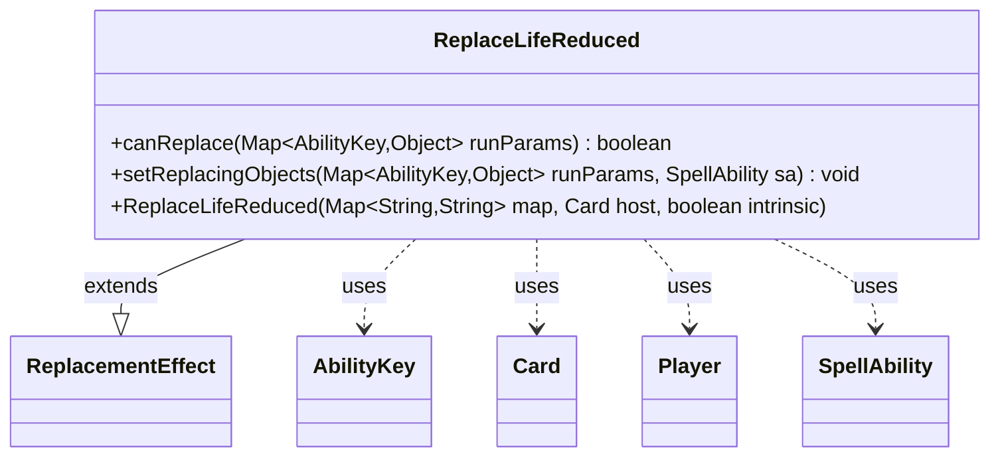

---
aliases:
  - ReplaceLifeReduced
tags:
  - java/class
  - module/forge-game
  - pkg/forge/game/replacement
fqn: forge.game.replacement.ReplaceLifeReduced
package: forge.game.replacement
module: forge-game
kind: Class
---

# ReplaceLifeReduced

**Package:** `forge.game.replacement`   **Module:** `forge-game`   **Kind:** Class



## Relationships
**Extends:**
- [[forge.game.replacement.ReplacementEffect|ReplacementEffect]]
**Uses:**
- [[forge.game.ability.AbilityKey|AbilityKey]]
- [[forge.game.card.Card|Card]]
- [[forge.game.player.Player|Player]]
- [[forge.game.spellability.SpellAbility|SpellAbility]]

## Design Description

ReplaceLifeReduced is a concrete replacement effect that intercepts events reducing a player's life—whether from damage or other loss—and lets the game substitute alternative behavior. Extending ReplacementEffect, it implements `canReplace` to test whether an incoming life-reduction event qualifies, filtering on a positive amount, a `ValidPlayer` match against the affected Player, an optional `IsDamage` flag, and an optional `Result` comparison that evaluates the player's resulting life total against an operator/operand expression via `Expressions.compare`. Its `setReplacingObjects` populates the SpellAbility with the relevant Amount and Player so the replacement ability can act on them.

The design leans on the parameter-map driven configuration shared across replacement effects, using AbilityKey-typed run parameters to stay decoupled from specific game events and keep matching logic data-driven rather than hardcoded.

## Source
`forge-game/src/main/java/forge/game/replacement/ReplaceLifeReduced.java`

```java
package forge.game.replacement;

import java.util.Map;

import forge.game.ability.AbilityKey;
import forge.game.card.Card;
import forge.game.player.Player;
import forge.game.spellability.SpellAbility;
import forge.util.Expressions;

/**
 * TODO: Write javadoc for this type.
 *
 */
public class ReplaceLifeReduced extends ReplacementEffect {

    /**
     * Instantiates a new replace life reduced.
     *
     * @param map  the map
     * @param host the host
     */
    public ReplaceLifeReduced(Map<String, String> map, Card host, boolean intrinsic) {
        super(map, host, intrinsic);
    }

    /* (non-Javadoc)
     * @see forge.card.replacement.ReplacementEffect#canReplace(java.util.HashMap)
     */
    @Override
    public boolean canReplace(Map<AbilityKey, Object> runParams) {
        int amount = (int)runParams.get(AbilityKey.Amount);
        Player affected = (Player) runParams.get(AbilityKey.Affected);
        if (amount <= 0) {
            return false;
        }

        if (!matchesValidParam("ValidPlayer", affected)) {
            return false;
        }

        if (hasParam("IsDamage")) {
            if (getParam("IsDamage").equals("True") != ((Boolean) runParams.get(AbilityKey.IsDamage))) {
                return false;
            }
        }

        if (hasParam("Result")) {
            final int n = affected.getLife() - amount;
            String comparator = getParam("Result");
            final String operator = comparator.substring(0, 2);
            final int operandValue = Integer.parseInt(comparator.substring(2));
            if (!Expressions.compare(n, operator, operandValue)) {
                return false;
            }
        }
        return true;
    }

    @Override
    public void setReplacingObjects(Map<AbilityKey, Object> runParams, SpellAbility sa) {
        sa.setReplacingObjectsFrom(runParams, AbilityKey.Amount);
        sa.setReplacingObject(AbilityKey.Player, runParams.get(AbilityKey.Affected));
    }
}
```

## Python
`forge/game/replacement/ReplaceLifeReduced.py`

```python
from typing import Map  # noqa

from forge.game.replacement.ReplacementEffect import ReplacementEffect
from forge.game.ability.AbilityKey import AbilityKey
from forge.game.card.Card import Card
from forge.game.player.Player import Player
from forge.game.spellability.SpellAbility import SpellAbility
from forge.util.Expressions import Expressions


class ReplaceLifeReduced(ReplacementEffect):
    """
    TODO: Write javadoc for this type.

    """

    def __init__(self, map: dict[str, str], host: Card, intrinsic: bool):
        """
        Instantiates a new replace life reduced.

        :param map:  the map
        :param host: the host
        """
        super().__init__(map, host, intrinsic)

    def canReplace(self, runParams: dict[AbilityKey, object]) -> bool:
        amount = int(runParams.get(AbilityKey.Amount))
        affected = runParams.get(AbilityKey.Affected)
        if amount <= 0:
            return False

        if not self.matchesValidParam("ValidPlayer", affected):
            return False

        if self.hasParam("IsDamage"):
            if (self.getParam("IsDamage") == "True") != bool(runParams.get(AbilityKey.IsDamage)):
                return False

        if self.hasParam("Result"):
            n = affected.getLife() - amount
            comparator = self.getParam("Result")
            operator = comparator[0:2]
            operandValue = int(comparator[2:])
            if not Expressions.compare(n, operator, operandValue):
                return False
        return True

    def setReplacingObjects(self, runParams: dict[AbilityKey, object], sa: SpellAbility) -> None:
        sa.setReplacingObjectsFrom(runParams, AbilityKey.Amount)
        sa.setReplacingObject(AbilityKey.Player, runParams.get(AbilityKey.Affected))
```
