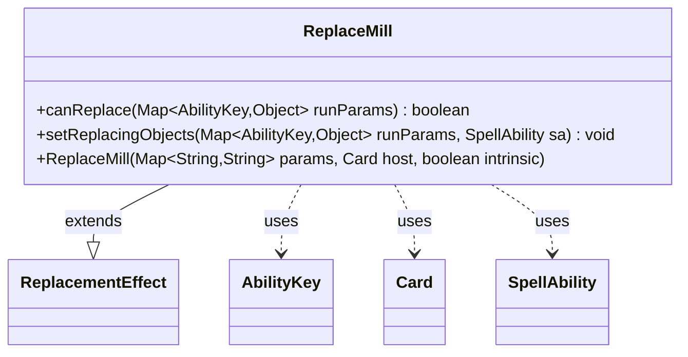

---
aliases:
  - ReplaceMill
tags:
  - java/class
  - module/forge-game
  - pkg/forge/game/replacement
fqn: forge.game.replacement.ReplaceMill
package: forge.game.replacement
module: forge-game
kind: Class
---

# ReplaceMill

**Package:** `forge.game.replacement`   **Module:** `forge-game`   **Kind:** Class



## Relationships
**Extends:**
- [[forge.game.replacement.ReplacementEffect|ReplacementEffect]]
**Uses:**
- [[forge.game.ability.AbilityKey|AbilityKey]]
- [[forge.game.card.Card|Card]]
- [[forge.game.spellability.SpellAbility|SpellAbility]]

## Design Description

ReplaceMill is a concrete replacement effect that intercepts mill events affecting a player. Extending `ReplacementEffect`, it overrides `canReplace` to gate activation on the standard `ValidPlayer` parameter—matching the affected player against the effect's configured criteria—and `setReplacingObjects` to expose the affected `Player` and the milled `Number` to the dependent `SpellAbility`, so downstream replacement logic can reference them.

Its design follows the engine's data-driven replacement pattern: the constructor simply forwards card script parameters, host `Card`, and the intrinsic flag to its supertype, while `AbilityKey`-keyed run-parameter maps decouple the effect from concrete event plumbing. The class adds no state of its own, contributing only the mill-specific matching and object-binding behavior that the generic `ReplacementEffect` framework invokes.

## Source
`forge-game/src/main/java/forge/game/replacement/ReplaceMill.java`

```java
/*
 * Forge: Play Magic: the Gathering.
 * Copyright (C) 2011  Forge Team
 *
 * This program is free software: you can redistribute it and/or modify
 * it under the terms of the GNU General Public License as published by
 * the Free Software Foundation, either version 3 of the License, or
 * (at your option) any later version.
 *
 * This program is distributed in the hope that it will be useful,
 * but WITHOUT ANY WARRANTY; without even the implied warranty of
 * MERCHANTABILITY or FITNESS FOR A PARTICULAR PURPOSE.  See the
 * GNU General Public License for more details.
 *
 * You should have received a copy of the GNU General Public License
 * along with this program.  If not, see <http://www.gnu.org/licenses/>.
 */
package forge.game.replacement;

import java.util.Map;

import forge.game.ability.AbilityKey;
import forge.game.card.Card;
import forge.game.spellability.SpellAbility;

/**
 * TODO: Write javadoc for this type.
 *
 */
public class ReplaceMill extends ReplacementEffect {

    /**
     * Instantiates a new replace mill.
     *
     * @param params the params
     * @param host the host
     */
    public ReplaceMill(final Map<String, String> params, final Card host, final boolean intrinsic) {
        super(params, host, intrinsic);
    }

    /* (non-Javadoc)
     * @see forge.card.replacement.ReplacementEffect#canReplace(java.util.HashMap)
     */
    @Override
    public boolean canReplace(Map<AbilityKey, Object> runParams) {
        if (!matchesValidParam("ValidPlayer", runParams.get(AbilityKey.Affected))) {
            return false;
        }

        return true;
    }

    /* (non-Javadoc)
     * @see forge.card.replacement.ReplacementEffect#setReplacingObjects(java.util.HashMap, forge.card.spellability.SpellAbility)
     */
    @Override
    public void setReplacingObjects(Map<AbilityKey, Object> runParams, SpellAbility sa) {
        sa.setReplacingObject(AbilityKey.Player, runParams.get(AbilityKey.Affected));
        sa.setReplacingObject(AbilityKey.Number, runParams.get(AbilityKey.Number));
    }
}
```

## Python
`forge/game/replacement/ReplaceMill.py`

```python
from forge.game.replacement.ReplacementEffect import ReplacementEffect
from forge.game.ability.AbilityKey import AbilityKey
from forge.game.card.Card import Card
from forge.game.spellability.SpellAbility import SpellAbility


class ReplaceMill(ReplacementEffect):
    """
    TODO: Write javadoc for this type.
    """

    def __init__(self, params: dict[str, str], host: Card, intrinsic: bool):
        """
        Instantiates a new replace mill.

        :param params: the params
        :param host: the host
        """
        super().__init__(params, host, intrinsic)

    def canReplace(self, runParams: dict[AbilityKey, object]) -> bool:
        if not self.matchesValidParam("ValidPlayer", runParams.get(AbilityKey.Affected)):
            return False

        return True

    def setReplacingObjects(self, runParams: dict[AbilityKey, object], sa: SpellAbility) -> None:
        sa.setReplacingObject(AbilityKey.Player, runParams.get(AbilityKey.Affected))
        sa.setReplacingObject(AbilityKey.Number, runParams.get(AbilityKey.Number))
```
