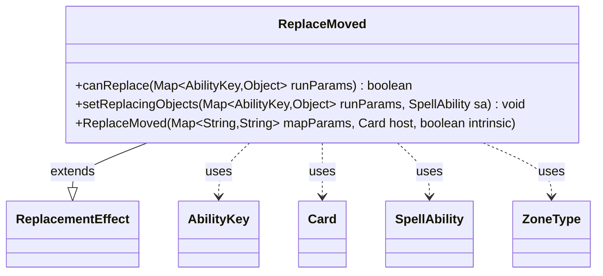

---
aliases:
  - ReplaceMoved
tags:
  - java/class
  - module/forge-game
  - pkg/forge/game/replacement
fqn: forge.game.replacement.ReplaceMoved
package: forge.game.replacement
module: forge-game
kind: Class
---

# ReplaceMoved

**Package:** `forge.game.replacement`   **Module:** `forge-game`   **Kind:** Class



## Relationships
**Extends:**
- [[forge.game.replacement.ReplacementEffect|ReplacementEffect]]
**Uses:**
- [[forge.game.ability.AbilityKey|AbilityKey]]
- [[forge.game.card.Card|Card]]
- [[forge.game.spellability.SpellAbility|SpellAbility]]
- [[forge.game.zone.ZoneType|ZoneType]]

## Design Description

ReplaceMoved is a concrete replacement effect that intercepts card zone-change ("moved") events, deciding whether the effect applies to a given game event and binding the relevant game objects for the replacing ability. As a subclass of ReplacementEffect, it implements the engine's standard `canReplace`/`setReplacingObjects` contract.

Its `canReplace` method filters events by matching declarative script parameters—Origin and Destination ZoneTypes, valid-card predicates, and boolean flags like Fizzle, Cycling, Discard, and FoundSearchingLibrary—against the runtime parameter map keyed by AbilityKey, delegating enter-the-battlefield checks to the inherited `canReplaceETB`. The design intent is data-driven matching: behavior is configured entirely through string parameters rather than code, letting card definitions specify movement-replacement conditions. `setReplacingObjects` then exposes the affected Card and related state to the triggered SpellAbility.

## Source
`forge-game/src/main/java/forge/game/replacement/ReplaceMoved.java`

```java
package forge.game.replacement;

import java.util.Map;

import forge.game.ability.AbilityKey;
import forge.game.card.Card;
import forge.game.spellability.SpellAbility;
import forge.game.zone.ZoneType;

/** 
 * TODO: Write javadoc for this type.
 *
 */
public class ReplaceMoved extends ReplacementEffect {

    /**
     * 
     * TODO: Write javadoc for Constructor.
     * @param mapParams &emsp; HashMap<String, String>
     * @param host &emsp; Card
     */
    public ReplaceMoved(final Map<String, String> mapParams, final Card host, final boolean intrinsic) {
        super(mapParams, host, intrinsic);
    }

    /* (non-Javadoc)
     * @see forge.card.replacement.ReplacementEffect#canReplace(java.util.HashMap)
     */
    @Override
    public boolean canReplace(Map<AbilityKey, Object> runParams) {
        if (hasParam("Destination")) {
            ZoneType zt = (ZoneType) runParams.get(AbilityKey.Destination);
            if (!ZoneType.listValueOf(getParam("Destination")).contains(zt)) {
                return false;
            }
        }

        if (hasParam("Origin")) {
            ZoneType zt = (ZoneType) runParams.get(AbilityKey.Origin);
            if (!ZoneType.listValueOf(getParam("Origin")).contains(zt)) {
                return false;
            }
        }

        if (!matchesValidParam("ValidCard", runParams.get(AbilityKey.Affected))) {
            return false;
        }
        if (!matchesValidParam("ValidLKI", runParams.get(AbilityKey.CardLKI))) {
            return false;
        }
        if (!matchesValidParam("ValidStackSa", runParams.get(AbilityKey.StackSa))) {
            return false;
        }
        if (!matchesValidParam("ValidCause", runParams.get(AbilityKey.Cause))) {
            return false;
        }
        
        if (hasParam("ExcludeDestination")) {
            ZoneType zt = (ZoneType) runParams.get(AbilityKey.Destination);
            if (ZoneType.listValueOf(getParam("ExcludeDestination")).contains(zt)) {
                return false;
            }
        }
        
        if (hasParam("Fizzle")) {
            // if Replacement look for Fizzle
            if (!runParams.containsKey(AbilityKey.Fizzle)) {
                return false;
            }
            Boolean val = (Boolean) runParams.get(AbilityKey.Fizzle);
            if ("True".equals(getParam("Fizzle")) != val) {
                return false;
            }
        }

        if (hasParam("Cycling")) { // Cycling is by cost, not by effect so cause is null
            if (getParam("Cycling").equalsIgnoreCase("True") != runParams.containsKey(AbilityKey.Cycling)) {
                return false;
            }
        }

        if (hasParam("Discard")) {
            if (getParam("Discard").equalsIgnoreCase("True") != runParams.containsKey(AbilityKey.Discard)) {
                return false;
            }
        }

        if (hasParam("EffectOnly")) {
            final Boolean effectOnly = (Boolean) runParams.get(AbilityKey.EffectOnly);
            if (!effectOnly) {
                return false;
            }
        }

        if (hasParam("FoundSearchingLibrary")) {
            if (!runParams.containsKey(AbilityKey.FoundSearchingLibrary)) {
                return false;
            }
            Boolean val = (Boolean) runParams.get(AbilityKey.FoundSearchingLibrary);
            if (!val) { return false; }
        }

        if (runParams.get(AbilityKey.Destination) == ZoneType.Battlefield && !canReplaceETB(runParams)) {
            return false;
        }

        return true;
    }

    /* (non-Javadoc)
     * @see forge.card.replacement.ReplacementEffect#setReplacingObjects(java.util.HashMap, forge.card.spellability.SpellAbility)
     */
    @Override
    public void setReplacingObjects(Map<AbilityKey, Object> runParams, SpellAbility sa) {
        sa.setReplacingObject(AbilityKey.Card, runParams.get(AbilityKey.Affected));
        sa.setReplacingObjectsFrom(runParams, AbilityKey.NewCard, AbilityKey.CardLKI, AbilityKey.Cause,
                AbilityKey.LastStateBattlefield, AbilityKey.LastStateGraveyard, AbilityKey.CounterTable, AbilityKey.CounterMap);
    }

}
```

## Python
`forge/game/replacement/ReplaceMoved.py`

```python
from forge.game.replacement.ReplacementEffect import ReplacementEffect
from forge.game.ability.AbilityKey import AbilityKey
from forge.game.card.Card import Card
from forge.game.spellability.SpellAbility import SpellAbility
from forge.game.zone.ZoneType import ZoneType


# TODO: Write javadoc for this type.
class ReplaceMoved(ReplacementEffect):

    # TODO: Write javadoc for Constructor.
    # @param mapParams   HashMap<String, String>
    # @param host        Card
    def __init__(self, mapParams: dict[str, str], host: Card, intrinsic: bool):
        super().__init__(mapParams, host, intrinsic)

    def canReplace(self, runParams: dict[AbilityKey, object]) -> bool:
        if self.hasParam("Destination"):
            zt = runParams.get(AbilityKey.Destination)
            if zt not in ZoneType.listValueOf(self.getParam("Destination")):
                return False

        if self.hasParam("Origin"):
            zt = runParams.get(AbilityKey.Origin)
            if zt not in ZoneType.listValueOf(self.getParam("Origin")):
                return False

        if not self.matchesValidParam("ValidCard", runParams.get(AbilityKey.Affected)):
            return False
        if not self.matchesValidParam("ValidLKI", runParams.get(AbilityKey.CardLKI)):
            return False
        if not self.matchesValidParam("ValidStackSa", runParams.get(AbilityKey.StackSa)):
            return False
        if not self.matchesValidParam("ValidCause", runParams.get(AbilityKey.Cause)):
            return False

        if self.hasParam("ExcludeDestination"):
            zt = runParams.get(AbilityKey.Destination)
            if zt in ZoneType.listValueOf(self.getParam("ExcludeDestination")):
                return False

        if self.hasParam("Fizzle"):
            # if Replacement look for Fizzle
            if AbilityKey.Fizzle not in runParams:
                return False
            val = runParams.get(AbilityKey.Fizzle)
            if ("True" == self.getParam("Fizzle")) != val:
                return False

        if self.hasParam("Cycling"):  # Cycling is by cost, not by effect so cause is null
            if (self.getParam("Cycling").lower() == "true") != (AbilityKey.Cycling in runParams):
                return False

        if self.hasParam("Discard"):
            if (self.getParam("Discard").lower() == "true") != (AbilityKey.Discard in runParams):
                return False

        if self.hasParam("EffectOnly"):
            effectOnly = runParams.get(AbilityKey.EffectOnly)
            if not effectOnly:
                return False

        if self.hasParam("FoundSearchingLibrary"):
            if AbilityKey.FoundSearchingLibrary not in runParams:
                return False
            val = runParams.get(AbilityKey.FoundSearchingLibrary)
            if not val:
                return False

        if runParams.get(AbilityKey.Destination) == ZoneType.Battlefield and not self.canReplaceETB(runParams):
            return False

        return True

    def setReplacingObjects(self, runParams: dict[AbilityKey, object], sa: SpellAbility) -> None:
        sa.setReplacingObject(AbilityKey.Card, runParams.get(AbilityKey.Affected))
        sa.setReplacingObjectsFrom(runParams, AbilityKey.NewCard, AbilityKey.CardLKI, AbilityKey.Cause,
                AbilityKey.LastStateBattlefield, AbilityKey.LastStateGraveyard, AbilityKey.CounterTable, AbilityKey.CounterMap)
```
