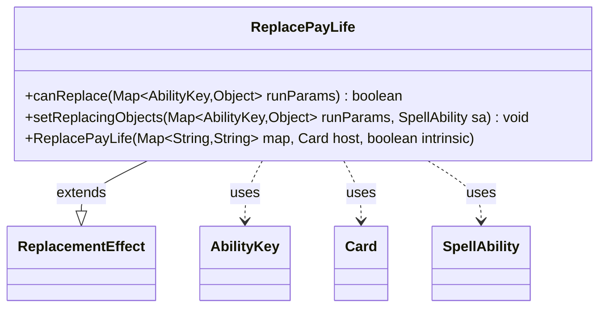

---
aliases:
  - ReplacePayLife
tags:
  - java/class
  - module/forge-game
  - pkg/forge/game/replacement
fqn: forge.game.replacement.ReplacePayLife
package: forge.game.replacement
module: forge-game
kind: Class
---

# ReplacePayLife

**Package:** `forge.game.replacement` &nbsp; **Module:** `forge-game` &nbsp; **Kind:** Class



## Relationships
**Extends:**
- [[forge.game.replacement.ReplacementEffect|ReplacementEffect]]
**Uses:**
- [[forge.game.ability.AbilityKey|AbilityKey]]
- [[forge.game.card.Card|Card]]
- [[forge.game.spellability.SpellAbility|SpellAbility]]

## Source
`forge-game/src/main/java/forge/game/replacement/ReplacePayLife.java`

```java
package forge.game.replacement;

import java.util.Map;

import forge.game.ability.AbilityKey;
import forge.game.ability.AbilityUtils;
import forge.game.card.Card;
import forge.game.spellability.SpellAbility;
import forge.util.Expressions;

public class ReplacePayLife extends ReplacementEffect {

    public ReplacePayLife(Map<String, String> map, Card host, boolean intrinsic) {
        super(map, host, intrinsic);
    }

    @Override
    public boolean canReplace(Map<AbilityKey, Object> runParams) {
        if (!matchesValidParam("ValidPlayer", runParams.get(AbilityKey.Affected))) {
            return false;
        }

        if (hasParam("Amount")) {
            final int n = (Integer)runParams.get(AbilityKey.Amount);
            String comparator = getParam("Amount");
            final String operator = comparator.substring(0, 2);
            final int operandValue = AbilityUtils.calculateAmount(getHostCard(), comparator.substring(2), this);
            if (!Expressions.compare(n, operator, operandValue)) {
                return false;
            }
        }
        return true;
    }

    @Override
    public void setReplacingObjects(Map<AbilityKey, Object> runParams, SpellAbility sa) {
        sa.setReplacingObject(AbilityKey.Player, runParams.get(AbilityKey.Affected));
        sa.setReplacingObjectsFrom(runParams, AbilityKey.Amount);
    }

}
```
