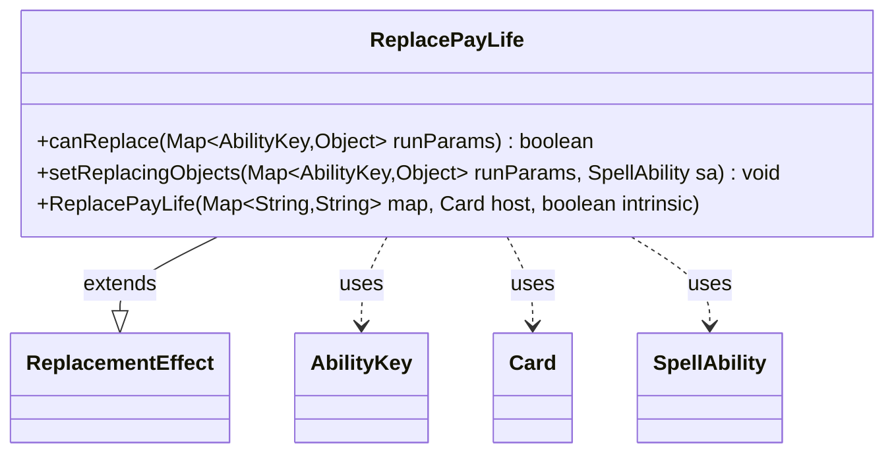

---
aliases:
  - ReplacePayLife
tags:
  - java/class
  - module/forge-game
  - pkg/forge/game/replacement
fqn: forge.game.replacement.ReplacePayLife
package: forge.game.replacement
module: forge-game
kind: Class
---

# ReplacePayLife

**Package:** `forge.game.replacement`   **Module:** `forge-game`   **Kind:** Class



## Relationships
**Extends:**
- [[forge.game.replacement.ReplacementEffect|ReplacementEffect]]
**Uses:**
- [[forge.game.ability.AbilityKey|AbilityKey]]
- [[forge.game.card.Card|Card]]
- [[forge.game.spellability.SpellAbility|SpellAbility]]

## Design Description

ReplacePayLife is a concrete replacement effect that intercepts life-payment events, allowing card abilities to alter or substitute the act of paying life. As a subclass of ReplacementEffect, it implements the standard two-part contract: canReplace determines applicability, and setReplacingObjects binds the relevant data for the replacing ability.

Its canReplace gate filters on the affected player (ValidPlayer) and optionally compares the life Amount against a configured threshold using a parsed operator, delegating arithmetic to AbilityUtils and comparison to Expressions. When triggered, setReplacingObjects exposes the affected Player and the Amount through AbilityKey-keyed entries on the SpellAbility, so dependent abilities can read the substituted values. The design follows Forge's data-driven pattern—behavior is parameterized through the inherited string map rather than hardcoded—keeping the class a thin, declarative specialization of the replacement framework.

## Source
`forge-game/src/main/java/forge/game/replacement/ReplacePayLife.java`

```java
package forge.game.replacement;

import java.util.Map;

import forge.game.ability.AbilityKey;
import forge.game.ability.AbilityUtils;
import forge.game.card.Card;
import forge.game.spellability.SpellAbility;
import forge.util.Expressions;

public class ReplacePayLife extends ReplacementEffect {

    public ReplacePayLife(Map<String, String> map, Card host, boolean intrinsic) {
        super(map, host, intrinsic);
    }

    @Override
    public boolean canReplace(Map<AbilityKey, Object> runParams) {
        if (!matchesValidParam("ValidPlayer", runParams.get(AbilityKey.Affected))) {
            return false;
        }

        if (hasParam("Amount")) {
            final int n = (Integer)runParams.get(AbilityKey.Amount);
            String comparator = getParam("Amount");
            final String operator = comparator.substring(0, 2);
            final int operandValue = AbilityUtils.calculateAmount(getHostCard(), comparator.substring(2), this);
            if (!Expressions.compare(n, operator, operandValue)) {
                return false;
            }
        }
        return true;
    }

    @Override
    public void setReplacingObjects(Map<AbilityKey, Object> runParams, SpellAbility sa) {
        sa.setReplacingObject(AbilityKey.Player, runParams.get(AbilityKey.Affected));
        sa.setReplacingObjectsFrom(runParams, AbilityKey.Amount);
    }

}
```

## Python
`forge/game/replacement/ReplacePayLife.py`

```python
from forge.game.replacement.ReplacementEffect import ReplacementEffect
from forge.game.ability.AbilityKey import AbilityKey
from forge.game.ability.AbilityUtils import AbilityUtils
from forge.game.card.Card import Card
from forge.game.spellability.SpellAbility import SpellAbility
from forge.util.Expressions import Expressions


class ReplacePayLife(ReplacementEffect):

    def __init__(self, map: dict[str, str], host: Card, intrinsic: bool):
        super().__init__(map, host, intrinsic)

    def canReplace(self, runParams: dict[AbilityKey, object]) -> bool:
        if not self.matchesValidParam("ValidPlayer", runParams.get(AbilityKey.Affected)):
            return False

        if self.hasParam("Amount"):
            n = runParams.get(AbilityKey.Amount)
            comparator = self.getParam("Amount")
            operator = comparator[0:2]
            operandValue = AbilityUtils.calculateAmount(self.getHostCard(), comparator[2:], self)
            if not Expressions.compare(n, operator, operandValue):
                return False
        return True

    def setReplacingObjects(self, runParams: dict[AbilityKey, object], sa: SpellAbility) -> None:
        sa.setReplacingObject(AbilityKey.Player, runParams.get(AbilityKey.Affected))
        sa.setReplacingObjectsFrom(runParams, AbilityKey.Amount)
```
