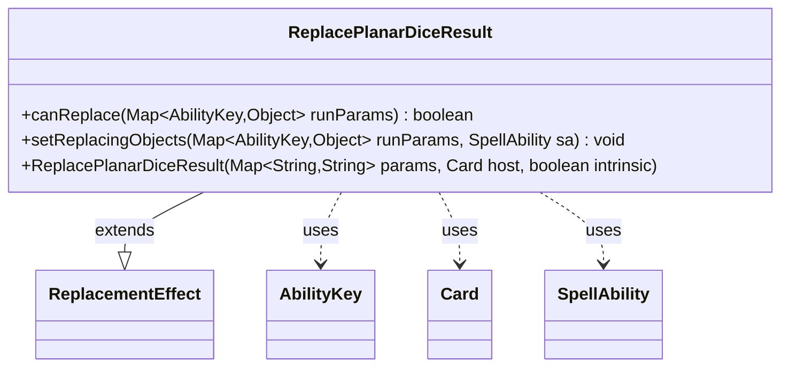

---
aliases:
  - ReplacePlanarDiceResult
tags:
  - java/class
  - module/forge-game
  - pkg/forge/game/replacement
fqn: forge.game.replacement.ReplacePlanarDiceResult
package: forge.game.replacement
module: forge-game
kind: Class
---

# ReplacePlanarDiceResult

**Package:** `forge.game.replacement` &nbsp; **Module:** `forge-game` &nbsp; **Kind:** Class



## Relationships
**Extends:**
- [[forge.game.replacement.ReplacementEffect|ReplacementEffect]]
**Uses:**
- [[forge.game.ability.AbilityKey|AbilityKey]]
- [[forge.game.card.Card|Card]]
- [[forge.game.spellability.SpellAbility|SpellAbility]]

## Design Description

ReplacePlanarDiceResult is a concrete replacement effect that intercepts the outcome of a planar die roll, allowing card definitions to substitute or react to a specific result. Extending ReplacementEffect, it overrides the framework's two key hooks: canReplace gates the effect by matching the rolled outcome against the card's "ValidRoll" parameter (read from the run parameters under AbilityKey.Result), and setReplacingObjects exposes that result to the resolving SpellAbility so downstream effects can reference it. It collaborates with AbilityKey to key into the typed run-parameter map, Card as its host, and SpellAbility as the replacing ability. The class is deliberately minimal, delegating construction and the broader replacement-matching machinery to its superclass and contributing only the planechase-specific roll-validation logic.

That's ~130 words. Good.ReplacePlanarDiceResult is a concrete replacement effect that intercepts the outcome of a planar die roll, letting card scripts validate or react to a specific result. Extending ReplacementEffect, it overrides the framework's two key hooks: canReplace gates the effect by matching the rolled outcome (read from the run-parameter map under AbilityKey.Result) against the card's configured "ValidRoll" parameter, while setReplacingObjects publishes that result onto the resolving SpellAbility so downstream effects can reference it. It collaborates with AbilityKey to index the typed parameter map, Card as its host, and SpellAbility as the replacing ability. The class is deliberately minimal, delegating construction and the general replacement-matching machinery to its superclass and contributing only the planechase-specific roll-validation logic, keeping each replacement subtype focused on a single triggering condition.

## Source
`forge-game/src/main/java/forge/game/replacement/ReplacePlanarDiceResult.java`

```java
/*
 * Forge: Play Magic: the Gathering.
 * Copyright (C) 2011  Forge Team
 *
 * This program is free software: you can redistribute it and/or modify
 * it under the terms of the GNU General Public License as published by
 * the Free Software Foundation, either version 3 of the License, or
 * (at your option) any later version.
 *
 * This program is distributed in the hope that it will be useful,
 * but WITHOUT ANY WARRANTY; without even the implied warranty of
 * MERCHANTABILITY or FITNESS FOR A PARTICULAR PURPOSE.  See the
 * GNU General Public License for more details.
 *
 * You should have received a copy of the GNU General Public License
 * along with this program.  If not, see <http://www.gnu.org/licenses/>.
 */
package forge.game.replacement;

import forge.game.ability.AbilityKey;
import forge.game.card.Card;
import forge.game.spellability.SpellAbility;

import java.util.Map;

public class ReplacePlanarDiceResult extends ReplacementEffect {

    /**
     * Instantiates a new replace roll planar dice.
     *
     * @param params the params
     * @param host   the host
     */
    public ReplacePlanarDiceResult(final Map<String, String> params, final Card host, final boolean intrinsic) {
        super(params, host, intrinsic);
    }

    /* (non-Javadoc)
     * @see forge.card.replacement.ReplacementEffect#canReplace(java.util.HashMap)
     */
    @Override
    public boolean canReplace(Map<AbilityKey, Object> runParams) {
        if (!matchesValidParam("ValidRoll", runParams.get(AbilityKey.Result))) {
            return false;
        }
        return true;
    }

    /* (non-Javadoc)
     * @see forge.card.replacement.ReplacementEffect#setReplacingObjects(java.util.Map, forge.card.spellability.SpellAbility)
     */
    @Override
    public void setReplacingObjects(Map<AbilityKey, Object> runParams, SpellAbility sa) {
        sa.setReplacingObject(AbilityKey.Result, runParams.get(AbilityKey.Result));
    }
}
```

## Python
`forge/game/replacement/ReplacePlanarDiceResult.py`

```python
from forge.game.replacement.ReplacementEffect import ReplacementEffect
from forge.game.ability.AbilityKey import AbilityKey
from forge.game.card.Card import Card
from forge.game.spellability.SpellAbility import SpellAbility


class ReplacePlanarDiceResult(ReplacementEffect):

    def __init__(self, params: dict[str, str], host: Card, intrinsic: bool):
        super().__init__(params, host, intrinsic)

    def canReplace(self, runParams: dict[AbilityKey, object]) -> bool:
        if not self.matchesValidParam("ValidRoll", runParams.get(AbilityKey.Result)):
            return False
        return True

    def setReplacingObjects(self, runParams: dict[AbilityKey, object], sa: SpellAbility) -> None:
        sa.setReplacingObject(AbilityKey.Result, runParams.get(AbilityKey.Result))
```
