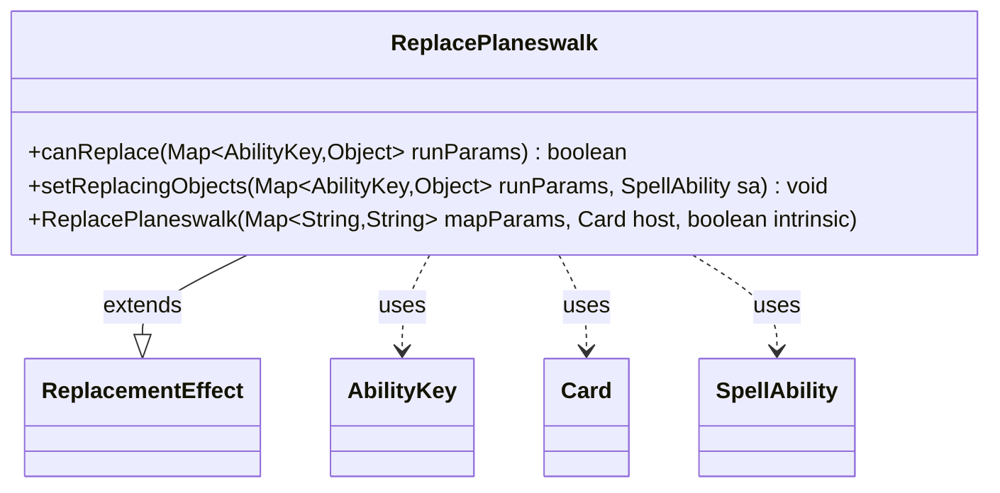

---
aliases:
  - ReplacePlaneswalk
tags:
  - java/class
  - module/forge-game
  - pkg/forge/game/replacement
fqn: forge.game.replacement.ReplacePlaneswalk
package: forge.game.replacement
module: forge-game
kind: Class
---

# ReplacePlaneswalk

**Package:** `forge.game.replacement`   **Module:** `forge-game`   **Kind:** Class



## Relationships
**Extends:**
- [[forge.game.replacement.ReplacementEffect|ReplacementEffect]]
**Uses:**
- [[forge.game.ability.AbilityKey|AbilityKey]]
- [[forge.game.card.Card|Card]]
- [[forge.game.spellability.SpellAbility|SpellAbility]]

## Design Description

ReplacePlaneswalk is a concrete replacement effect that intercepts a player's planeswalking event (movement between planes in the Planechase format), allowing card or game rules to substitute alternate behavior. Extending ReplacementEffect, it implements the two hooks the replacement system requires: canReplace gates activation by validating the affected player and triggering cause against the effect's configured ValidPlayer and ValidCause parameters, while setReplacingObjects exposes the originating Cause to the resolving SpellAbility. It collaborates with AbilityKey to read and write typed entries in the run-parameter map, Card as its host, and SpellAbility as the replacement's executor. The design is deliberately minimal—delegating construction and parameter matching to its superclass and contributing only the planeswalk-specific validation and object-binding logic, consistent with Forge's data-driven, per-event replacement-effect pattern.

## Source
`forge-game/src/main/java/forge/game/replacement/ReplacePlaneswalk.java`

```java
package forge.game.replacement;

import forge.game.ability.AbilityKey;
import forge.game.card.Card;
import forge.game.spellability.SpellAbility;

import java.util.Map;

public class ReplacePlaneswalk extends ReplacementEffect {

    public ReplacePlaneswalk(final Map<String, String> mapParams, final Card host, final boolean intrinsic) {
        super(mapParams, host, intrinsic);
    }

    @Override
    public boolean canReplace(Map<AbilityKey, Object> runParams) {
        if (!matchesValidParam("ValidPlayer", runParams.get(AbilityKey.Affected))) {
            return false;
        }
        if (!matchesValidParam("ValidCause", runParams.get(AbilityKey.Cause))) {
            return false;
        }
        return true;
    }

    @Override
    public void setReplacingObjects(Map<AbilityKey, Object> runParams, SpellAbility sa) {
        sa.setReplacingObject(AbilityKey.Cause, runParams.get(AbilityKey.Cause));
    }

}
```

## Python
`forge/game/replacement/ReplacePlaneswalk.py`

```python
from forge.game.ability.AbilityKey import AbilityKey
from forge.game.card.Card import Card
from forge.game.spellability.SpellAbility import SpellAbility
from forge.game.replacement.ReplacementEffect import ReplacementEffect


class ReplacePlaneswalk(ReplacementEffect):

    def __init__(self, mapParams: dict[str, str], host: Card, intrinsic: bool):
        super().__init__(mapParams, host, intrinsic)

    def canReplace(self, runParams: dict[AbilityKey, object]) -> bool:
        if not self.matchesValidParam("ValidPlayer", runParams.get(AbilityKey.Affected)):
            return False
        if not self.matchesValidParam("ValidCause", runParams.get(AbilityKey.Cause)):
            return False
        return True

    def setReplacingObjects(self, runParams: dict[AbilityKey, object], sa: SpellAbility) -> None:
        sa.setReplacingObject(AbilityKey.Cause, runParams.get(AbilityKey.Cause))
```
