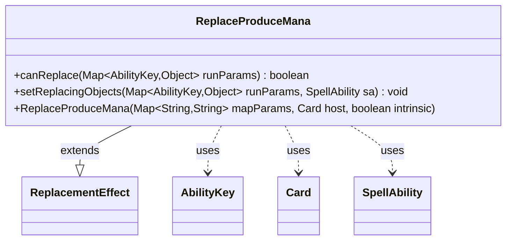

---
aliases:
  - ReplaceProduceMana
tags:
  - java/class
  - module/forge-game
  - pkg/forge/game/replacement
fqn: forge.game.replacement.ReplaceProduceMana
package: forge.game.replacement
module: forge-game
kind: Class
---

# ReplaceProduceMana

**Package:** `forge.game.replacement`   **Module:** `forge-game`   **Kind:** Class



## Relationships
**Extends:**
- [[forge.game.replacement.ReplacementEffect|ReplacementEffect]]
**Uses:**
- [[forge.game.ability.AbilityKey|AbilityKey]]
- [[forge.game.card.Card|Card]]
- [[forge.game.spellability.SpellAbility|SpellAbility]]

## Design Description

Replaces the mana produced by a mana ability, implementing Magic's "produces mana instead" replacement effects (e.g. doubling or substituting tapped-for mana). As a concrete `ReplacementEffect` subclass, it overrides `canReplace` to gate on the standard `ValidCard`/`ValidPlayer`/`ValidActivator` selectors plus a `ValidSA` filter that—by default—targets activated mana abilities with a tap cost, and optionally compares the produced mana count against a `ManaAmount` expression. `setReplacingObjects` exposes the original mana to the replacement script via the `Mana` key.

Collaborating through `AbilityKey`-keyed run-parameter maps, it reads game state (`Card`, `SpellAbility`) and delegates amount math to `AbilityUtils` and comparisons to `Expressions`, keeping the effect data-driven from card-script parameters rather than hardcoded behavior.

## Source
`forge-game/src/main/java/forge/game/replacement/ReplaceProduceMana.java`

```java
package forge.game.replacement;

import java.util.Map;

import org.apache.commons.lang3.StringUtils;

import forge.game.ability.AbilityKey;
import forge.game.ability.AbilityUtils;
import forge.game.card.Card;
import forge.game.spellability.SpellAbility;
import forge.util.Expressions;

/** 
 * TODO: Write javadoc for this type.
 *
 */
public class ReplaceProduceMana extends ReplacementEffect {

    /**
     * 
     * ReplaceProduceMana.
     * @param mapParams &emsp; HashMap<String, String>
     * @param host &emsp; Card
     */
    public ReplaceProduceMana(final Map<String, String> mapParams, final Card host, final boolean intrinsic) {
        super(mapParams, host, intrinsic);
    }

    /* (non-Javadoc)
     * @see forge.card.replacement.ReplacementEffect#canReplace(java.util.HashMap)
     */
    @Override
    public boolean canReplace(Map<AbilityKey, Object> runParams) {
        if (!matchesValidParam("ValidCard", runParams.get(AbilityKey.Affected))) {
            return false;
        }
        if (!matchesValidParam("ValidPlayer", runParams.get(AbilityKey.Player))) {
            return false;
        }
        if (!matchesValidParam("ValidActivator", runParams.get(AbilityKey.Activator))) {
            return false;
        }
        if (!matchesValid(runParams.get(AbilityKey.AbilityMana), getParamOrDefault("ValidSA", "Activated.hasTapCost+ManaAbility").split(","), getHostCard())) {
            return false;
        }

        if (hasParam("ManaAmount")) {
            String full = getParam("ManaAmount");
            String operator = full.substring(0, 2);
            String operand = full.substring(2);

            int intoperand = AbilityUtils.calculateAmount(getHostCard(), operand, this);

            int manaAmount = StringUtils.countMatches((String) runParams.get(AbilityKey.Mana), " ") + 1;
            if (!Expressions.compare(manaAmount, operator, intoperand)) {
                return false;
            }
        }

        return true;
    }

    public void setReplacingObjects(Map<AbilityKey, Object> runParams, SpellAbility sa) {
        sa.setReplacingObject(AbilityKey.Mana, runParams.get(AbilityKey.Mana));
    }
}
```

## Python
`forge/game/replacement/ReplaceProduceMana.py`

```python
from typing import Map
from forge.game.replacement.ReplacementEffect import ReplacementEffect
from forge.game.ability.AbilityKey import AbilityKey
from forge.game.ability.AbilityUtils import AbilityUtils
from forge.game.card.Card import Card
from forge.game.spellability.SpellAbility import SpellAbility
from forge.util.Expressions import Expressions


# TODO: Write javadoc for this type.
class ReplaceProduceMana(ReplacementEffect):

    def __init__(self, mapParams: dict[str, str], host: Card, intrinsic: bool):
        super().__init__(mapParams, host, intrinsic)

    def canReplace(self, runParams: dict[AbilityKey, object]) -> bool:
        if not self.matchesValidParam("ValidCard", runParams.get(AbilityKey.Affected)):
            return False
        if not self.matchesValidParam("ValidPlayer", runParams.get(AbilityKey.Player)):
            return False
        if not self.matchesValidParam("ValidActivator", runParams.get(AbilityKey.Activator)):
            return False
        if not self.matchesValid(runParams.get(AbilityKey.AbilityMana), self.getParamOrDefault("ValidSA", "Activated.hasTapCost+ManaAbility").split(","), self.getHostCard()):
            return False

        if self.hasParam("ManaAmount"):
            full = self.getParam("ManaAmount")
            operator = full[0:2]
            operand = full[2:]

            intoperand = AbilityUtils.calculateAmount(self.getHostCard(), operand, self)

            manaAmount = str(runParams.get(AbilityKey.Mana)).count(" ") + 1
            if not Expressions.compare(manaAmount, operator, intoperand):
                return False

        return True

    def setReplacingObjects(self, runParams: dict[AbilityKey, object], sa: SpellAbility) -> None:
        sa.setReplacingObject(AbilityKey.Mana, runParams.get(AbilityKey.Mana))
```
