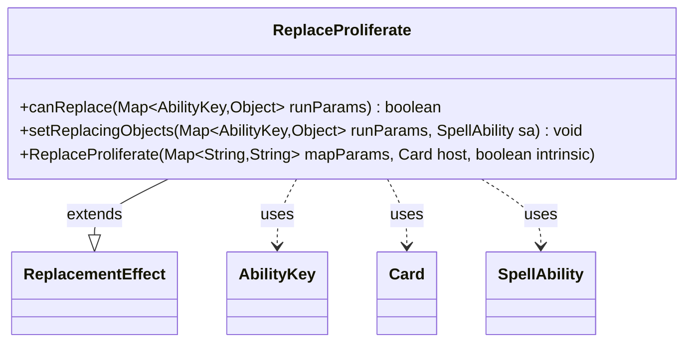

---
aliases:
  - ReplaceProliferate
tags:
  - java/class
  - module/forge-game
  - pkg/forge/game/replacement
fqn: forge.game.replacement.ReplaceProliferate
package: forge.game.replacement
module: forge-game
kind: Class
---

# ReplaceProliferate

**Package:** `forge.game.replacement`   **Module:** `forge-game`   **Kind:** Class



## Relationships
**Extends:**
- [[forge.game.replacement.ReplacementEffect|ReplacementEffect]]
**Uses:**
- [[forge.game.ability.AbilityKey|AbilityKey]]
- [[forge.game.card.Card|Card]]
- [[forge.game.spellability.SpellAbility|SpellAbility]]

## Design Description

ReplaceProliferate is a concrete replacement effect that intercepts proliferate events, deciding whether the engine should apply or replace a proliferate action affecting a player. Extending ReplacementEffect, it overrides `canReplace` to gate on the event's parameters—rejecting non-positive counter counts and enforcing the optional `ValidPlayer` restriction via the inherited `matchesValidParam` helper—and `setReplacingObjects` to publish the affected player and count back onto the triggering SpellAbility under standard AbilityKey slots. It collaborates with AbilityKey to read and write the typed run-parameter map, Card as its host, and SpellAbility as the effect's execution context. The design keeps the class a thin, data-driven specialization: behavior is parameterized through the constructor's `mapParams`, leaving matching and substitution logic to the base class.

## Source
`forge-game/src/main/java/forge/game/replacement/ReplaceProliferate.java`

```java
package forge.game.replacement;

import java.util.Map;

import forge.game.ability.AbilityKey;
import forge.game.card.Card;
import forge.game.spellability.SpellAbility;

/**
 * TODO: Write javadoc for this type.
 *
 */
public class ReplaceProliferate extends ReplacementEffect {

    /**
     *
     * @param mapParams &emsp; HashMap<String, String>
     * @param host &emsp; Card
     */
    public ReplaceProliferate(final Map<String, String> mapParams, final Card host, final boolean intrinsic) {
        super(mapParams, host, intrinsic);
    }

    /* (non-Javadoc)
     * @see forge.card.replacement.ReplacementEffect#canReplace(java.util.Map)
     */
    @Override
    public boolean canReplace(Map<AbilityKey, Object> runParams) {
        if (((int) runParams.get(AbilityKey.Num)) <= 0) {
            return false;
        }

        if (!matchesValidParam("ValidPlayer", runParams.get(AbilityKey.Affected))) {
            return false;
        }

        return true;
    }

    /* (non-Javadoc)
     * @see forge.card.replacement.ReplacementEffect#setReplacingObjects(java.util.Map, forge.card.spellability.SpellAbility)
     */
    @Override
    public void setReplacingObjects(Map<AbilityKey, Object> runParams, SpellAbility sa) {
        sa.setReplacingObject(AbilityKey.Player, runParams.get(AbilityKey.Affected));
        sa.setReplacingObject(AbilityKey.Num, runParams.get(AbilityKey.Num));
    }

}
```

## Python
`forge/game/replacement/ReplaceProliferate.py`

```python
from typing import Map

from forge.game.replacement.ReplacementEffect import ReplacementEffect
from forge.game.ability.AbilityKey import AbilityKey
from forge.game.card.Card import Card
from forge.game.spellability.SpellAbility import SpellAbility


# TODO: Write javadoc for this type.
class ReplaceProliferate(ReplacementEffect):

    def __init__(self, mapParams: dict[str, str], host: Card, intrinsic: bool):
        """
        :param mapParams: HashMap<String, String>
        :param host: Card
        """
        super().__init__(mapParams, host, intrinsic)

    def canReplace(self, runParams: dict[AbilityKey, object]) -> bool:
        if int(runParams.get(AbilityKey.Num)) <= 0:
            return False

        if not self.matchesValidParam("ValidPlayer", runParams.get(AbilityKey.Affected)):
            return False

        return True

    def setReplacingObjects(self, runParams: dict[AbilityKey, object], sa: SpellAbility) -> None:
        sa.setReplacingObject(AbilityKey.Player, runParams.get(AbilityKey.Affected))
        sa.setReplacingObject(AbilityKey.Num, runParams.get(AbilityKey.Num))
```
