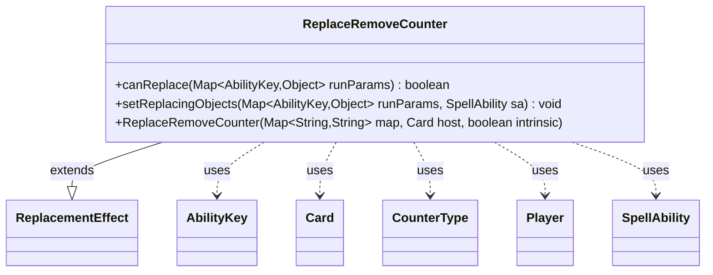

---
aliases:
  - ReplaceRemoveCounter
tags:
  - java/class
  - module/forge-game
  - pkg/forge/game/replacement
fqn: forge.game.replacement.ReplaceRemoveCounter
package: forge.game.replacement
module: forge-game
kind: Class
---

# ReplaceRemoveCounter

**Package:** `forge.game.replacement` &nbsp; **Module:** `forge-game` &nbsp; **Kind:** Class



## Relationships
**Extends:**
- [[forge.game.replacement.ReplacementEffect|ReplacementEffect]]
**Uses:**
- [[forge.game.ability.AbilityKey|AbilityKey]]
- [[forge.game.card.Card|Card]]
- [[forge.game.card.CounterType|CounterType]]
- [[forge.game.player.Player|Player]]
- [[forge.game.spellability.SpellAbility|SpellAbility]]

## Source
`forge-game/src/main/java/forge/game/replacement/ReplaceRemoveCounter.java`

```java
package forge.game.replacement;

import forge.game.ability.AbilityKey;
import forge.game.card.Card;
import forge.game.card.CounterType;
import forge.game.player.Player;
import forge.game.spellability.SpellAbility;
import forge.util.Expressions;

import java.util.Map;

public class ReplaceRemoveCounter extends ReplacementEffect {

    /**
     * Instantiates a new replace counters removed.
     *
     * @param map  the map
     * @param host the host
     */
    public ReplaceRemoveCounter(Map<String, String> map, Card host, boolean intrinsic) {
        super(map, host, intrinsic);
    }

    /* (non-Javadoc)
     * @see forge.card.replacement.ReplacementEffect#canReplace(java.util.HashMap)
     */
    @Override
    public boolean canReplace(Map<AbilityKey, Object> runParams) {
        if (!matchesValidParam("ValidCard", runParams.get(AbilityKey.Affected))) {
            return false;
        }
        if (hasParam("IsDamage")) {
            if (getParam("IsDamage").equals("True") != ((Boolean) runParams.get(AbilityKey.IsDamage))) {
                return false;
            }
        }
        if (hasParam("ValidCounterType")) {
            final CounterType cType = (CounterType) runParams.get(AbilityKey.CounterType);
            final String type = getParam("ValidCounterType");
            if (!type.equals(cType.toString())) {
                return false;
            }
        }
        if (hasParam("Result")) {
            final int n = (Integer)runParams.get(AbilityKey.Result);
            String comparator = getParam("Result");
            final String operator = comparator.substring(0, 2);
            final int operandValue = Integer.parseInt(comparator.substring(2));
            if (!Expressions.compare(n, operator, operandValue)) {
                return false;
            }
        }
        return true;
    }

    /* (non-Javadoc)
     * @see forge.card.replacement.ReplacementEffect#setReplacingObjects(java.util.HashMap, forge.card.spellability.SpellAbility)
     */
    @Override
    public void setReplacingObjects(Map<AbilityKey, Object> runParams, SpellAbility sa) {
        sa.setReplacingObject(AbilityKey.CounterMap, runParams.get(AbilityKey.CounterMap));
        Object o = runParams.get(AbilityKey.Affected);
        if (o instanceof Card) {
            sa.setReplacingObject(AbilityKey.Card, o);
        } else if (o instanceof Player) {
            sa.setReplacingObject(AbilityKey.Player, o);
        }
        sa.setReplacingObject(AbilityKey.Object, o);
    }
}
```
