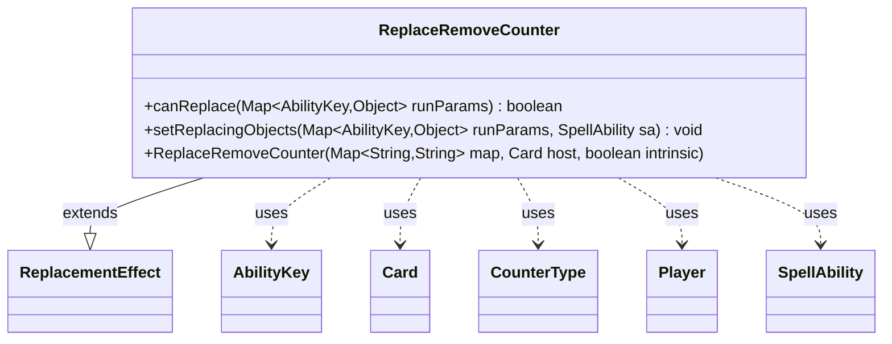

---
aliases:
  - ReplaceRemoveCounter
tags:
  - java/class
  - module/forge-game
  - pkg/forge/game/replacement
fqn: forge.game.replacement.ReplaceRemoveCounter
package: forge.game.replacement
module: forge-game
kind: Class
---

# ReplaceRemoveCounter

**Package:** `forge.game.replacement`   **Module:** `forge-game`   **Kind:** Class



## Relationships
**Extends:**
- [[forge.game.replacement.ReplacementEffect|ReplacementEffect]]
**Uses:**
- [[forge.game.ability.AbilityKey|AbilityKey]]
- [[forge.game.card.Card|Card]]
- [[forge.game.card.CounterType|CounterType]]
- [[forge.game.player.Player|Player]]
- [[forge.game.spellability.SpellAbility|SpellAbility]]

## Design Description

ReplaceRemoveCounter is a concrete replacement effect that intercepts attempts to remove counters from a permanent or player, allowing card scripts to modify or prevent that removal. Extending ReplacementEffect, it overrides canReplace to gate activation by matching the affected object against ValidCard, optionally constraining on whether the removal stems from damage, the specific CounterType involved, and a comparator-based check on the resulting count (via Expressions). Its setReplacingObjects populates the SpellAbility with the relevant replacing objects—the CounterMap plus the affected entity bound as either Card or Player and generically as Object. Collaborating with AbilityKey-keyed run-parameter maps, it follows the engine's data-driven design: behavior is configured through string parameters rather than subclassing, keeping the class a thin, declarative bridge between scripted counter-removal triggers and the replacement framework.

## Source
`forge-game/src/main/java/forge/game/replacement/ReplaceRemoveCounter.java`

```java
package forge.game.replacement;

import forge.game.ability.AbilityKey;
import forge.game.card.Card;
import forge.game.card.CounterType;
import forge.game.player.Player;
import forge.game.spellability.SpellAbility;
import forge.util.Expressions;

import java.util.Map;

public class ReplaceRemoveCounter extends ReplacementEffect {

    /**
     * Instantiates a new replace counters removed.
     *
     * @param map  the map
     * @param host the host
     */
    public ReplaceRemoveCounter(Map<String, String> map, Card host, boolean intrinsic) {
        super(map, host, intrinsic);
    }

    /* (non-Javadoc)
     * @see forge.card.replacement.ReplacementEffect#canReplace(java.util.HashMap)
     */
    @Override
    public boolean canReplace(Map<AbilityKey, Object> runParams) {
        if (!matchesValidParam("ValidCard", runParams.get(AbilityKey.Affected))) {
            return false;
        }
        if (hasParam("IsDamage")) {
            if (getParam("IsDamage").equals("True") != ((Boolean) runParams.get(AbilityKey.IsDamage))) {
                return false;
            }
        }
        if (hasParam("ValidCounterType")) {
            final CounterType cType = (CounterType) runParams.get(AbilityKey.CounterType);
            final String type = getParam("ValidCounterType");
            if (!type.equals(cType.toString())) {
                return false;
            }
        }
        if (hasParam("Result")) {
            final int n = (Integer)runParams.get(AbilityKey.Result);
            String comparator = getParam("Result");
            final String operator = comparator.substring(0, 2);
            final int operandValue = Integer.parseInt(comparator.substring(2));
            if (!Expressions.compare(n, operator, operandValue)) {
                return false;
            }
        }
        return true;
    }

    /* (non-Javadoc)
     * @see forge.card.replacement.ReplacementEffect#setReplacingObjects(java.util.HashMap, forge.card.spellability.SpellAbility)
     */
    @Override
    public void setReplacingObjects(Map<AbilityKey, Object> runParams, SpellAbility sa) {
        sa.setReplacingObject(AbilityKey.CounterMap, runParams.get(AbilityKey.CounterMap));
        Object o = runParams.get(AbilityKey.Affected);
        if (o instanceof Card) {
            sa.setReplacingObject(AbilityKey.Card, o);
        } else if (o instanceof Player) {
            sa.setReplacingObject(AbilityKey.Player, o);
        }
        sa.setReplacingObject(AbilityKey.Object, o);
    }
}
```

## Python
`forge/game/replacement/ReplaceRemoveCounter.py`

```python
from forge.game.replacement.ReplacementEffect import ReplacementEffect
from forge.game.ability.AbilityKey import AbilityKey
from forge.game.card.Card import Card
from forge.game.card.CounterType import CounterType
from forge.game.player.Player import Player
from forge.game.spellability.SpellAbility import SpellAbility
from forge.util.Expressions import Expressions


class ReplaceRemoveCounter(ReplacementEffect):

    def __init__(self, map: dict[str, str], host: Card, intrinsic: bool):
        """
        Instantiates a new replace counters removed.

        :param map:  the map
        :param host: the host
        """
        super().__init__(map, host, intrinsic)

    def canReplace(self, runParams: dict[AbilityKey, object]) -> bool:
        if not self.matchesValidParam("ValidCard", runParams.get(AbilityKey.Affected)):
            return False
        if self.hasParam("IsDamage"):
            if (self.getParam("IsDamage") == "True") != bool(runParams.get(AbilityKey.IsDamage)):
                return False
        if self.hasParam("ValidCounterType"):
            cType = runParams.get(AbilityKey.CounterType)
            type = self.getParam("ValidCounterType")
            if type != str(cType):
                return False
        if self.hasParam("Result"):
            n = int(runParams.get(AbilityKey.Result))
            comparator = self.getParam("Result")
            operator = comparator[0:2]
            operandValue = int(comparator[2:])
            if not Expressions.compare(n, operator, operandValue):
                return False
        return True

    def setReplacingObjects(self, runParams: dict[AbilityKey, object], sa: SpellAbility) -> None:
        sa.setReplacingObject(AbilityKey.CounterMap, runParams.get(AbilityKey.CounterMap))
        o = runParams.get(AbilityKey.Affected)
        if isinstance(o, Card):
            sa.setReplacingObject(AbilityKey.Card, o)
        elif isinstance(o, Player):
            sa.setReplacingObject(AbilityKey.Player, o)
        sa.setReplacingObject(AbilityKey.Object, o)
```
