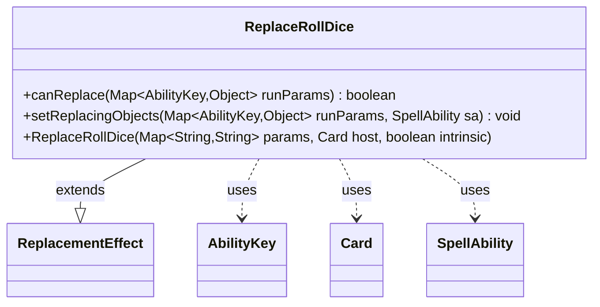

---
aliases:
  - ReplaceRollDice
tags:
  - java/class
  - module/forge-game
  - pkg/forge/game/replacement
fqn: forge.game.replacement.ReplaceRollDice
package: forge.game.replacement
module: forge-game
kind: Class
---

# ReplaceRollDice

**Package:** `forge.game.replacement`   **Module:** `forge-game`   **Kind:** Class



## Relationships
**Extends:**
- [[forge.game.replacement.ReplacementEffect|ReplacementEffect]]
**Uses:**
- [[forge.game.ability.AbilityKey|AbilityKey]]
- [[forge.game.card.Card|Card]]
- [[forge.game.spellability.SpellAbility|SpellAbility]]

## Design Description

ReplaceRollDice is a concrete replacement effect that intercepts dice-roll events in Forge's game engine, allowing card abilities to modify or substitute the outcome of a die roll before it resolves. Extending `ReplacementEffect`, it implements the standard `canReplace`/`setReplacingObjects` contract: `canReplace` gates the effect by validating the affected player and, optionally, matching a required die size via the `ValidSides` parameter, while `setReplacingObjects` exposes the roll's mutable details—the rolled number, ignore flags, and any die power/toughness exchanges—on the triggering `SpellAbility` for downstream resolution.

It collaborates with `AbilityKey` as the typed key into the replacement run-parameter map, `Card` as its host, and `SpellAbility` as the carrier of replacing objects. The design keeps the class declarative and data-driven, deriving all matching behavior from string parameters rather than hard-coded logic, consistent with Forge's parameterized replacement-effect framework.

## Source
`forge-game/src/main/java/forge/game/replacement/ReplaceRollDice.java`

```java
package forge.game.replacement;

import forge.game.ability.AbilityKey;
import forge.game.card.Card;
import forge.game.spellability.SpellAbility;

import java.util.Map;

public class ReplaceRollDice extends ReplacementEffect {

    /**
     * Instantiates a new replace roll planar dice.
     *
     * @param params the params
     * @param host   the host
     */
    public ReplaceRollDice(final Map<String, String> params, final Card host, final boolean intrinsic) {
        super(params, host, intrinsic);
    }

    /* (non-Javadoc)
     * @see forge.card.replacement.ReplacementEffect#canReplace(java.util.HashMap)
     */
    @Override
    public boolean canReplace(Map<AbilityKey, Object> runParams) {
        if (!matchesValidParam("ValidPlayer", runParams.get(AbilityKey.Affected))) {
            return false;
        }
        if (hasParam("ValidSides")) {
            if (((Integer) runParams.get(AbilityKey.Sides)) != Integer.parseInt(getParam("ValidSides"))) {
                return false;
            }
        }
        return true;
    }

    /* (non-Javadoc)
     * @see forge.card.replacement.ReplacementEffect#setReplacingObjects(java.util.Map, forge.card.spellability.SpellAbility)
     */
    @Override
    public void setReplacingObjects(Map<AbilityKey, Object> runParams, SpellAbility sa) {
        sa.setReplacingObject(AbilityKey.Number, runParams.get(AbilityKey.Number));
        sa.setReplacingObject(AbilityKey.Ignore, runParams.get(AbilityKey.Ignore));
        sa.setReplacingObject(AbilityKey.IgnoreChosen, runParams.get(AbilityKey.IgnoreChosen));
        sa.setReplacingObject(AbilityKey.DicePTExchanges, runParams.get(AbilityKey.DicePTExchanges));
    }
}
```

## Python
`forge/game/replacement/ReplaceRollDice.py`

```python
from forge.game.replacement.ReplacementEffect import ReplacementEffect
from forge.game.ability.AbilityKey import AbilityKey
from forge.game.card.Card import Card
from forge.game.spellability.SpellAbility import SpellAbility

from typing import Map


class ReplaceRollDice(ReplacementEffect):

    def __init__(self, params: dict[str, str], host: Card, intrinsic: bool):
        """
        Instantiates a new replace roll planar dice.

        :param params: the params
        :param host:   the host
        """
        super().__init__(params, host, intrinsic)

    # (non-Javadoc)
    # @see forge.card.replacement.ReplacementEffect#canReplace(java.util.HashMap)
    def canReplace(self, runParams: dict[AbilityKey, object]) -> bool:
        if not self.matchesValidParam("ValidPlayer", runParams.get(AbilityKey.Affected)):
            return False
        if self.hasParam("ValidSides"):
            if int(runParams.get(AbilityKey.Sides)) != int(self.getParam("ValidSides")):
                return False
        return True

    # (non-Javadoc)
    # @see forge.card.replacement.ReplacementEffect#setReplacingObjects(java.util.Map, forge.card.spellability.SpellAbility)
    def setReplacingObjects(self, runParams: dict[AbilityKey, object], sa: SpellAbility) -> None:
        sa.setReplacingObject(AbilityKey.Number, runParams.get(AbilityKey.Number))
        sa.setReplacingObject(AbilityKey.Ignore, runParams.get(AbilityKey.Ignore))
        sa.setReplacingObject(AbilityKey.IgnoreChosen, runParams.get(AbilityKey.IgnoreChosen))
        sa.setReplacingObject(AbilityKey.DicePTExchanges, runParams.get(AbilityKey.DicePTExchanges))
```
