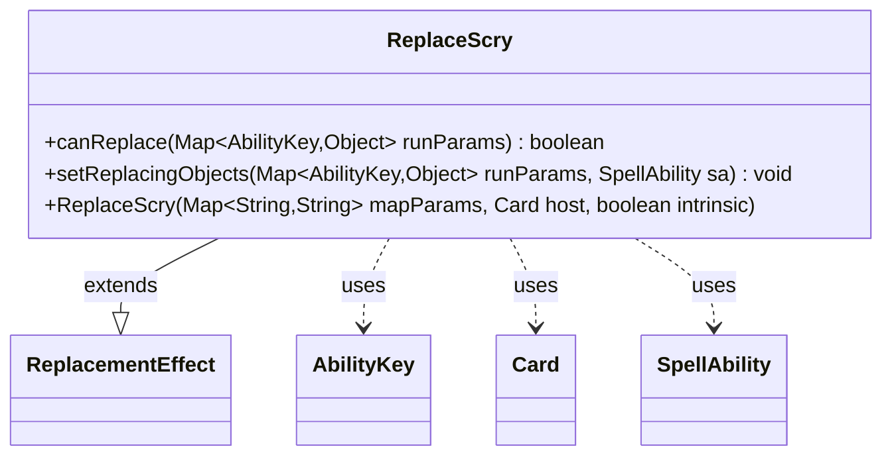

---
aliases:
  - ReplaceScry
tags:
  - java/class
  - module/forge-game
  - pkg/forge/game/replacement
fqn: forge.game.replacement.ReplaceScry
package: forge.game.replacement
module: forge-game
kind: Class
---

# ReplaceScry

**Package:** `forge.game.replacement` &nbsp; **Module:** `forge-game` &nbsp; **Kind:** Class



## Relationships
**Extends:**
- [[forge.game.replacement.ReplacementEffect|ReplacementEffect]]
**Uses:**
- [[forge.game.ability.AbilityKey|AbilityKey]]
- [[forge.game.card.Card|Card]]
- [[forge.game.spellability.SpellAbility|SpellAbility]]

## Design Description

Forge's ReplaceScry is a concrete replacement effect that intercepts scry events, allowing the engine to substitute or condition how a player scries. Extending ReplacementEffect, it inherits the host card, parameter map, and intrinsic flag through its constructor, fitting into the data-driven replacement framework that matches scripted effects against game events. Its canReplace method gates activation, requiring a positive scry count (AbilityKey.Num) and validating the affected player against the "ValidPlayer" parameter via the inherited matchesValidParam helper. The setReplacingObjects method then exposes the affected player and scry amount as replacing objects on the resolving SpellAbility, so downstream scripting can reference them through AbilityKey. It collaborates with Card as its host, AbilityKey for typed runtime parameters, and SpellAbility as the replacement vehicle, keeping scry-specific logic isolated within the generic effect hierarchy.

## Source
`forge-game/src/main/java/forge/game/replacement/ReplaceScry.java`

```java
package forge.game.replacement;

import java.util.Map;

import forge.game.ability.AbilityKey;
import forge.game.card.Card;
import forge.game.spellability.SpellAbility;

/**
 * TODO: Write javadoc for this type.
 *
 */
public class ReplaceScry extends ReplacementEffect {

    /**
     *
     * @param mapParams &emsp; HashMap<String, String>
     * @param host &emsp; Card
     */
    public ReplaceScry(final Map<String, String> mapParams, final Card host, final boolean intrinsic) {
        super(mapParams, host, intrinsic);
    }

    /* (non-Javadoc)
     * @see forge.card.replacement.ReplacementEffect#canReplace(java.util.Map)
     */
    @Override
    public boolean canReplace(Map<AbilityKey, Object> runParams) {
        if (((int) runParams.get(AbilityKey.Num)) <= 0) {
            return false;
        }

        if (!matchesValidParam("ValidPlayer", runParams.get(AbilityKey.Affected))) {
            return false;
        }

        return true;
    }

    /* (non-Javadoc)
     * @see forge.card.replacement.ReplacementEffect#setReplacingObjects(java.util.Map, forge.card.spellability.SpellAbility)
     */
    @Override
    public void setReplacingObjects(Map<AbilityKey, Object> runParams, SpellAbility sa) {
        sa.setReplacingObject(AbilityKey.Player, runParams.get(AbilityKey.Affected));
        sa.setReplacingObject(AbilityKey.Num, runParams.get(AbilityKey.Num));
    }

}
```

## Python
`forge/game/replacement/ReplaceScry.py`

```python
from typing import Map

from forge.game.replacement.ReplacementEffect import ReplacementEffect
from forge.game.ability.AbilityKey import AbilityKey
from forge.game.card.Card import Card
from forge.game.spellability.SpellAbility import SpellAbility


# TODO: Write javadoc for this type.
#
class ReplaceScry(ReplacementEffect):

    #
    # @param mapParams   HashMap<String, String>
    # @param host        Card
    #
    def __init__(self, mapParams: dict[str, str], host: Card, intrinsic: bool):
        super().__init__(mapParams, host, intrinsic)

    # (non-Javadoc)
    # @see forge.card.replacement.ReplacementEffect#canReplace(java.util.Map)
    def canReplace(self, runParams: dict[AbilityKey, object]) -> bool:
        if int(runParams.get(AbilityKey.Num)) <= 0:
            return False

        if not self.matchesValidParam("ValidPlayer", runParams.get(AbilityKey.Affected)):
            return False

        return True

    # (non-Javadoc)
    # @see forge.card.replacement.ReplacementEffect#setReplacingObjects(java.util.Map, forge.card.spellability.SpellAbility)
    def setReplacingObjects(self, runParams: dict[AbilityKey, object], sa: SpellAbility) -> None:
        sa.setReplacingObject(AbilityKey.Player, runParams.get(AbilityKey.Affected))
        sa.setReplacingObject(AbilityKey.Num, runParams.get(AbilityKey.Num))
```
