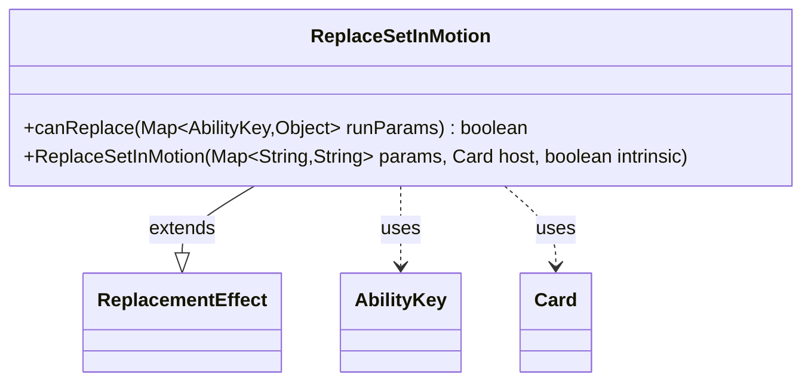

---
aliases:
  - ReplaceSetInMotion
tags:
  - java/class
  - module/forge-game
  - pkg/forge/game/replacement
fqn: forge.game.replacement.ReplaceSetInMotion
package: forge.game.replacement
module: forge-game
kind: Class
---

# ReplaceSetInMotion

**Package:** `forge.game.replacement`   **Module:** `forge-game`   **Kind:** Class



## Relationships
**Extends:**
- [[forge.game.replacement.ReplacementEffect|ReplacementEffect]]
**Uses:**
- [[forge.game.ability.AbilityKey|AbilityKey]]
- [[forge.game.card.Card|Card]]

## Design Description

ReplaceSetInMotion is a concrete replacement effect that intercepts the "set in motion" game event—the mechanic by which an ongoing scheme card is put into play and activated during the Archenemy format. As a subclass of ReplacementEffect, it inherits the framework for substituting one game outcome for another and supplies the single piece of custom logic the framework requires: a canReplace check that confirms the affected player matches the effect's configured ValidPlayer constraint before the replacement may apply.

Its design is deliberately minimal. The constructor simply forwards its params, host Card, and intrinsic flag to the superclass, while the only behavioral override delegates filtering to the inherited matchesValidParam helper, reading the affected entity through the AbilityKey-keyed runtime parameter map. By relying on Card and AbilityKey purely as collaborators and pushing all replacement orchestration up to ReplacementEffect, the class keeps event-specific matching narrowly scoped and consistent with the engine's other replacement-effect implementations.

## Source
`forge-game/src/main/java/forge/game/replacement/ReplaceSetInMotion.java`

```java
/*
 * Forge: Play Magic: the Gathering.
 * Copyright (C) 2011  Forge Team
 *
 * This program is free software: you can redistribute it and/or modify
 * it under the terms of the GNU General Public License as published by
 * the Free Software Foundation, either version 3 of the License, or
 * (at your option) any later version.
 * 
 * This program is distributed in the hope that it will be useful,
 * but WITHOUT ANY WARRANTY; without even the implied warranty of
 * MERCHANTABILITY or FITNESS FOR A PARTICULAR PURPOSE.  See the
 * GNU General Public License for more details.
 * 
 * You should have received a copy of the GNU General Public License
 * along with this program.  If not, see <http://www.gnu.org/licenses/>.
 */
package forge.game.replacement;

import java.util.Map;

import forge.game.ability.AbilityKey;
import forge.game.card.Card;

/** 
 * TODO: Write javadoc for this type.
 *
 */
public class ReplaceSetInMotion extends ReplacementEffect {

    /**
     * Instantiates a new replace draw.
     *
     * @param params the params
     * @param host the host
     */
    public ReplaceSetInMotion(final Map<String, String> params, final Card host, final boolean intrinsic) {
        super(params, host, intrinsic);
    }

    /* (non-Javadoc)
     * @see forge.card.replacement.ReplacementEffect#canReplace(java.util.HashMap)
     */
    @Override
    public boolean canReplace(Map<AbilityKey, Object> runParams) {
        if (!matchesValidParam("ValidPlayer", runParams.get(AbilityKey.Affected))) {
            return false;
        }

        return true;
    }

}
```

## Python
`forge/game/replacement/ReplaceSetInMotion.py`

```python
/*
 * Forge: Play Magic: the Gathering.
 * Copyright (C) 2011  Forge Team
 *
 * This program is free software: you can redistribute it and/or modify
 * it under the terms of the GNU General Public License as published by
 * the Free Software Foundation, either version 3 of the License, or
 * (at your option) any later version.
 *
 * This program is distributed in the hope that it will be useful,
 * but WITHOUT ANY WARRANTY; without even the implied warranty of
 * MERCHANTABILITY or FITNESS FOR A PARTICULAR PURPOSE.  See the
 * GNU General Public License for more details.
 *
 * You should have received a copy of the GNU General Public License
 * along with this program.  If not, see <http://www.gnu.org/licenses/>.
 */
from typing import Map

from forge.game.ability.AbilityKey import AbilityKey
from forge.game.card.Card import Card
from forge.game.replacement.ReplacementEffect import ReplacementEffect


# TODO: Write javadoc for this type.
class ReplaceSetInMotion(ReplacementEffect):

    def __init__(self, params: dict[str, str], host: Card, intrinsic: bool):
        """Instantiates a new replace draw.

        :param params: the params
        :param host: the host
        """
        super().__init__(params, host, intrinsic)

    def canReplace(self, runParams: dict[AbilityKey, object]) -> bool:
        if not self.matchesValidParam("ValidPlayer", runParams.get(AbilityKey.Affected)):
            return False

        return True
```
