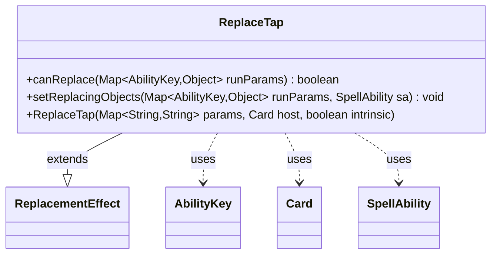

---
aliases:
  - ReplaceTap
tags:
  - java/class
  - module/forge-game
  - pkg/forge/game/replacement
fqn: forge.game.replacement.ReplaceTap
package: forge.game.replacement
module: forge-game
kind: Class
---

# ReplaceTap

**Package:** `forge.game.replacement`   **Module:** `forge-game`   **Kind:** Class



## Relationships
**Extends:**
- [[forge.game.replacement.ReplacementEffect|ReplacementEffect]]
**Uses:**
- [[forge.game.ability.AbilityKey|AbilityKey]]
- [[forge.game.card.Card|Card]]
- [[forge.game.spellability.SpellAbility|SpellAbility]]

## Design Description

The class ReplaceTap is a concrete replacement effect that intercepts tap events in Forge's MTG rules engine, allowing card abilities to prevent or substitute a permanent's tapping. Extending ReplacementEffect, it implements the standard replacement contract: canReplace evaluates whether a given event matches the effect's configured conditions—checking the affected card against the "ValidCard" filter and optionally requiring a combat ("Attacker") context—while setReplacingObjects exposes the affected card as the replacement's Card object for downstream resolution.

It collaborates with AbilityKey to read and write typed entries in the runtime parameter map, Card as its host permanent, and SpellAbility as the replacing ability. Configuration is data-driven through inherited param maps, keeping tap-replacement behavior declarative rather than hard-coded, consistent with the engine's broader replacement-effect framework.

## Source
`forge-game/src/main/java/forge/game/replacement/ReplaceTap.java`

```java
package forge.game.replacement;

import java.util.Map;

import forge.game.ability.AbilityKey;
import forge.game.card.Card;
import forge.game.spellability.SpellAbility;

/**
 * TODO: Write javadoc for this type.
 *
 */
public class ReplaceTap extends ReplacementEffect {

    /**
     * Instantiates a new replace tap.
     *
     * @param params the params
     * @param host the host
     */
    public ReplaceTap(final Map<String, String> params, final Card host, final boolean intrinsic) {
        super(params, host, intrinsic);
    }

    /* (non-Javadoc)
     * @see forge.card.replacement.ReplacementEffect#canReplace(java.util.HashMap)
     */
    @Override
    public boolean canReplace(Map<AbilityKey, Object> runParams) {
        if (!matchesValidParam("ValidCard", runParams.get(AbilityKey.Affected))) {
            return false;
        }

        if (hasParam("Attacker")) {
            if (getParam("Attacker").equalsIgnoreCase("True") != (boolean) runParams.get(AbilityKey.IsCombat)) {
                return false;
            }
        }

        return true;
    }

    /* (non-Javadoc)
     * @see forge.card.replacement.ReplacementEffect#setReplacingObjects(java.util.HashMap, forge.card.spellability.SpellAbility)
     */
    @Override
    public void setReplacingObjects(Map<AbilityKey, Object> runParams, SpellAbility sa) {
        sa.setReplacingObject(AbilityKey.Card, runParams.get(AbilityKey.Affected));
    }

}
```

## Python
`forge/game/replacement/ReplaceTap.py`

```python
package forge.game.replacement; let me produce the Python port.

The module path for ReplaceTap is forge.game.replacement.ReplaceTap. Let me write the Python.from typing import Any, Dict

from forge.game.replacement.ReplacementEffect import ReplacementEffect
from forge.game.ability.AbilityKey import AbilityKey
from forge.game.card.Card import Card
from forge.game.spellability.SpellAbility import SpellAbility


# TODO: Write javadoc for this type.
class ReplaceTap(ReplacementEffect):

    def __init__(self, params: Dict[str, str], host: Card, intrinsic: bool):
        """Instantiates a new replace tap.

        :param params: the params
        :param host: the host
        """
        super().__init__(params, host, intrinsic)

    def canReplace(self, runParams: Dict[AbilityKey, Any]) -> bool:
        if not self.matchesValidParam("ValidCard", runParams.get(AbilityKey.Affected)):
            return False

        if self.hasParam("Attacker"):
            if self.getParam("Attacker").equalsIgnoreCase("True") != bool(runParams.get(AbilityKey.IsCombat)):
                return False

        return True

    def setReplacingObjects(self, runParams: Dict[AbilityKey, Any], sa: SpellAbility) -> None:
        sa.setReplacingObject(AbilityKey.Card, runParams.get(AbilityKey.Affected))
```
