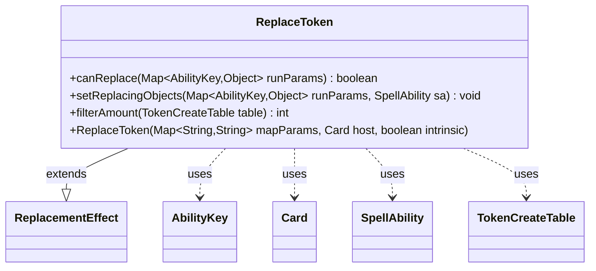

---
aliases:
  - ReplaceToken
tags:
  - java/class
  - module/forge-game
  - pkg/forge/game/replacement
fqn: forge.game.replacement.ReplaceToken
package: forge.game.replacement
module: forge-game
kind: Class
---

# ReplaceToken

**Package:** `forge.game.replacement` &nbsp; **Module:** `forge-game` &nbsp; **Kind:** Class



## Relationships
**Extends:**
- [[forge.game.replacement.ReplacementEffect|ReplacementEffect]]
**Uses:**
- [[forge.game.ability.AbilityKey|AbilityKey]]
- [[forge.game.card.Card|Card]]
- [[forge.game.card.TokenCreateTable|TokenCreateTable]]
- [[forge.game.spellability.SpellAbility|SpellAbility]]

## Design Description

Token replacement effect that extends `ReplacementEffect` to intercept token-creation events and conditionally substitute the number of tokens produced. As a concrete subclass, it implements the engine's replacement-effect contract: `canReplace` decides whether the effect applies by checking the optional `EffectOnly` flag, validating the affected player against the `ValidPlayer` parameter, and confirming that a positive token count survives filtering; `setReplacingObjects` then publishes the filtered token count, source table, cause, and player onto the triggering `SpellAbility` for downstream resolution.

Collaboration is keyed through `AbilityKey` lookups into the runtime parameter map, with the `TokenCreateTable` (retrieved via `AbilityKey.Token`) supplying the filtered amount. The shared `filterAmount` helper centralizes the `ValidPlayer`/`ValidToken` filtering logic so the gating check and the replacement output stay consistent, reflecting a data-driven design where card scripts configure behavior through string parameters interpreted by the inherited base class.

## Source
`forge-game/src/main/java/forge/game/replacement/ReplaceToken.java`

```java
package forge.game.replacement;

import java.util.Map;

import forge.game.ability.AbilityKey;
import forge.game.card.Card;
import forge.game.card.TokenCreateTable;
import forge.game.spellability.SpellAbility;

/** 
 * TODO: Write javadoc for this type.
 *
 */
public class ReplaceToken extends ReplacementEffect {

    /**
     * 
     * ReplaceProduceMana.
     * @param mapParams &emsp; HashMap<String, String>
     * @param host &emsp; Card
     */
    public ReplaceToken(final Map<String, String> mapParams, final Card host, final boolean intrinsic) {
        super(mapParams, host, intrinsic);
    }

    /* (non-Javadoc)
     * @see forge.card.replacement.ReplacementEffect#canReplace(java.util.Map)
     */
    @Override
    public boolean canReplace(Map<AbilityKey, Object> runParams) {
        if (hasParam("EffectOnly")) {
            final Boolean effectOnly = (Boolean) runParams.get(AbilityKey.EffectOnly);
            if (!effectOnly) {
                return false;
            }
        }

        if (!matchesValidParam("ValidPlayer", runParams.get(AbilityKey.Affected))) {
            return false;
        }

        if (filterAmount((TokenCreateTable) runParams.get(AbilityKey.Token)) <= 0) {
            return false;
        }

        return true;
    }

    /* (non-Javadoc)
     * @see forge.card.replacement.ReplacementEffect#setReplacingObjects(java.util.Map, forge.card.spellability.SpellAbility)
     */
    @Override
    public void setReplacingObjects(Map<AbilityKey, Object> runParams, SpellAbility sa) {
        sa.setReplacingObject(AbilityKey.TokenNum, filterAmount((TokenCreateTable) runParams.get(AbilityKey.Token)));
        sa.setReplacingObjectsFrom(runParams, AbilityKey.Token, AbilityKey.Cause);
        sa.setReplacingObject(AbilityKey.Player, runParams.get(AbilityKey.Affected));
    }

    public int filterAmount(final TokenCreateTable table) {
        return table.getFilterAmount(getParamOrDefault("ValidPlayer", null), getParamOrDefault("ValidToken", null), this);
    }
}
```

## Python
`forge/game/replacement/ReplaceToken.py`

```python
package forge.game.replacement → module path forge/game/replacement/ReplaceToken.py

Output only Python source:

from typing import Any

from forge.game.ability.AbilityKey import AbilityKey
from forge.game.card.Card import Card
from forge.game.card.TokenCreateTable import TokenCreateTable
from forge.game.replacement.ReplacementEffect import ReplacementEffect
from forge.game.spellability.SpellAbility import SpellAbility


# TODO: Write javadoc for this type.
class ReplaceToken(ReplacementEffect):

    # ReplaceProduceMana.
    # @param mapParams &emsp; HashMap<String, String>
    # @param host &emsp; Card
    def __init__(self, mapParams: dict[str, str], host: Card, intrinsic: bool):
        super().__init__(mapParams, host, intrinsic)

    def canReplace(self, runParams: dict[AbilityKey, Any]) -> bool:
        if self.hasParam("EffectOnly"):
            effectOnly = runParams.get(AbilityKey.EffectOnly)
            if not effectOnly:
                return False

        if not self.matchesValidParam("ValidPlayer", runParams.get(AbilityKey.Affected)):
            return False

        if self.filterAmount(runParams.get(AbilityKey.Token)) <= 0:
            return False

        return True

    def setReplacingObjects(self, runParams: dict[AbilityKey, Any], sa: SpellAbility) -> None:
        sa.setReplacingObject(AbilityKey.TokenNum, self.filterAmount(runParams.get(AbilityKey.Token)))
        sa.setReplacingObjectsFrom(runParams, AbilityKey.Token, AbilityKey.Cause)
        sa.setReplacingObject(AbilityKey.Player, runParams.get(AbilityKey.Affected))

    def filterAmount(self, table: TokenCreateTable) -> int:
        return table.getFilterAmount(self.getParamOrDefault("ValidPlayer", None), self.getParamOrDefault("ValidToken", None), self)
```
