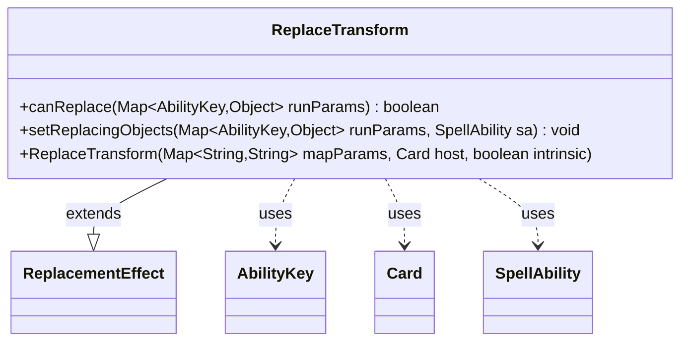

---
aliases:
  - ReplaceTransform
tags:
  - java/class
  - module/forge-game
  - pkg/forge/game/replacement
fqn: forge.game.replacement.ReplaceTransform
package: forge.game.replacement
module: forge-game
kind: Class
---

# ReplaceTransform

**Package:** `forge.game.replacement`   **Module:** `forge-game`   **Kind:** Class



## Relationships
**Extends:**
- [[forge.game.replacement.ReplacementEffect|ReplacementEffect]]
**Uses:**
- [[forge.game.ability.AbilityKey|AbilityKey]]
- [[forge.game.card.Card|Card]]
- [[forge.game.spellability.SpellAbility|SpellAbility]]

## Design Description

Forge's transform-event replacement effect. ReplaceTransform extends ReplacementEffect to intercept the moment a permanent would transform, gating the substitution through a single `ValidCard` predicate matched against the affected card. Its `canReplace` consults the run parameters keyed by AbilityKey.Affected and approves only when that card satisfies the effect's filter, while `setReplacingObjects` publishes the affected card back into the parameter map under AbilityKey.Card so dependent SpellAbility logic can reference it as the replacing object.

Collaborating with Card as the host permanent, AbilityKey as the typed parameter vocabulary, and SpellAbility as the consumer of replacement context, the class deliberately stays minimal—delegating construction and the broader replacement lifecycle to its superclass and contributing only the narrow matching and object-binding behavior specific to transform events.

## Source
`forge-game/src/main/java/forge/game/replacement/ReplaceTransform.java`

```java
package forge.game.replacement;

import java.util.Map;

import forge.game.ability.AbilityKey;
import forge.game.card.Card;
import forge.game.spellability.SpellAbility;

/**
 * TODO: Write javadoc for this type.
 *
 */
public class ReplaceTransform extends ReplacementEffect {

    /**
     *
     * TODO: Write javadoc for Constructor.
     * @param mapParams &emsp; HashMap<String, String>
     * @param host &emsp; Card
     */
    public ReplaceTransform(final Map<String, String> mapParams, final Card host, final boolean intrinsic) {
        super(mapParams, host, intrinsic);
    }

    /* (non-Javadoc)
     * @see forge.card.replacement.ReplacementEffect#canReplace(java.util.HashMap)
     */
    @Override
    public boolean canReplace(Map<AbilityKey, Object> runParams) {
        if (!matchesValidParam("ValidCard", runParams.get(AbilityKey.Affected))) {
            return false;
        }
        return true;
    }

    /* (non-Javadoc)
     * @see forge.card.replacement.ReplacementEffect#setReplacingObjects(java.util.HashMap, forge.card.spellability.SpellAbility)
     */
    @Override
    public void setReplacingObjects(Map<AbilityKey, Object> runParams, SpellAbility sa) {
        sa.setReplacingObject(AbilityKey.Card, runParams.get(AbilityKey.Affected));
    }

}
```

## Python
`forge/game/replacement/ReplaceTransform.py`

```python
from forge.game.ability.AbilityKey import AbilityKey
from forge.game.card.Card import Card
from forge.game.spellability.SpellAbility import SpellAbility
from forge.game.replacement.ReplacementEffect import ReplacementEffect


# TODO: Write javadoc for this type.
class ReplaceTransform(ReplacementEffect):

    # TODO: Write javadoc for Constructor.
    # @param mapParams &emsp; HashMap<String, String>
    # @param host &emsp; Card
    def __init__(self, mapParams: dict[str, str], host: Card, intrinsic: bool):
        super().__init__(mapParams, host, intrinsic)

    # (non-Javadoc)
    # @see forge.card.replacement.ReplacementEffect#canReplace(java.util.HashMap)
    def canReplace(self, runParams: dict[AbilityKey, object]) -> bool:
        if not self.matchesValidParam("ValidCard", runParams.get(AbilityKey.Affected)):
            return False
        return True

    # (non-Javadoc)
    # @see forge.card.replacement.ReplacementEffect#setReplacingObjects(java.util.HashMap, forge.card.spellability.SpellAbility)
    def setReplacingObjects(self, runParams: dict[AbilityKey, object], sa: SpellAbility) -> None:
        sa.setReplacingObject(AbilityKey.Card, runParams.get(AbilityKey.Affected))
```
