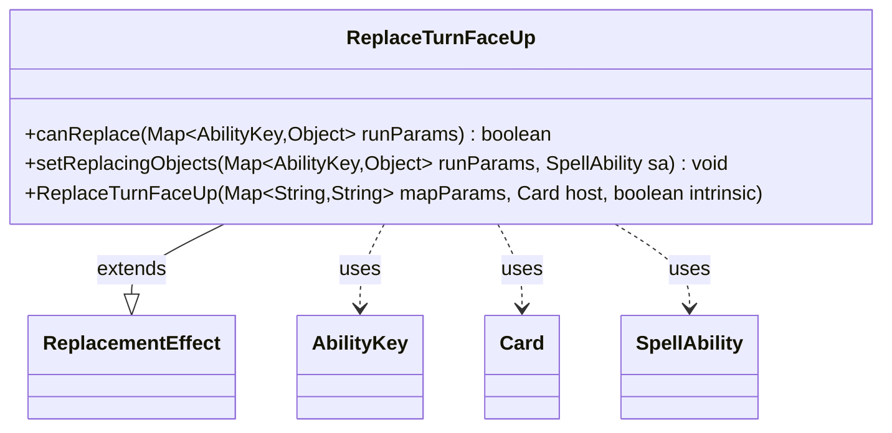

---
aliases:
  - ReplaceTurnFaceUp
tags:
  - java/class
  - module/forge-game
  - pkg/forge/game/replacement
fqn: forge.game.replacement.ReplaceTurnFaceUp
package: forge.game.replacement
module: forge-game
kind: Class
---

# ReplaceTurnFaceUp

**Package:** `forge.game.replacement`   **Module:** `forge-game`   **Kind:** Class



## Relationships
**Extends:**
- [[forge.game.replacement.ReplacementEffect|ReplacementEffect]]
**Uses:**
- [[forge.game.ability.AbilityKey|AbilityKey]]
- [[forge.game.card.Card|Card]]
- [[forge.game.spellability.SpellAbility|SpellAbility]]

## Design Description

Forge's replacement effects use a Card scripting layer where each ReplacementEffect subclass implements one replaceable game event. ReplaceTurnFaceUp handles the turning-face-up of a card (such as a manifested or face-down permanent), intercepting that event so the surrounding effect can react to or modify it.

Extending ReplacementEffect, it inherits parameter storage and host-card binding while overriding the two hooks that define a replacement: canReplace gates the effect by validating the affected card (ValidCard) and the triggering cause (ValidCause) against the run parameters keyed by AbilityKey, and setReplacingObjects publishes the affected card and cause onto the SpellAbility so downstream resolution can reference them. The deliberately thin implementation—delegating construction to the superclass and relying on inherited matchesValidParam matching—keeps event-specific logic minimal and consistent with sibling replacement classes.

## Source
`forge-game/src/main/java/forge/game/replacement/ReplaceTurnFaceUp.java`

```java
package forge.game.replacement;

import java.util.Map;

import forge.game.ability.AbilityKey;
import forge.game.card.Card;
import forge.game.spellability.SpellAbility;

/** 
 * TODO: Write javadoc for this type.
 *
 */
public class ReplaceTurnFaceUp extends ReplacementEffect {

    /**
     * 
     * TODO: Write javadoc for Constructor.
     * @param mapParams &emsp; HashMap<String, String>
     * @param host &emsp; Card
     */
    public ReplaceTurnFaceUp(final Map<String, String> mapParams, final Card host, final boolean intrinsic) {
        super(mapParams, host, intrinsic);
    }

    /* (non-Javadoc)
     * @see forge.card.replacement.ReplacementEffect#canReplace(java.util.HashMap)
     */
    @Override
    public boolean canReplace(Map<AbilityKey, Object> runParams) {
        if (!matchesValidParam("ValidCard", runParams.get(AbilityKey.Affected))) {
            return false;
        }
        if (!matchesValidParam("ValidCause", runParams.get(AbilityKey.Cause))) {
            return false;
        }
        return true;
    }

    /* (non-Javadoc)
     * @see forge.card.replacement.ReplacementEffect#setReplacingObjects(java.util.HashMap, forge.card.spellability.SpellAbility)
     */
    @Override
    public void setReplacingObjects(Map<AbilityKey, Object> runParams, SpellAbility sa) {
        sa.setReplacingObject(AbilityKey.Card, runParams.get(AbilityKey.Affected));
        sa.setReplacingObjectsFrom(runParams, AbilityKey.Cause);
    }

}
```

## Python
`forge/game/replacement/ReplaceTurnFaceUp.py`

```python
package forge.game.replacement

from typing import Any
from forge.game.replacement.ReplacementEffect import ReplacementEffect
from forge.game.ability.AbilityKey import AbilityKey
from forge.game.card.Card import Card
from forge.game.spellability.SpellAbility import SpellAbility


# TODO: Write javadoc for this type.
class ReplaceTurnFaceUp(ReplacementEffect):

    # TODO: Write javadoc for Constructor.
    # @param mapParams &emsp; HashMap<String, String>
    # @param host &emsp; Card
    def __init__(self, mapParams: dict[str, str], host: Card, intrinsic: bool):
        super().__init__(mapParams, host, intrinsic)

    def canReplace(self, runParams: dict[AbilityKey, Any]) -> bool:
        if not self.matchesValidParam("ValidCard", runParams.get(AbilityKey.Affected)):
            return False
        if not self.matchesValidParam("ValidCause", runParams.get(AbilityKey.Cause)):
            return False
        return True

    def setReplacingObjects(self, runParams: dict[AbilityKey, Any], sa: SpellAbility) -> None:
        sa.setReplacingObject(AbilityKey.Card, runParams.get(AbilityKey.Affected))
        sa.setReplacingObjectsFrom(runParams, AbilityKey.Cause)
```
