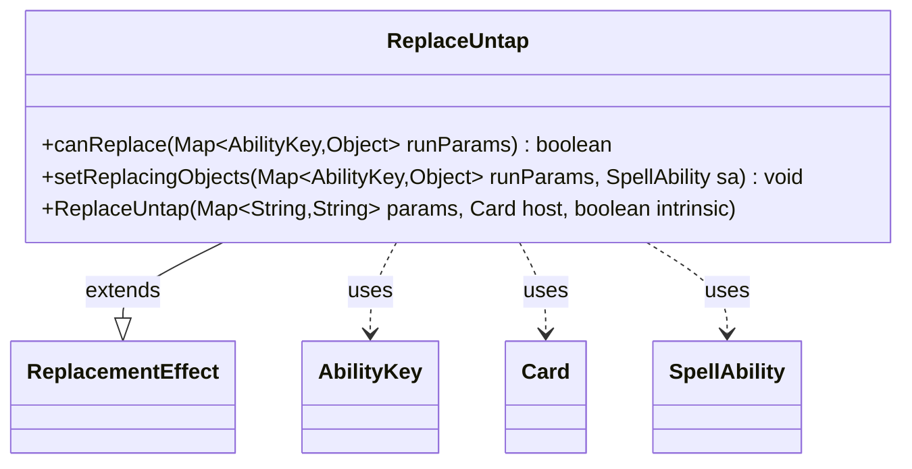

---
aliases:
  - ReplaceUntap
tags:
  - java/class
  - module/forge-game
  - pkg/forge/game/replacement
fqn: forge.game.replacement.ReplaceUntap
package: forge.game.replacement
module: forge-game
kind: Class
---

# ReplaceUntap

**Package:** `forge.game.replacement`   **Module:** `forge-game`   **Kind:** Class



## Relationships
**Extends:**
- [[forge.game.replacement.ReplacementEffect|ReplacementEffect]]
**Uses:**
- [[forge.game.ability.AbilityKey|AbilityKey]]
- [[forge.game.card.Card|Card]]
- [[forge.game.spellability.SpellAbility|SpellAbility]]

## Design Description

ReplaceUntap is a concrete replacement effect that intercepts untap events, deciding whether the engine should substitute its scripted behavior when a permanent would untap. Extending ReplacementEffect, it overrides `canReplace` to gate the effect on the affected Card matching the `ValidCard` filter and, optionally, a `ValidStepTurnToController` constraint that compares against the active player during the untap step—a check deliberately framed so the AI can predict the outcome ahead of time. Its `setReplacingObjects` override exposes the affected permanent back to the triggered SpellAbility under the `Card` key. Collaborating with AbilityKey for typed run-parameter lookups, Card for the affected permanent, and SpellAbility for the replacing ability, the class keeps untap-replacement logic data-driven through inherited parameter-matching helpers rather than hardcoded rules.

## Source
`forge-game/src/main/java/forge/game/replacement/ReplaceUntap.java`

```java
/*
 * Forge: Play Magic: the Gathering.
 * Copyright (C) 2011  Forge Team
 *
 * This program is free software: you can redistribute it and/or modify
 * it under the terms of the GNU General Public License as published by
 * the Free Software Foundation, either version 3 of the License, or
 * (at your option) any later version.
 * 
 * This program is distributed in the hope that it will be useful,
 * but WITHOUT ANY WARRANTY; without even the implied warranty of
 * MERCHANTABILITY or FITNESS FOR A PARTICULAR PURPOSE.  See the
 * GNU General Public License for more details.
 * 
 * You should have received a copy of the GNU General Public License
 * along with this program.  If not, see <http://www.gnu.org/licenses/>.
 */
package forge.game.replacement;

import java.util.Map;

import forge.game.ability.AbilityKey;
import forge.game.card.Card;
import forge.game.spellability.SpellAbility;

/** 
 * TODO: Write javadoc for this type.
 *
 */
public class ReplaceUntap extends ReplacementEffect {

    /**
     * Instantiates a new replace discard.
     *
     * @param params the params
     * @param host the host
     */
    public ReplaceUntap(final Map<String, String> params, final Card host, final boolean intrinsic) {
        super(params, host, intrinsic);
    }

    /* (non-Javadoc)
     * @see forge.card.replacement.ReplacementEffect#canReplace(java.util.HashMap)
     */
    @Override
    public boolean canReplace(Map<AbilityKey, Object> runParams) {
        Card c = (Card) runParams.get(AbilityKey.Affected);
        if (!matchesValidParam("ValidCard", c)) {
            return false;
        }

        // compares based on AP in Unstap step:
        // this allows AI to predict ahead of time
        if (hasParam("ValidStepTurnToController") &&
                !matchesValid(runParams.get(AbilityKey.Player), getParam("ValidStepTurnToController").split(","), getHostCard(), c.getController())) {
            return false;
        }

        return true;
    }

    /* (non-Javadoc)
     * @see forge.card.replacement.ReplacementEffect#setReplacingObjects(java.util.HashMap, forge.card.spellability.SpellAbility)
     */
    @Override
    public void setReplacingObjects(Map<AbilityKey, Object> runParams, SpellAbility sa) {
        sa.setReplacingObject(AbilityKey.Card, runParams.get(AbilityKey.Affected));
    }

}
```

## Python
`forge/game/replacement/ReplaceUntap.py`

```python
from forge.game.replacement.ReplacementEffect import ReplacementEffect
from forge.game.ability.AbilityKey import AbilityKey
from forge.game.card.Card import Card
from forge.game.spellability.SpellAbility import SpellAbility


class ReplaceUntap(ReplacementEffect):
    """
    TODO: Write javadoc for this type.
    """

    def __init__(self, params: dict[str, str], host: Card, intrinsic: bool):
        """
        Instantiates a new replace discard.

        :param params: the params
        :param host: the host
        """
        super().__init__(params, host, intrinsic)

    def canReplace(self, runParams: dict[AbilityKey, object]) -> bool:
        c = runParams.get(AbilityKey.Affected)
        if not self.matchesValidParam("ValidCard", c):
            return False

        # compares based on AP in Unstap step:
        # this allows AI to predict ahead of time
        if self.hasParam("ValidStepTurnToController") and \
                not self.matchesValid(runParams.get(AbilityKey.Player), self.getParam("ValidStepTurnToController").split(","), self.getHostCard(), c.getController()):
            return False

        return True

    def setReplacingObjects(self, runParams: dict[AbilityKey, object], sa: SpellAbility) -> None:
        sa.setReplacingObject(AbilityKey.Card, runParams.get(AbilityKey.Affected))
```
