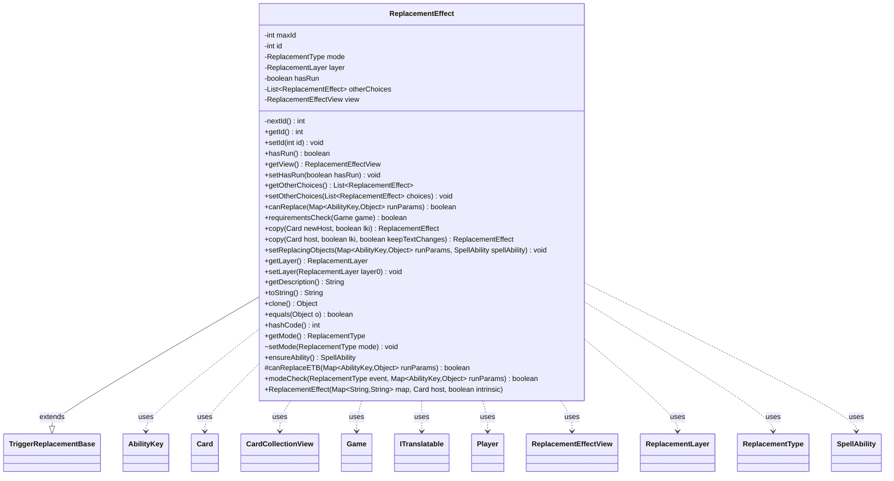

---
aliases:
  - ReplacementEffect
tags:
  - java/class
  - module/forge-game
  - pkg/forge/game/replacement
fqn: forge.game.replacement.ReplacementEffect
package: forge.game.replacement
module: forge-game
kind: Class
---

# ReplacementEffect

**Package:** `forge.game.replacement` &nbsp; **Module:** `forge-game` &nbsp; **Kind:** Class



## Relationships
**Extends:**
- [[forge.game.TriggerReplacementBase|TriggerReplacementBase]]
**Uses:**
- [[forge.game.Game|Game]]
- [[forge.game.ability.AbilityKey|AbilityKey]]
- [[forge.game.card.Card|Card]]
- [[forge.game.card.CardCollectionView|CardCollectionView]]
- [[forge.game.player.Player|Player]]
- [[forge.game.replacement.ReplacementEffectView|ReplacementEffectView]]
- [[forge.game.replacement.ReplacementLayer|ReplacementLayer]]
- [[forge.game.replacement.ReplacementType|ReplacementType]]
- [[forge.game.spellability.SpellAbility|SpellAbility]]
- [[forge.util.ITranslatable|ITranslatable]]

## Design Description

Replacement effects model Magic's "instead" rules: an abstract game element that intercepts a game event and substitutes alternative behavior. Extending TriggerReplacementBase, it shares the host-card, parameter-map, and zone-tracking machinery common to triggers and replacements, while adding replacement-specific state: a unique id, a ReplacementType mode, and a ReplacementLayer governing application order. Subclasses implement the abstract canReplace to decide applicability per event, with requirementsCheck and modeCheck filtering by phase, controller's turn, and event type.

The class collaborates with the Game state, AbilityKey-keyed runtime parameters, and a SpellAbility that supplies the substitute behavior via ensureAbility. Identity rests solely on id, so copy mints fresh ids for non-LKI clones while resetting run state. A lazily built ReplacementEffectView exposes UI state, and getDescription renders translated, token-substituted rules text, signaling a clean separation between game logic and presentation.

## Source
`forge-game/src/main/java/forge/game/replacement/ReplacementEffect.java`

```java
/*
 * Forge: Play Magic: the Gathering.
 * Copyright (C) 2011  Forge Team
 *
 * This program is free software: you can redistribute it and/or modify
 * it under the terms of the GNU General Public License as published by
 * the Free Software Foundation, either version 3 of the License, or
 * (at your option) any later version.
 *
 * This program is distributed in the hope that it will be useful,
 * but WITHOUT ANY WARRANTY; without even the implied warranty of
 * MERCHANTABILITY or FITNESS FOR A PARTICULAR PURPOSE.  See the
 * GNU General Public License for more details.
 *
 * You should have received a copy of the GNU General Public License
 * along with this program.  If not, see <http://www.gnu.org/licenses/>.
 */
package forge.game.replacement;

import java.util.List;
import java.util.Map;
import java.util.Objects;

import com.google.common.collect.*;

import forge.util.ITranslatable;
import org.apache.commons.lang3.StringUtils;

import forge.game.Game;
import forge.game.TriggerReplacementBase;
import forge.game.ability.AbilityFactory;
import forge.game.ability.AbilityKey;
import forge.game.ability.AbilityUtils;
import forge.game.ability.ApiType;
import forge.game.card.Card;
import forge.game.card.CardCollectionView;
import forge.game.phase.PhaseType;
import forge.game.player.Player;
import forge.game.spellability.SpellAbility;
import forge.game.zone.ZoneType;
import forge.util.CardTranslation;
import forge.util.Lang;
import forge.util.TextUtil;

/**
 * TODO: Write javadoc for this type.
 *
 */
public abstract class ReplacementEffect extends TriggerReplacementBase {
    private static int maxId = 0;
    private static int nextId() { return ++maxId; }

    /** The ID. */
    private int id;

    private ReplacementType mode;

    private ReplacementLayer layer = ReplacementLayer.Other;

    /** The has run. */
    private boolean hasRun = false;

    private List<ReplacementEffect> otherChoices = null;
    private ReplacementEffectView view = null;

    /**
     * Gets the id.
     *
     * @return the id
     */
    public int getId() {
        return this.id;
    }

    /**
     * <p>
     * setID.
     * </p>
     *
     * @param id
     *            a int.
     */
    public final void setId(final int id) {
        this.id = id;
    }
    /**
     * Checks for run.
     *
     * @return the hasRun
     */
    public final boolean hasRun() {
        return this.hasRun;
    }

    /**
     * Instantiates a new replacement effect.
     *
     * @param map
     *            the map
     * @param host
     *            the host
     */
    public ReplacementEffect(final Map<String, String> map, final Card host, final boolean intrinsic) {
        this.id = nextId();
        this.intrinsic = intrinsic;
        originalMapParams.putAll(map);
        mapParams.putAll(map);
        this.setHostCard(host);
        if (map.containsKey("Layer")) {
            this.setLayer(ReplacementLayer.smartValueOf(map.get("Layer")));
        }
    }

    public ReplacementEffectView getView() {
        if (view == null)
            view = new ReplacementEffectView(this);
        else {
            view.updateHostCard(this);
            view.updateDescription(this);
        }
        return view;
    }
    /**
     * Sets the checks for run.
     *
     * @param hasRun
     *            the hasRun to set
     */
    public final void setHasRun(final boolean hasRun) {
        this.hasRun = hasRun;
    }

    public List<ReplacementEffect> getOtherChoices() {
        return otherChoices;
    }
    public void setOtherChoices(List<ReplacementEffect> choices) {
        this.otherChoices = choices;
    }

    /**
     * Can replace.
     *
     * @param runParams
     *            the run params
     * @return true, if successful
     */
    public abstract boolean canReplace(final Map<AbilityKey, Object> runParams);

    /**
     * <p>
     * requirementsCheck.
     * </p>
     * @param game
     *
     * @return a boolean.
     */
    public boolean requirementsCheck(Game game) {
        if (this.isSuppressed()) {
            return false; // Effect removed by effect
        }

        if (hasParam("PlayerTurn")) {
            if (getParam("PlayerTurn").equals("True")) {
                if (!game.getPhaseHandler().isPlayerTurn(getHostCard().getController())) {
                    return false;
                }
            } else {
                List<Player> players = AbilityUtils.getDefinedPlayers(getHostCard(), getParam("PlayerTurn"), this);
                if (!players.contains(game.getPhaseHandler().getPlayerTurn())) {
                    return false;
                }
            }
        }

        if (hasParam("ActivePhases")) {
            if (!PhaseType.parseRange(getParam("ActivePhases")).contains(game.getPhaseHandler().getPhase())) {
                return false;
            }
        }

        return meetsCommonRequirements(getMapParams());
    }

    public final ReplacementEffect copy(Card newHost, boolean lki) {
        return copy(newHost, lki, false);
    }
    /**
     * Gets the copy.
     *
     * @return the copy
     */
    public final ReplacementEffect copy(final Card host, final boolean lki, boolean keepTextChanges) {
        final ReplacementEffect res = (ReplacementEffect) clone();

        copyHelper(res, host, lki || keepTextChanges);

        final SpellAbility sa = this.getOverridingAbility();
        if (sa != null) {
            final SpellAbility overridingAbilityCopy = sa.copy(host, lki);
            if (overridingAbilityCopy != null) {
                res.setOverridingAbility(overridingAbilityCopy);
            }
        }

        if (!lki) {
            res.setId(nextId());
            res.setHasRun(false);
            res.setOtherChoices(null);
        }

        res.setActiveZone(validHostZones);
        res.setLayer(getLayer());
        return res;
    }

    /**
     * Sets the replacing objects.
     *  @param runParams
     *            the run params
     * @param spellAbility
     */
    public void setReplacingObjects(final Map<AbilityKey, Object> runParams, final SpellAbility spellAbility) {
        // Should be overridden by replacers that need it.
    }

    /**
     * @return the layer
     */
    public ReplacementLayer getLayer() {
        return layer;
    }

    /**
     * @param layer0 the layer to set
     */
    public void setLayer(ReplacementLayer layer0) {
        this.layer = layer0;
    }

    public String getDescription() {
        if (hasParam("Description") && !this.isSuppressed()) {
            String desc = AbilityUtils.applyDescriptionTextChangeEffects(getParam("Description"), this);
            ITranslatable nameSource = getHostName(this);
            desc = CardTranslation.translateMultipleDescriptionText(desc, nameSource);
            String translatedName = nameSource.getTranslatedName();
            desc = TextUtil.fastReplace(desc, "CARDNAME", translatedName);
            desc = TextUtil.fastReplace(desc, "NICKNAME", Lang.getInstance().getNickName(translatedName));
            if (desc.contains("EFFECTSOURCE")) {
                desc = TextUtil.fastReplace(desc, "EFFECTSOURCE", getHostCard().getEffectSource().toString());
            }
            // Add remaining shield amount
            if (mode == ReplacementType.DamageDone) {
                SpellAbility repSA = getOverridingAbility();
                if (repSA != null && repSA.getApi() == ApiType.ReplaceDamage && repSA.hasParam("Amount")) {
                    String varValue = repSA.getParam("Amount");
                    if (!StringUtils.isNumeric(varValue)) {
                        varValue = repSA.getSVar(varValue);
                        if (varValue.startsWith("Number$")) {
                            desc += " \nShields remain: " + varValue.substring(7);
                        }
                    }
                }
                if (repSA != null && repSA.getApi() == ApiType.ReplaceSplitDamage) {
                    String varValue = repSA.getParamOrDefault("VarName", "1");
                    if (varValue.equals("1")) {
                        desc += " \nShields remain: 1";
                    } else if (!StringUtils.isNumeric(varValue)) {
                        varValue = repSA.getSVar(varValue);
                        if (varValue.startsWith("Number$")) {
                            desc += " \nShields remain: " + varValue.substring(7);
                        }
                    }
                }
            }
            return desc;
        } else {
            return "";
        }
    }

    /**
     * To string.
     *
     * @return a String
     */
    @Override
    public String toString() {
        return getHostCard().toString() + " - " + getDescription();
    }

    /** {@inheritDoc} */
    @Override
    public final Object clone() {
        try {
            return super.clone();
        } catch (final Exception ex) {
            throw new RuntimeException("ReplacementEffect : clone() error, " + ex);
        }
    }

    /** {@inheritDoc} */
    @Override
    public final boolean equals(final Object o) {
        if (!(o instanceof ReplacementEffect)) {
            return false;
        }

        return this.getId() == ((ReplacementEffect) o).getId();
    }

    /** {@inheritDoc} */
    @Override
    public int hashCode() {
        return Objects.hash(ReplacementEffect.class, getId());
    }

    public ReplacementType getMode() {
        return mode;
    }

    void setMode(ReplacementType mode) {
        this.mode = mode;
    }

    public SpellAbility ensureAbility() {
        SpellAbility sa = getOverridingAbility();
        if (sa == null && hasParam("ReplaceWith")) {
            sa = AbilityFactory.getAbility(getHostCard(), getParam("ReplaceWith"));
            setOverridingAbility(sa);
        }
        return sa;
    }

    protected boolean canReplaceETB(Map<AbilityKey, Object> runParams) {
        // if Card does affect something other than itself
        if (!hasParam("ValidCard") || !getParam("ValidCard").startsWith("Card.Self")) {
            // and it self is entering, skip
            if (getHostCard().equals(runParams.get(AbilityKey.Affected))) {
                return false;
            }
            // and it wasn't already on the field, skip
            if (getActiveZone() != null && getActiveZone().contains(ZoneType.Battlefield) && runParams.containsKey(AbilityKey.LastStateBattlefield)) {
                CardCollectionView lastBattlefield = (CardCollectionView) runParams.get(AbilityKey.LastStateBattlefield);
                if (lastBattlefield != null && !lastBattlefield.contains(getHostCard())) {
                    return false;
                }
            }
        }
        return true;
    }

    public boolean modeCheck(ReplacementType event, Map<AbilityKey, Object> runParams) {
        return event.equals(getMode());
    }
}
```

## Python
`forge/game/replacement/ReplacementEffect.py`

```python
from typing import List, Map
from forge.game.TriggerReplacementBase import TriggerReplacementBase
from forge.game.Game import Game
from forge.game.ability.AbilityKey import AbilityKey
from forge.game.card.Card import Card
from forge.game.card.CardCollectionView import CardCollectionView
from forge.game.player.Player import Player
from forge.game.replacement.ReplacementEffectView import ReplacementEffectView
from forge.game.replacement.ReplacementLayer import ReplacementLayer
from forge.game.replacement.ReplacementType import ReplacementType
from forge.game.spellability.SpellAbility import SpellAbility
from forge.util.ITranslatable import ITranslatable
from forge.game.ability.AbilityFactory import AbilityFactory
from forge.game.ability.AbilityUtils import AbilityUtils
from forge.game.ability.ApiType import ApiType
from forge.game.phase.PhaseType import PhaseType
from forge.game.zone.ZoneType import ZoneType
from forge.util.CardTranslation import CardTranslation
from forge.util.Lang import Lang
from forge.util.TextUtil import TextUtil


# TODO: Write javadoc for this type.
class ReplacementEffect(TriggerReplacementBase):
    maxId = 0

    @staticmethod
    def nextId() -> int:
        ReplacementEffect.maxId += 1
        return ReplacementEffect.maxId

    def __init__(self, map: dict[str, str], host: Card, intrinsic: bool):
        self.id = ReplacementEffect.nextId()
        self.mode = None
        self.layer = ReplacementLayer.Other
        self.hasRun = False
        self.otherChoices = None
        self.view = None
        self.intrinsic = intrinsic
        self.originalMapParams.putAll(map)
        self.mapParams.putAll(map)
        self.setHostCard(host)
        if "Layer" in map:
            self.setLayer(ReplacementLayer.smartValueOf(map.get("Layer")))

    def getId(self) -> int:
        return self.id

    def setId(self, id: int) -> None:
        self.id = id

    def hasRun(self) -> bool:
        return self.hasRun

    def getView(self) -> ReplacementEffectView:
        if self.view is None:
            self.view = ReplacementEffectView(self)
        else:
            self.view.updateHostCard(self)
            self.view.updateDescription(self)
        return self.view

    def setHasRun(self, hasRun: bool) -> None:
        self.hasRun = hasRun

    def getOtherChoices(self) -> List[ReplacementEffect]:
        return self.otherChoices

    def setOtherChoices(self, choices: List[ReplacementEffect]) -> None:
        self.otherChoices = choices

    def canReplace(self, runParams: dict[AbilityKey, object]) -> bool:
        raise NotImplementedError()

    def requirementsCheck(self, game: Game) -> bool:
        if self.isSuppressed():
            return False  # Effect removed by effect

        if self.hasParam("PlayerTurn"):
            if self.getParam("PlayerTurn") == "True":
                if not game.getPhaseHandler().isPlayerTurn(self.getHostCard().getController()):
                    return False
            else:
                players = AbilityUtils.getDefinedPlayers(self.getHostCard(), self.getParam("PlayerTurn"), self)
                if game.getPhaseHandler().getPlayerTurn() not in players:
                    return False

        if self.hasParam("ActivePhases"):
            if game.getPhaseHandler().getPhase() not in PhaseType.parseRange(self.getParam("ActivePhases")):
                return False

        return self.meetsCommonRequirements(self.getMapParams())

    def copy(self, host: Card, lki: bool, keepTextChanges: bool = False) -> "ReplacementEffect":
        res = self.clone()

        self.copyHelper(res, host, lki or keepTextChanges)

        sa = self.getOverridingAbility()
        if sa is not None:
            overridingAbilityCopy = sa.copy(host, lki)
            if overridingAbilityCopy is not None:
                res.setOverridingAbility(overridingAbilityCopy)

        if not lki:
            res.setId(ReplacementEffect.nextId())
            res.setHasRun(False)
            res.setOtherChoices(None)

        res.setActiveZone(self.validHostZones)
        res.setLayer(self.getLayer())
        return res

    def setReplacingObjects(self, runParams: dict[AbilityKey, object], spellAbility: SpellAbility) -> None:
        # Should be overridden by replacers that need it.
        pass

    def getLayer(self) -> ReplacementLayer:
        return self.layer

    def setLayer(self, layer0: ReplacementLayer) -> None:
        self.layer = layer0

    def getDescription(self) -> str:
        if self.hasParam("Description") and not self.isSuppressed():
            desc = AbilityUtils.applyDescriptionTextChangeEffects(self.getParam("Description"), self)
            nameSource = self.getHostName(self)
            desc = CardTranslation.translateMultipleDescriptionText(desc, nameSource)
            translatedName = nameSource.getTranslatedName()
            desc = TextUtil.fastReplace(desc, "CARDNAME", translatedName)
            desc = TextUtil.fastReplace(desc, "NICKNAME", Lang.getInstance().getNickName(translatedName))
            if "EFFECTSOURCE" in desc:
                desc = TextUtil.fastReplace(desc, "EFFECTSOURCE", self.getHostCard().getEffectSource().toString())
            # Add remaining shield amount
            if self.mode == ReplacementType.DamageDone:
                repSA = self.getOverridingAbility()
                if repSA is not None and repSA.getApi() == ApiType.ReplaceDamage and repSA.hasParam("Amount"):
                    varValue = repSA.getParam("Amount")
                    if not StringUtils.isNumeric(varValue):
                        varValue = repSA.getSVar(varValue)
                        if varValue.startswith("Number$"):
                            desc += " \nShields remain: " + varValue[7:]
                if repSA is not None and repSA.getApi() == ApiType.ReplaceSplitDamage:
                    varValue = repSA.getParamOrDefault("VarName", "1")
                    if varValue == "1":
                        desc += " \nShields remain: 1"
                    elif not StringUtils.isNumeric(varValue):
                        varValue = repSA.getSVar(varValue)
                        if varValue.startswith("Number$"):
                            desc += " \nShields remain: " + varValue[7:]
            return desc
        else:
            return ""

    def toString(self) -> str:
        return self.getHostCard().toString() + " - " + self.getDescription()

    def clone(self) -> object:
        try:
            return super().clone()
        except Exception as ex:
            raise RuntimeError("ReplacementEffect : clone() error, " + str(ex))

    def equals(self, o: object) -> bool:
        if not isinstance(o, ReplacementEffect):
            return False

        return self.getId() == o.getId()

    def hashCode(self) -> int:
        return Objects.hash(ReplacementEffect, self.getId())

    def getMode(self) -> ReplacementType:
        return self.mode

    def setMode(self, mode: ReplacementType) -> None:
        self.mode = mode

    def ensureAbility(self) -> SpellAbility:
        sa = self.getOverridingAbility()
        if sa is None and self.hasParam("ReplaceWith"):
            sa = AbilityFactory.getAbility(self.getHostCard(), self.getParam("ReplaceWith"))
            self.setOverridingAbility(sa)
        return sa

    def canReplaceETB(self, runParams: dict[AbilityKey, object]) -> bool:
        # if Card does affect something other than itself
        if not self.hasParam("ValidCard") or not self.getParam("ValidCard").startswith("Card.Self"):
            # and it self is entering, skip
            if self.getHostCard() == runParams.get(AbilityKey.Affected):
                return False
            # and it wasn't already on the field, skip
            if self.getActiveZone() is not None and ZoneType.Battlefield in self.getActiveZone() and AbilityKey.LastStateBattlefield in runParams:
                lastBattlefield = runParams.get(AbilityKey.LastStateBattlefield)
                if lastBattlefield is not None and self.getHostCard() not in lastBattlefield:
                    return False
        return True

    def modeCheck(self, event: ReplacementType, runParams: dict[AbilityKey, object]) -> bool:
        return event == self.getMode()
```
