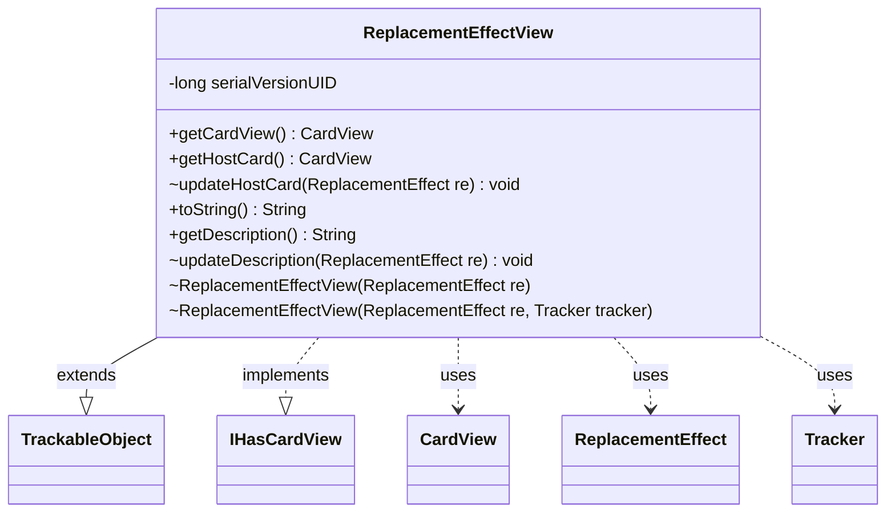

---
aliases:
  - ReplacementEffectView
tags:
  - java/class
  - module/forge-game
  - pkg/forge/game/replacement
fqn: forge.game.replacement.ReplacementEffectView
package: forge.game.replacement
module: forge-game
kind: Class
---

# ReplacementEffectView

**Package:** `forge.game.replacement` &nbsp; **Module:** `forge-game` &nbsp; **Kind:** Class



## Relationships
**Extends:**
- [[forge.trackable.TrackableObject|TrackableObject]]
**Implements:**
- [[forge.game.card.IHasCardView|IHasCardView]]
**Uses:**
- [[forge.game.card.CardView|CardView]]
- [[forge.game.replacement.ReplacementEffect|ReplacementEffect]]
- [[forge.trackable.Tracker|Tracker]]

## Source
`forge-game/src/main/java/forge/game/replacement/ReplacementEffectView.java`

```java
package forge.game.replacement;

import forge.game.card.CardView;
import forge.game.card.IHasCardView;
import forge.trackable.TrackableObject;
import forge.trackable.TrackableProperty;
import forge.trackable.Tracker;

public class ReplacementEffectView extends TrackableObject implements IHasCardView {
    private static final long serialVersionUID = 1L;

    ReplacementEffectView(ReplacementEffect re) {
        this(re, re.getHostCard() == null || re.getHostCard().getGame() == null ? null : re.getHostCard().getGame().getTracker());
    }

    ReplacementEffectView(ReplacementEffect re, Tracker tracker) {
        super(re.getId(), tracker);
        updateHostCard(re);
        updateDescription(re);
    }

    @Override
    public CardView getCardView() {
        return this.getHostCard();
    }

    public CardView getHostCard() {
        return get(TrackableProperty.RE_HostCard);
    }

    void updateHostCard(ReplacementEffect re) {
        set(TrackableProperty.RE_HostCard, CardView.get(re.getHostCard()));
    }

    @Override
    public String toString() {
        return this.getDescription();
    }

    public String getDescription() {
        return get(TrackableProperty.RE_Description);
    }

    void updateDescription(ReplacementEffect re) {
        set(TrackableProperty.RE_Description, re.getDescription());
    }
}
```
