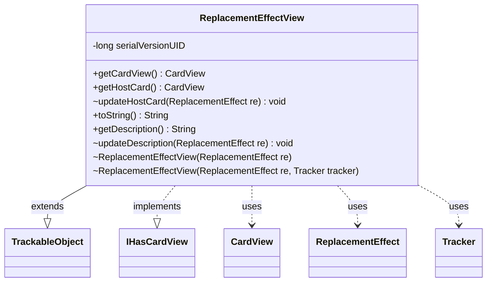

---
aliases:
  - ReplacementEffectView
tags:
  - java/class
  - module/forge-game
  - pkg/forge/game/replacement
fqn: forge.game.replacement.ReplacementEffectView
package: forge.game.replacement
module: forge-game
kind: Class
---

# ReplacementEffectView

**Package:** `forge.game.replacement`   **Module:** `forge-game`   **Kind:** Class



## Relationships
**Extends:**
- [[forge.trackable.TrackableObject|TrackableObject]]
**Implements:**
- [[forge.game.card.IHasCardView|IHasCardView]]
**Uses:**
- [[forge.game.card.CardView|CardView]]
- [[forge.game.replacement.ReplacementEffect|ReplacementEffect]]
- [[forge.trackable.Tracker|Tracker]]

## Design Description

Replacement effects in Forge's MTG engine are server-side game rules that intercept and modify game events; this class is their lightweight, client-facing projection. ReplacementEffectView extends TrackableObject to participate in the engine's change-tracking and serialization framework, caching only the data a UI needs—the host card and a human-readable description—as TrackableProperty values keyed by the underlying ReplacementEffect's id. By implementing IHasCardView (with getCardView delegating to the host card), it presents uniformly with other view types wherever the UI resolves an owning card. The package-private constructors and update methods signal that instances are created and refreshed only by the game layer, deriving their Tracker from the host card's game; toString returns the description for convenient display.

## Source
`forge-game/src/main/java/forge/game/replacement/ReplacementEffectView.java`

```java
package forge.game.replacement;

import forge.game.card.CardView;
import forge.game.card.IHasCardView;
import forge.trackable.TrackableObject;
import forge.trackable.TrackableProperty;
import forge.trackable.Tracker;

public class ReplacementEffectView extends TrackableObject implements IHasCardView {
    private static final long serialVersionUID = 1L;

    ReplacementEffectView(ReplacementEffect re) {
        this(re, re.getHostCard() == null || re.getHostCard().getGame() == null ? null : re.getHostCard().getGame().getTracker());
    }

    ReplacementEffectView(ReplacementEffect re, Tracker tracker) {
        super(re.getId(), tracker);
        updateHostCard(re);
        updateDescription(re);
    }

    @Override
    public CardView getCardView() {
        return this.getHostCard();
    }

    public CardView getHostCard() {
        return get(TrackableProperty.RE_HostCard);
    }

    void updateHostCard(ReplacementEffect re) {
        set(TrackableProperty.RE_HostCard, CardView.get(re.getHostCard()));
    }

    @Override
    public String toString() {
        return this.getDescription();
    }

    public String getDescription() {
        return get(TrackableProperty.RE_Description);
    }

    void updateDescription(ReplacementEffect re) {
        set(TrackableProperty.RE_Description, re.getDescription());
    }
}
```

## Python
`forge/game/replacement/ReplacementEffectView.py`

```python
from forge.game.card.CardView import CardView
from forge.game.card.IHasCardView import IHasCardView
from forge.trackable.TrackableObject import TrackableObject
from forge.trackable.TrackableProperty import TrackableProperty
from forge.trackable.Tracker import Tracker
from forge.game.replacement.ReplacementEffect import ReplacementEffect


class ReplacementEffectView(TrackableObject, IHasCardView):
    serialVersionUID = 1

    def __init__(self, re, tracker=None):
        if tracker is None:
            tracker = None if re.getHostCard() is None or re.getHostCard().getGame() is None else re.getHostCard().getGame().getTracker()
        super().__init__(re.getId(), tracker)
        self.updateHostCard(re)
        self.updateDescription(re)

    def getCardView(self):
        return self.getHostCard()

    def getHostCard(self):
        return self.get(TrackableProperty.RE_HostCard)

    def updateHostCard(self, re):
        self.set(TrackableProperty.RE_HostCard, CardView.get(re.getHostCard()))

    def __str__(self):
        return self.getDescription()

    def getDescription(self):
        return self.get(TrackableProperty.RE_Description)

    def updateDescription(self, re):
        self.set(TrackableProperty.RE_Description, re.getDescription())
```
