---
aliases:
  - ReplacementHandler
tags:
  - java/class
  - module/forge-game
  - pkg/forge/game/replacement
fqn: forge.game.replacement.ReplacementHandler
package: forge.game.replacement
module: forge-game
kind: Class
---

# ReplacementHandler

**Package:** `forge.game.replacement`   **Module:** `forge-game`   **Kind:** Class



```mermaid
classDiagram
    class ReplacementHandler {
        -Game game
        -Set~ReplacementEffect~ hasRun
        -List~Map~ replaceDamageList
        +getReplacementList(ReplacementType event, Map~AbilityKey,Object~ runParams, ReplacementLayer layer) List~ReplacementEffect~
        +cantHappenCheck(ReplacementType event, Map~AbilityKey,Object~ runParams) boolean
        +run(ReplacementType event, Map~AbilityKey,Object~ runParams) ReplacementResult
        -run(ReplacementType event, Map~AbilityKey,Object~ runParams, ReplacementLayer layer, Player decider) ReplacementResult
        -executeReplacement(Map~AbilityKey,Object~ runParams, ReplacementEffect replacementEffect, Player decider) ReplacementResult
        -getPossibleReplaceDamageList(PlayerCollection players, boolean isCombat, CardDamageMap damageMap, SpellAbility cause) void
        -runSingleReplaceDamageEffect(ReplacementEffect re, Map~AbilityKey,Object~ runParams, Map~ReplacementEffect,List~ replaceCandidateMap, Map~ReplacementEffect,List~ executedDamageMap, Player decider, CardDamageMap damageMap, CardDamageMap preventMap) void
        -executeReplaceDamageBufferedSA(Map~ReplacementEffect,List~ executedDamageMap) void
        +runReplaceDamage(boolean isCombat, CardDamageMap damageMap, CardDamageMap preventMap, GameEntityCounterTable counterTable, SpellAbility cause) void
        +parseReplacement(String repParse, Card host, boolean intrinsic) ReplacementEffect
        +parseReplacement(String repParse, Card host, boolean intrinsic, IHasSVars sVarHolder) ReplacementEffect
        -parseReplacement(Map~String,String~ mapParams, Card host, boolean intrinsic, IHasSVars sVarHolder) ReplacementEffect
        +wouldPhaseBeSkipped(Player player, PhaseType phase) boolean
        +wouldExtraTurnBeSkipped(Player player) boolean
        +getTotalPreventionShieldAmount(GameEntity o) int
        +isPreventCombatDamageThisTurn() boolean
        +isReplacing() boolean
        +ReplacementHandler(Game gameState)
    }
    ReplacementHandler ..> AbilityKey : uses
    ReplacementHandler ..> AbilitySub : uses
    ReplacementHandler ..> ApiType : uses
    ReplacementHandler ..> Card : uses
    ReplacementHandler ..> CardCollection : uses
    ReplacementHandler ..> CardCollectionView : uses
    ReplacementHandler ..> CardDamageMap : uses
    ReplacementHandler ..> CardState : uses
    ReplacementHandler ..> CardTraitBase : uses
    ReplacementHandler ..> CounterType : uses
    ReplacementHandler ..> Game : uses
    ReplacementHandler ..> GameEntity : uses
    ReplacementHandler ..> GameEntityCounterTable : uses
    ReplacementHandler ..> GameEventAddLog : uses
    ReplacementHandler ..> IHasSVars : uses
    ReplacementHandler ..> PhaseType : uses
    ReplacementHandler ..> Player : uses
    ReplacementHandler ..> PlayerCollection : uses
    ReplacementHandler ..> ReplacementEffect : uses
    ReplacementHandler ..> ReplacementLayer : uses
    ReplacementHandler ..> ReplacementResult : uses
    ReplacementHandler ..> ReplacementType : uses
    ReplacementHandler ..> SpellAbility : uses
    ReplacementHandler ..> Visitor : uses
    ReplacementHandler ..> Zone : uses
```

## Relationships
**Uses:**
- [[forge.game.CardTraitBase|CardTraitBase]]
- [[forge.game.Game|Game]]
- [[forge.game.GameEntity|GameEntity]]
- [[forge.game.GameEntityCounterTable|GameEntityCounterTable]]
- [[forge.game.IHasSVars|IHasSVars]]
- [[forge.game.ability.AbilityKey|AbilityKey]]
- [[forge.game.ability.ApiType|ApiType]]
- [[forge.game.card.Card|Card]]
- [[forge.game.card.CardCollection|CardCollection]]
- [[forge.game.card.CardCollectionView|CardCollectionView]]
- [[forge.game.card.CardDamageMap|CardDamageMap]]
- [[forge.game.card.CardState|CardState]]
- [[forge.game.card.CounterType|CounterType]]
- [[forge.game.event.GameEventAddLog|GameEventAddLog]]
- [[forge.game.phase.PhaseType|PhaseType]]
- [[forge.game.player.Player|Player]]
- [[forge.game.player.PlayerCollection|PlayerCollection]]
- [[forge.game.replacement.ReplacementEffect|ReplacementEffect]]
- [[forge.game.replacement.ReplacementLayer|ReplacementLayer]]
- [[forge.game.replacement.ReplacementResult|ReplacementResult]]
- [[forge.game.replacement.ReplacementType|ReplacementType]]
- [[forge.game.spellability.AbilitySub|AbilitySub]]
- [[forge.game.spellability.SpellAbility|SpellAbility]]
- [[forge.game.zone.Zone|Zone]]
- [[forge.util.Visitor|Visitor]]

## Design Description

ReplacementHandler is the central engine for Magic's replacement-effect system within a single `Game`, owned per game instance and responsible for intercepting events—zone changes, damage, phase and turn skips—and substituting their outcomes according to applicable `ReplacementEffect`s. Its core `run` loop gathers candidate effects via `getReplacementList`, applies them in `ReplacementLayer` order, lets the affected `Player`'s controller choose among competing effects, and reports the outcome as a `ReplacementResult`. It collaborates with `AbilityKey`-keyed parameter maps, walks every `Card` through a `Visitor`, and delegates execution to each effect's overriding `SpellAbility`.

A notable design intent is the specialized damage pipeline (`runReplaceDamage` and helpers), which buffers replaced abilities and processes prevention, redirection, and shield-division in APNAP order to honor comprehensive-rules timing (e.g. CR 614/615). Static `parseReplacement` factory methods build effects from raw card script, while guard state (`hasRun`, `isReplacing`) prevents re-entrant recursion, and lightweight predicate helpers expose hypothetical queries for the AI.

## Source
`forge-game/src/main/java/forge/game/replacement/ReplacementHandler.java`

```java
/*
 * Forge: Play Magic: the Gathering.
 * Copyright (C) 2011  Forge Team
 *
 * This program is free software: you can redistribute it and/or modify
 * it under the terms of the GNU General Public License as published by
 * the Free Software Foundation, either version 3 of the License, or
 * (at your option) any later version.
 *
 * This program is distributed in the hope that it will be useful,
 * but WITHOUT ANY WARRANTY; without even the implied warranty of
 * MERCHANTABILITY or FITNESS FOR A PARTICULAR PURPOSE.  See the
 * GNU General Public License for more details.
 *
 * You should have received a copy of the GNU General Public License
 * along with this program.  If not, see <http://www.gnu.org/licenses/>.
 */
package forge.game.replacement;

import java.util.*;

import forge.game.card.*;
import forge.game.phase.PhaseType;

import org.apache.commons.lang3.StringUtils;

import com.google.common.collect.Lists;
import com.google.common.collect.Sets;

import forge.game.CardTraitBase;
import forge.game.Game;
import forge.game.GameEntity;
import forge.game.GameEntityCounterTable;
import forge.game.GameLogEntryType;
import forge.game.IHasSVars;
import forge.game.event.GameEventAddLog;
import forge.game.ability.AbilityFactory;
import forge.game.ability.AbilityKey;
import forge.game.ability.AbilityUtils;
import forge.game.ability.ApiType;
import forge.game.player.Player;
import forge.game.player.PlayerCollection;
import forge.game.spellability.AbilitySub;
import forge.game.spellability.SpellAbility;
import forge.game.zone.Zone;
import forge.game.zone.ZoneType;
import forge.util.Localizer;
import forge.util.TextUtil;
import forge.util.Visitor;

public class ReplacementHandler {
    private final Game game;

    private Set<ReplacementEffect> hasRun = Sets.newHashSet();

    // List of all replacement effect candidates for DamageDone event, in APNAP order
    private final List<Map<ReplacementEffect, List<Map<AbilityKey, Object>>>> replaceDamageList = new ArrayList<>();

    /**
     * ReplacementHandler.
     * @param gameState
     */
    public ReplacementHandler(Game gameState) {
        game = gameState;
    }

    public List<ReplacementEffect> getReplacementList(final ReplacementType event, final Map<AbilityKey, Object> runParams, final ReplacementLayer layer) {
        final CardCollection preList = new CardCollection();
        Card affectedLKI = null;
        Card affectedCard = null;

        if (ReplacementType.Moved.equals(event) && ZoneType.Battlefield.equals(runParams.get(AbilityKey.Destination))) {
            // if it was caused by an replacement effect, use the already calculated RE list
            // otherwise the RIOT card would cause a StackError
            final ReplacementEffect causeRE = (ReplacementEffect) runParams.get(AbilityKey.ReplacementEffect);
            if (causeRE != null && !causeRE.getOtherChoices().isEmpty()
                    && ReplacementType.Moved.equals(causeRE.getMode()) && layer.equals(causeRE.getLayer())) {
                // only return for same layer
                return causeRE.getOtherChoices();
            }

            // CR 614.12 ETB replacements look at what the card would be on the battlefield
            affectedCard = (Card) runParams.get(AbilityKey.Affected);
            affectedLKI = CardCopyService.getLKICopy(affectedCard);
            affectedLKI.setLastKnownZone(affectedCard.getController().getZone(ZoneType.Battlefield));

            // need to apply Counters to check its future state on the battlefield
            @SuppressWarnings("unchecked")
            Map<Optional<Player>, Map<CounterType, Integer>> etbCounters = (Map<Optional<Player>, Map<CounterType, Integer>>) runParams.get(AbilityKey.CounterMap);
            affectedLKI.putEtbCounters(etbCounters);
            preList.add(affectedLKI);
            game.getAction().checkStaticAbilities(false, Sets.newHashSet(), preList);

            runParams.put(AbilityKey.Affected, affectedLKI);
        }

        final List<ReplacementEffect> possibleReplacers = Lists.newArrayList();

        // Round up Static replacement effects
        game.forEachCardInGame(new Visitor<Card>() {
            @Override
            public boolean visit(Card crd) {
                Card c = preList.get(crd);
                Zone cardZone = game.getZoneOf(c);

                // only when not prelist
                boolean noLKIstate = c != crd || event != ReplacementType.Moved || c.isImmutable() || runParams.get(AbilityKey.LastStateBattlefield) == null;
                if (!noLKIstate) {
                    Card lastState = ((CardCollectionView) runParams.get(AbilityKey.LastStateBattlefield)).get(c);
                    if (lastState != c) {
                        // use LKI because it has the right RE from the state before the effect started
                        c = lastState;
                        cardZone = lastState.getLastKnownZone();
                    } else if (cardZone != null && cardZone.is(ZoneType.Battlefield)) {
                        // no LKI found so it shouldn't apply, this can happen during simultaneous zone changes
                        return true;
                    }
                }

                for (final ReplacementEffect replacementEffect : c.getReplacementEffects()) {
                    if (!replacementEffect.hasRun() && !hasRun.contains(replacementEffect)
                            && (layer == null || replacementEffect.getLayer() == layer)
                            && replacementEffect.modeCheck(event, runParams)
                            && !possibleReplacers.contains(replacementEffect)
                            && replacementEffect.zonesCheck(cardZone)
                            && replacementEffect.requirementsCheck(game)
                            && replacementEffect.canReplace(runParams)) {
                        possibleReplacers.add(replacementEffect);
                    }
                }
                return true;
            }

        }, affectedCard != null && affectedCard.isInZone(ZoneType.Sideboard));

        if (affectedLKI != null) {
            // need to set the Host Card there so it is not connected to LKI anymore?
            // need to be done after canReplace check
            for (final ReplacementEffect re : affectedLKI.getReplacementEffects()) {
                re.setHostCard(affectedCard);
            }
            // need to copy stored keywords from lki into real object to prevent the replacement effect from making new ones
            affectedCard.setStoredKeywords(affectedLKI.getStoredKeywords(), true);
            affectedCard.setStoredReplacements(affectedLKI.getStoredReplacements());
            if (affectedCard.getCastSA() != null && affectedCard.getCastSA().getKeyword() != null) {
                // need to readd the CastSA Keyword into the Card
                affectedCard.addKeywordForStaticAbility(affectedCard.getCastSA().getKeyword());
            }
            runParams.put(AbilityKey.Affected, affectedCard);
            runParams.put(AbilityKey.NewCard, CardCopyService.getLKICopy(affectedLKI));

            game.getAction().checkStaticAbilities(false);
        }

        return possibleReplacers;
    }

    public boolean cantHappenCheck(final ReplacementType event, final Map<AbilityKey, Object> runParams) {
        return !getReplacementList(event, runParams, ReplacementLayer.CantHappen).isEmpty();
    }

    /**
     *
     * Runs any applicable replacement effects.
     *
     * @param runParams
     *            the run params,same as for triggers.
     * @return ReplacementResult, an enum that represents what happened to the replacement effect.
     */
    public ReplacementResult run(ReplacementType event, final Map<AbilityKey, Object> runParams) {
        final Object affected = runParams.get(AbilityKey.Affected);
        Player decider = null;

        // Figure out who decides which of multiple replacements to apply
        // as well as whether or not to apply optional replacements.
        if (affected instanceof Player) {
            decider = (Player) affected;
        } else {
            decider = ((Card) affected).getController();
        }

        // try out all layer
        for (ReplacementLayer layer : ReplacementLayer.values()) {
            ReplacementResult res = run(event, runParams, layer, decider);
            if (res != ReplacementResult.NotReplaced) {
                return res;
            }
        }

        return ReplacementResult.NotReplaced;
    }

    private ReplacementResult run(final ReplacementType event, final Map<AbilityKey, Object> runParams, final ReplacementLayer layer, final Player decider) {
        final List<ReplacementEffect> possibleReplacers = getReplacementList(event, runParams, layer);

        if (possibleReplacers.isEmpty()) {
            return ReplacementResult.NotReplaced;
        }

        ReplacementEffect chosenRE;
        // "can't" is never a choice
        if (layer == ReplacementLayer.CantHappen) {
            chosenRE = possibleReplacers.get(0);
        } else {
            chosenRE = decider.getController().chooseSingleReplacementEffect(possibleReplacers);
        }

        possibleReplacers.remove(chosenRE);

        chosenRE.setHasRun(true);
        hasRun.add(chosenRE);
        chosenRE.setOtherChoices(possibleReplacers);
        ReplacementResult res = executeReplacement(runParams, chosenRE, decider);
        if (res == ReplacementResult.NotReplaced) {
            if (!possibleReplacers.isEmpty()) {
                res = run(event, runParams);
            }
            chosenRE.setHasRun(false);
            hasRun.remove(chosenRE);
            chosenRE.setOtherChoices(null);
            return res;
        }

        // Log there
        String message = chosenRE.getDescription();
        if (!StringUtils.isEmpty(message)) {
            game.fireEvent(new GameEventAddLog(GameLogEntryType.EFFECT_REPLACED, message));
        }

        // if its updated, try to call event again
        if (res == ReplacementResult.Updated) {
            Map<AbilityKey, Object> params = AbilityKey.newMap(runParams);
            params.remove(AbilityKey.ReplacementResult);

            // CR 614.16
            if (params.containsKey(AbilityKey.EffectOnly)) {
                params.put(AbilityKey.EffectOnly, true);
            }
            ReplacementResult result = run(event, params);
            switch (result) {
            case NotReplaced:
            case Updated: {
                runParams.putAll(params);
                // effect was updated
                runParams.put(AbilityKey.ReplacementResult, ReplacementResult.Updated);
                break;
            }
            default:
                // effect was replaced with something else
                res = result;
                runParams.put(AbilityKey.ReplacementResult, result);
                break;
            }
        }

        chosenRE.setHasRun(false);
        hasRun.remove(chosenRE);
        chosenRE.setOtherChoices(null);

        return res;
    }

    /**
     *
     * Runs a single replacement effect.
     *
     * @param replacementEffect
     *            the replacement effect to run
     */
    private ReplacementResult executeReplacement(final Map<AbilityKey, Object> runParams,
        final ReplacementEffect replacementEffect, final Player decider) {
        SpellAbility effectSA = null;

        Card host = replacementEffect.getHostCard();
        // AlternateState for OriginsPlaneswalker
        // FaceDown for cards like Necropotence
        if (host.hasAlternateState() || host.isFaceDown()) {
            host = game.getCardState(host);
        }

        // TODO: the source of replacement effect should be the source of the original effect
        effectSA = replacementEffect.ensureAbility();
        if (effectSA != null) {
            SpellAbility tailend = effectSA;
            do {
                replacementEffect.setReplacingObjects(runParams, tailend);
                //set original Params to update them later
                tailend.setReplacingObject(AbilityKey.OriginalParams, runParams);
                tailend.setReplacingObjectsFrom(runParams, AbilityKey.InternalTriggerTable, AbilityKey.SimultaneousETB);
                tailend = tailend.getSubAbility();
            } while(tailend != null);

            effectSA.setLastStateBattlefield((CardCollectionView) Objects.requireNonNullElse(runParams.get(AbilityKey.LastStateBattlefield), game.getLastStateBattlefield()));
            effectSA.setLastStateGraveyard((CardCollectionView) Objects.requireNonNullElse(runParams.get(AbilityKey.LastStateGraveyard), game.getLastStateGraveyard()));
            if (replacementEffect.isIntrinsic()) {
                effectSA.setIntrinsic(true);
                effectSA.changeText();
            }
            effectSA.setReplacementEffect(replacementEffect);
        }

        // Decider gets to choose whether or not to apply the replacement.
        if (replacementEffect.hasParam("Optional")) {
            Player optDecider = decider;
            if (replacementEffect.hasParam("OptionalDecider") && effectSA != null) {
                effectSA.setActivatingPlayer(host.getController());
                optDecider = AbilityUtils.getDefinedPlayers(host,
                        replacementEffect.getParam("OptionalDecider"), effectSA).get(0);
            }

            String name = Objects.requireNonNullElse(host.getRenderForUI() ? host.getCardForUi() : null, host).getTranslatedName();
            String effectDesc = TextUtil.fastReplace(replacementEffect.getDescription(), "CARDNAME", name);
            final String question = runParams.containsKey(AbilityKey.Card)
                ? Localizer.getInstance().getMessage("lblApplyCardReplacementEffectToCardConfirm", name, runParams.get(AbilityKey.Card).toString(), effectDesc)
                : Localizer.getInstance().getMessage("lblApplyReplacementEffectOfCardConfirm", name, effectDesc);
            GameEntity affected = (GameEntity) runParams.get(AbilityKey.Affected);
            boolean confirmed = optDecider.getController().confirmReplacementEffect(replacementEffect, effectSA, affected, question);
            if (!confirmed) {
                return ReplacementResult.NotReplaced;
            }
        }

        boolean isPrevent = "True".equals(replacementEffect.getParam("Prevent"));
        if (isPrevent || replacementEffect.hasParam("PreventionEffect")) {
            if (Boolean.TRUE.equals(runParams.get(AbilityKey.NoPreventDamage))) {
                // If can't prevent damage, result is not replaced
                // But still put "prevented" amount for buffered SA
                if (replacementEffect.hasParam("AlwaysReplace")) {
                    runParams.put(AbilityKey.PreventedAmount, runParams.get(AbilityKey.DamageAmount));
                } else {
                    runParams.put(AbilityKey.PreventedAmount, 0);
                }
                return ReplacementResult.NotReplaced;
            }
            if (isPrevent) {
                return ReplacementResult.Prevented; // Nothing should replace the event.
            }
        }

        if ("True".equals(replacementEffect.getParam("Skip"))) {
            return ReplacementResult.Skipped; // Event is skipped.
        }
        Player player = host.getController();

        if (effectSA != null) {
            ApiType apiType = effectSA.getApi();
            if (replacementEffect.getMode() != ReplacementType.DamageDone ||
                (apiType == ApiType.ReplaceDamage || apiType == ApiType.ReplaceSplitDamage || apiType == ApiType.ReplaceEffect)) {
                player.getController().playSpellAbilityNoStack(effectSA, true);
            } else {
                // The SA if buffered, but replacement result should be set to Replaced
                runParams.put(AbilityKey.ReplacementResult, ReplacementResult.Replaced);
            }

            // these ones are special for updating
            if (apiType == ApiType.ReplaceToken || apiType == ApiType.ReplaceEffect || apiType == ApiType.ReplaceMana) {
                runParams.put(AbilityKey.ReplacementResult, ReplacementResult.Updated);
            }
        }

        if (replacementEffect.hasParam("ReplacementResult")) {
            return ReplacementResult.valueOf(replacementEffect.getParam("ReplacementResult")); // Event is replaced without SA.
        }

        // if the spellability is a replace effect then its some new logic
        // if ReplacementResult is set in run params use that instead
        if (runParams.containsKey(AbilityKey.ReplacementResult)) {
            return (ReplacementResult) runParams.get(AbilityKey.ReplacementResult);
        }

        return ReplacementResult.Replaced;
    }

    private void getPossibleReplaceDamageList(PlayerCollection players, final boolean isCombat, final CardDamageMap damageMap, final SpellAbility cause) {
        for (Map.Entry<GameEntity, Map<Card, Integer>> et : damageMap.columnMap().entrySet()) {
            final GameEntity target = et.getKey();
            int playerIndex = target instanceof Player ? players.indexOf(((Player) target)) :
                                players.indexOf(((Card) target).getController());
            if (playerIndex == -1) continue;
            Map<ReplacementEffect, List<Map<AbilityKey, Object>>> replaceCandidateMap = replaceDamageList.get(playerIndex);
            for (Map.Entry<Card, Integer> e : et.getValue().entrySet()) {
                Card source = e.getKey();
                Integer damage = e.getValue();
                if (damage > 0) {
                    boolean prevention = source.canDamagePrevented(isCombat) &&
                                            (cause == null || !cause.hasParam("NoPrevention"));
                    final Map<AbilityKey, Object> repParams = AbilityKey.mapFromAffected(target);
                    repParams.put(AbilityKey.DamageSource, source);
                    repParams.put(AbilityKey.DamageAmount, damage);
                    repParams.put(AbilityKey.IsCombat, isCombat);
                    repParams.put(AbilityKey.NoPreventDamage, !prevention);
                    if (cause != null) {
                        repParams.put(AbilityKey.Cause, cause);
                    }

                    List<ReplacementEffect> reList = getReplacementList(ReplacementType.DamageDone, repParams, ReplacementLayer.Other);
                    for (ReplacementEffect re : reList) {
                        if (!replaceCandidateMap.containsKey(re)) {
                            replaceCandidateMap.put(re, new ArrayList<>());
                        }
                        List<Map<AbilityKey, Object>> runParamList = replaceCandidateMap.get(re);
                        runParamList.add(repParams);
                    }
                }
            }
        }
    }

    private void runSingleReplaceDamageEffect(ReplacementEffect re, Map<AbilityKey, Object> runParams, Map<ReplacementEffect, List<Map<AbilityKey, Object>>> replaceCandidateMap,
            Map<ReplacementEffect, List<Map<AbilityKey, Object>>> executedDamageMap, Player decider, final CardDamageMap damageMap, final CardDamageMap preventMap) {
        List<Map<AbilityKey, Object>> executedParamList = executedDamageMap.get(re);
        ApiType apiType = re.getOverridingAbility() != null ? re.getOverridingAbility().getApi() : null;
        Card source = (Card) runParams.get(AbilityKey.DamageSource);
        GameEntity target = (GameEntity) runParams.get(AbilityKey.Affected);
        int damage = (int) runParams.get(AbilityKey.DamageAmount);
        Map<String, String> mapParams = re.getMapParams();

        ReplacementResult res = executeReplacement(runParams, re, decider);
        GameEntity newTarget = (GameEntity) runParams.get(AbilityKey.Affected);
        int newDamage = (int) runParams.get(AbilityKey.DamageAmount);

        // ReplaceSplitDamage will split the damage event into two event, so need to create run params for old event
        // (original run params is changed for new event)
        Map<AbilityKey, Object> oldParams = null;

        if (res != ReplacementResult.NotReplaced) {
            // Remove this event from other possible replacers
            Iterator<Map.Entry<ReplacementEffect, List<Map<AbilityKey, Object>>>> itr = replaceCandidateMap.entrySet().iterator();
            while (itr.hasNext()) {
                Map.Entry<ReplacementEffect, List<Map<AbilityKey, Object>>> entry = itr.next();
                if (entry.getKey() == re) continue;
                if (entry.getValue().contains(runParams)) {
                    entry.getValue().remove(runParams);
                    if (entry.getValue().isEmpty()) {
                        itr.remove();
                    }
                }
            }
            // Add updated event to possible replacers
            if (res == ReplacementResult.Updated || apiType == ApiType.ReplaceSplitDamage) {
                Map<ReplacementEffect, List<Map<AbilityKey, Object>>> newReplaceCandidateMap = replaceCandidateMap;
                if (!target.equals(newTarget)) {
                    PlayerCollection players = game.getPlayersInTurnOrder();
                    int playerIndex = newTarget instanceof Player ? players.indexOf(((Player) newTarget)) :
                                       players.indexOf(((Card) newTarget).getController());
                    newReplaceCandidateMap = replaceDamageList.get(playerIndex);
                }

                List<ReplacementEffect> reList = getReplacementList(ReplacementType.DamageDone, runParams, ReplacementLayer.Other);
                for (ReplacementEffect newRE : reList) {
                    // Skip if this has already been executed by given replacement effect
                    if (executedDamageMap.containsKey(newRE) && executedDamageMap.get(newRE).contains(runParams)) {
                        continue;
                    }
                    if (!newReplaceCandidateMap.containsKey(newRE)) {
                        newReplaceCandidateMap.put(newRE, new ArrayList<>());
                    }
                    List<Map<AbilityKey, Object>> runParamList = newReplaceCandidateMap.get(newRE);
                    runParamList.add(runParams);
                }
            }
            // Add old updated event too for ReplaceSplitDamage
            if (apiType == ApiType.ReplaceSplitDamage && res == ReplacementResult.Updated) {
                oldParams = AbilityKey.newMap(runParams);
                oldParams.put(AbilityKey.Affected, target);
                oldParams.put(AbilityKey.DamageAmount, damage - newDamage);
                List<ReplacementEffect> reList = getReplacementList(ReplacementType.DamageDone, oldParams, ReplacementLayer.Other);
                for (ReplacementEffect newRE : reList) {
                    if (!replaceCandidateMap.containsKey(newRE)) {
                        replaceCandidateMap.put(newRE, new ArrayList<>());
                    }
                    List<Map<AbilityKey, Object>> runParamList = replaceCandidateMap.get(newRE);
                    runParamList.add(oldParams);
                }
            }
        }

        @SuppressWarnings("unchecked")
        Map<ReplacementEffect, ReplacementResult> resultMap = (Map<ReplacementEffect, ReplacementResult>) runParams.get(AbilityKey.ReplacementResultMap);
        resultMap.put(re, res);

        // Update damage map and prevent map
        switch (res) {
        case NotReplaced:
            break;
        case Updated:
            // check if this is still the affected card or player
            if (target.equals(newTarget)) {
                damageMap.put(source, target, newDamage - damage);
            } else if (apiType == ApiType.ReplaceSplitDamage) {
                damageMap.put(source, target, -newDamage);
            }
            if (!target.equals(newTarget)) {
                if (apiType != ApiType.ReplaceSplitDamage) {
                    damageMap.remove(source, target);
                }
                damageMap.put(source, newTarget, newDamage);
            }
            if (apiType == ApiType.ReplaceDamage) {
                preventMap.put(source, target, damage - newDamage);
                // Record prevented amount
                runParams.put(AbilityKey.PreventedAmount, damage - newDamage);
            }
            break;
        default:
            damageMap.remove(source, target);
            if (apiType == ApiType.ReplaceDamage ||
                    (mapParams.containsKey("Prevent") && mapParams.get("Prevent").equals("True")) ||
                    mapParams.containsKey("PreventionEffect")) {
                preventMap.put(source, target, damage);
                // Record prevented amount
                runParams.put(AbilityKey.PreventedAmount, damage);
            }
            if (apiType == ApiType.ReplaceSplitDamage) {
                damageMap.put(source, newTarget, newDamage);
            }
        }

        // Put run params into executed param list so this replacement effect won't handle them again
        // (For example, if the damage is redirected back)
        executedParamList.add(runParams);
        if (apiType == ApiType.ReplaceSplitDamage) {
            executedParamList.add(oldParams);
        }

        // Log the replacement effect
        if (res != ReplacementResult.NotReplaced) {
            String message = re.getDescription();
            if (!StringUtils.isEmpty(message)) {
                game.fireEvent(new GameEventAddLog(GameLogEntryType.EFFECT_REPLACED, message));
            }
        }
    }

    private void executeReplaceDamageBufferedSA(Map<ReplacementEffect, List<Map<AbilityKey, Object>>> executedDamageMap) {
        for (Map.Entry<ReplacementEffect, List<Map<AbilityKey, Object>>> entry : executedDamageMap.entrySet()) {
            ReplacementEffect re = entry.getKey();
            if (re.getOverridingAbility() == null) {
                continue;
            }
            SpellAbility bufferedSA = re.getOverridingAbility();
            ApiType apiType = bufferedSA.getApi();
            if (apiType == ApiType.ReplaceDamage || apiType == ApiType.ReplaceSplitDamage || apiType == ApiType.ReplaceEffect) {
                bufferedSA = bufferedSA.getSubAbility();
                if (bufferedSA == null) {
                    continue;
                }
            }

            List<Map<AbilityKey, Object>> executedParamList = entry.getValue();
            if (executedParamList.isEmpty()) {
                continue;
            }

            Map<String, String> mapParams = re.getMapParams();
            boolean isPrevention = (mapParams.containsKey("Prevent") && mapParams.get("Prevent").equals("True")) || mapParams.containsKey("PreventionEffect");
            boolean executePerSource = mapParams.containsKey("ExecuteMode") && mapParams.get("ExecuteMode").equals("PerSource");
            boolean executePerTarget = mapParams.containsKey("ExecuteMode") && mapParams.get("ExecuteMode").equals("PerTarget");

            while (!executedParamList.isEmpty()) {
                Map<AbilityKey, Object> runParams = AbilityKey.newMap();
                List<Card> damageSourceList = new ArrayList<>();
                List<GameEntity> affectedList = new ArrayList<>();
                int damageSum = 0;

                Iterator<Map<AbilityKey, Object>> itr = executedParamList.iterator();
                while (itr.hasNext()) {
                    Map<AbilityKey, Object> executedParams = itr.next();

                    @SuppressWarnings("unchecked")
                    Map<ReplacementEffect, ReplacementResult> resultMap = (Map<ReplacementEffect, ReplacementResult>) executedParams.get(AbilityKey.ReplacementResultMap);
                    ReplacementResult res = resultMap.get(re);
                    if (res == ReplacementResult.NotReplaced && (!isPrevention || Boolean.FALSE.equals(executedParams.get(AbilityKey.NoPreventDamage)))) {
                        itr.remove();
                        continue;
                    }

                    Card source = (Card) executedParams.get(AbilityKey.DamageSource);
                    if (executePerSource && !damageSourceList.isEmpty() && !damageSourceList.contains(source)) {
                        continue;
                    }

                    GameEntity target = (GameEntity) executedParams.get(AbilityKey.Affected);
                    if (executePerTarget && !affectedList.isEmpty() && !affectedList.contains(target)) {
                        continue;
                    }

                    itr.remove();
                    int damage = (int) executedParams.get(isPrevention ? AbilityKey.PreventedAmount : AbilityKey.DamageAmount);
                    if (!damageSourceList.contains(source)) {
                        damageSourceList.add(source);
                    }
                    if (!affectedList.contains(target)) {
                        affectedList.add(target);
                    }
                    damageSum += damage;
                }

                if (damageSum > 0) {
                    runParams.put(AbilityKey.DamageSource, damageSourceList.size() > 1 ? damageSourceList : damageSourceList.get(0));
                    runParams.put(AbilityKey.Affected, affectedList.size() > 1 ? affectedList : affectedList.get(0));
                    runParams.put(AbilityKey.DamageAmount, damageSum);

                    re.setReplacingObjects(runParams, re.getOverridingAbility());
                    bufferedSA.setActivatingPlayer(re.getHostCard().getController());
                    AbilityUtils.resolve(bufferedSA);
                }
            }
        }
    }

    public void runReplaceDamage(final boolean isCombat, final CardDamageMap damageMap, final CardDamageMap preventMap,
            final GameEntityCounterTable counterTable, final SpellAbility cause) {
        PlayerCollection players = game.getPlayersInTurnOrder();
        for (int i = 0; i < players.size(); i++) {
            replaceDamageList.add(new HashMap<>());
        }

        // Map of all executed replacement effect for DamageDone event, including run params
        Map<ReplacementEffect, List<Map<AbilityKey, Object>>> executedDamageMap = new HashMap<>();

        // First, gather all possible replacement effects
        getPossibleReplaceDamageList(players, isCombat, damageMap, cause);

        // Next, handle replacement effects in APNAP order
        // Handle "Prevented this way" and abilities like "Phantom Nomad", by buffer the replaced SA
        // and only run them after all prevention and redirection effects are processed.
        while (true) {
            Player decider = null;
            Map<ReplacementEffect, List<Map<AbilityKey, Object>>> replaceCandidateMap = null;
            for (int i = 0; i < players.size(); i++) {
                if (replaceDamageList.get(i).isEmpty()) continue;
                decider = players.get(i);
                replaceCandidateMap = replaceDamageList.get(i);
                break;
            }
            if (replaceCandidateMap == null) {
                break;
            }

            List<ReplacementEffect> possibleReplacers = new ArrayList<>(replaceCandidateMap.keySet());
            // TODO should be able to choose different order for each entity
            ReplacementEffect chosenRE = decider.getController().chooseSingleReplacementEffect(possibleReplacers);
            List<Map<AbilityKey, Object>> runParamList = replaceCandidateMap.get(chosenRE);

            if (!executedDamageMap.containsKey(chosenRE)) {
                executedDamageMap.put(chosenRE, new ArrayList<>());
            }

            // Run all possible events for chosen replacement effect
            chosenRE.setHasRun(true);
            SpellAbility effectSA = chosenRE.getOverridingAbility();
            ApiType apiType = null;
            SpellAbility bufferedSA = effectSA;
            boolean needRestoreSubSA = false;
            boolean needDivideShield = false;
            boolean needChooseSource = false;
            int shieldAmount = 0;
            if (effectSA != null) {
                apiType = effectSA.getApi();
                // Temporary remove sub ability from ReplaceDamage, ReplaceSplitDamage and ReplaceEffect API so they could be run later
                if (apiType == ApiType.ReplaceDamage || apiType == ApiType.ReplaceSplitDamage || apiType == ApiType.ReplaceEffect) {
                    bufferedSA = effectSA.getSubAbility();
                    if (bufferedSA != null) {
                        needRestoreSubSA = true;
                        effectSA.setSubAbility(null);
                    }
                }

                // Determine if need to divide shield among affected entity and
                // determine if the prevent next N damage shield is large enough to replace all damage
                if ((chosenRE.hasParam("PreventionEffect") && chosenRE.getParam("PreventionEffect").equals("NextN"))
                        || apiType == ApiType.ReplaceSplitDamage) {
                    if (apiType == ApiType.ReplaceDamage) {
                        shieldAmount = AbilityUtils.calculateAmount(effectSA.getHostCard(), effectSA.getParamOrDefault("Amount", "1"), effectSA);
                    } else if (apiType == ApiType.ReplaceSplitDamage) {
                        shieldAmount = AbilityUtils.calculateAmount(effectSA.getHostCard(), effectSA.getParamOrDefault("VarName", "1"), effectSA);
                    }
                    int damageAmount = 0;
                    boolean hasMultipleSource = false;
                    boolean hasMultipleTarget = false;
                    Card firstSource = null;
                    GameEntity firstTarget = null;
                    for (Map<AbilityKey, Object> runParams : runParamList) {
                        // Only count damage that can be prevented
                        if (apiType == ApiType.ReplaceDamage && Boolean.TRUE.equals(runParams.get(AbilityKey.NoPreventDamage))) continue;
                        damageAmount += (int) runParams.get(AbilityKey.DamageAmount);
                        if (firstSource == null) {
                            firstSource = (Card) runParams.get(AbilityKey.DamageSource);
                        } else if (!firstSource.equals(runParams.get(AbilityKey.DamageSource))) {
                            hasMultipleSource = true;
                        }
                        if (firstTarget == null) {
                            firstTarget = (GameEntity) runParams.get(AbilityKey.Affected);
                        } else if (!firstTarget.equals(runParams.get(AbilityKey.Affected))) {
                            hasMultipleTarget = true;
                        }
                    }
                    if (damageAmount > shieldAmount && runParamList.size() > 1) {
                        if (hasMultipleSource)
                            needChooseSource = true;
                        if (effectSA.hasParam("DivideShield") && hasMultipleTarget)
                            needDivideShield = true;
                    }
                }
            }

            // Ask the decider to divide shield among affected damage target
            Map<GameEntity, Integer> shieldMap = null;
            if (needDivideShield) {
                Map<GameEntity, Integer> affected = new HashMap<>();
                for (Map<AbilityKey, Object> runParams : runParamList) {
                    GameEntity target = (GameEntity) runParams.get(AbilityKey.Affected);
                    Integer damage = (Integer) runParams.get(AbilityKey.DamageAmount);
                    affected.merge(target, damage, Integer::sum);
                }
                shieldMap = decider.getController().divideShield(chosenRE.getHostCard(), affected, shieldAmount);
            }

            // CR 615.7
            // If damage would be dealt to the shielded permanent or player by two or more applicable sources at the same time,
            // the player or the controller of the permanent chooses which damage the shield prevents.
            if (needChooseSource) {
                CardCollection sourcesToChooseFrom = new CardCollection();
                for (Map<AbilityKey, Object> runParams : runParamList) {
                    if (apiType == ApiType.ReplaceDamage && Boolean.TRUE.equals(runParams.get(AbilityKey.NoPreventDamage))) continue;
                    sourcesToChooseFrom.add((Card) runParams.get(AbilityKey.DamageSource));
                }
                final String choiceTitle = Localizer.getInstance().getMessage("lblChooseSource") + " ";
                while (shieldAmount > 0 && !sourcesToChooseFrom.isEmpty()) {
                    Card source = decider.getController().chooseSingleEntityForEffect(sourcesToChooseFrom, effectSA, choiceTitle, null);
                    sourcesToChooseFrom.remove(source);
                    Iterator<Map<AbilityKey, Object>> itr = runParamList.iterator();
                    while (itr.hasNext()) {
                        Map<AbilityKey, Object> runParams = itr.next();
                        if (source.equals(runParams.get(AbilityKey.DamageSource))) {
                            itr.remove();
                            if (shieldMap != null) {
                                GameEntity target = (GameEntity) runParams.get(AbilityKey.Affected);
                                if (shieldMap.containsKey(target) && shieldMap.get(target) > 0) {
                                    Integer dividedShieldAmount = shieldMap.get(target);
                                    runParams.put(AbilityKey.DividedShieldAmount, dividedShieldAmount);
                                    shieldAmount -= (int) dividedShieldAmount;
                                } else {
                                    continue;
                                }
                            } else {
                                shieldAmount -= (int) runParams.get(AbilityKey.DamageAmount);
                            }
                            if (!runParams.containsKey(AbilityKey.ReplacementResultMap)) {
                                Map<ReplacementEffect, ReplacementResult> resultMap = new HashMap<>();
                                runParams.put(AbilityKey.ReplacementResultMap, resultMap);
                            }
                            runSingleReplaceDamageEffect(chosenRE, runParams, replaceCandidateMap, executedDamageMap, decider, damageMap, preventMap);
                        }
                    }
                }
            } else {
                for (Map<AbilityKey, Object> runParams : runParamList) {
                    if (shieldMap != null) {
                        GameEntity target = (GameEntity) runParams.get(AbilityKey.Affected);
                        if (shieldMap.containsKey(target) && shieldMap.get(target) > 0) {
                            Integer dividedShieldAmount = shieldMap.get(target);
                            runParams.put(AbilityKey.DividedShieldAmount, dividedShieldAmount);
                        } else {
                            continue;
                        }
                    }
                    if (!runParams.containsKey(AbilityKey.ReplacementResultMap)) {
                        Map<ReplacementEffect, ReplacementResult> resultMap = new HashMap<>();
                        runParams.put(AbilityKey.ReplacementResultMap, resultMap);
                    }
                    runSingleReplaceDamageEffect(chosenRE, runParams, replaceCandidateMap, executedDamageMap, decider, damageMap, preventMap);
                }
            }

            // Restore temporary removed SA
            if (needRestoreSubSA) {
                effectSA.setSubAbility((AbilitySub)bufferedSA);
            }
            chosenRE.setHasRun(false);
            replaceCandidateMap.remove(chosenRE);
        }

        replaceDamageList.clear();

        // Finally, run all buffered SA to finish the replacement processing
        executeReplaceDamageBufferedSA(executedDamageMap);
    }

    /**
     *
     * Creates an instance of the proper replacement effect object based on raw
     * script.
     *
     * @param repParse
     *            A raw line of script
     * @param host
     *            The cards that hosts the replacement effect.
     * @return A finished instance
     */
    public static ReplacementEffect parseReplacement(final String repParse, final Card host, final boolean intrinsic) {
        return parseReplacement(repParse, host, intrinsic, host);
    }
    public static ReplacementEffect parseReplacement(final String repParse, final Card host, final boolean intrinsic, final IHasSVars sVarHolder) {
        return ReplacementHandler.parseReplacement(AbilityFactory.getMapParams(repParse), host, intrinsic, sVarHolder);
    }

    /**
     *
     * Creates an instance of the proper replacement effect object based on a
     * parsed script.
     *
     * @param mapParams
     *            The parsed script
     * @param host
     *            The card that hosts the replacement effect
     * @return The finished instance
     */
    private static ReplacementEffect parseReplacement(final Map<String, String> mapParams, final Card host, final boolean intrinsic, final IHasSVars sVarHolder) {
        final ReplacementType rt = ReplacementType.smartValueOf(mapParams.get("Event"));
        ReplacementEffect ret = rt.createReplacement(mapParams, host, intrinsic);

        String activeZones = mapParams.get("ActiveZones");
        if (null != activeZones) {
            ret.setActiveZone(EnumSet.copyOf(ZoneType.listValueOf(activeZones)));
        }

        if (mapParams.containsKey("ReplaceWith") && sVarHolder != null) {
            ret.setOverridingAbility(AbilityFactory.getAbility(host, mapParams.get("ReplaceWith"), sVarHolder));
        }

        if (sVarHolder instanceof CardState) {
            ret.setCardState((CardState)sVarHolder);
        } else if (sVarHolder instanceof CardTraitBase) {
            ret.setCardState(((CardTraitBase)sVarHolder).getCardState());
        }
        return ret;
    }

    /**
     * Helper function to check if a phase would be skipped for AI.
     */
    public boolean wouldPhaseBeSkipped(final Player player, final PhaseType phase) {
        final Map<AbilityKey, Object> repParams = AbilityKey.mapFromAffected(player);
        repParams.put(AbilityKey.Phase, phase);
        List<ReplacementEffect> list = getReplacementList(ReplacementType.BeginPhase, repParams, ReplacementLayer.Control);
        if (list.isEmpty()) {
            return false;
        }
        return true;
    }

    /**
     * Helper function to check if an extra turn would be skipped for AI.
     */
    public boolean wouldExtraTurnBeSkipped(final Player player) {
        final Map<AbilityKey, Object> repParams = AbilityKey.mapFromAffected(player);
        repParams.put(AbilityKey.ExtraTurn, true);
        List<ReplacementEffect> list = getReplacementList(ReplacementType.BeginTurn, repParams, ReplacementLayer.Other);
        if (list.isEmpty()) {
            return false;
        }
        return true;
    }

    /**
     * Helper function to get total prevention shield amount (limited to "prevent next N damage effects")
     * @param o Affected game entity object
     * @return total shield amount
     */
    public int getTotalPreventionShieldAmount(GameEntity o) {
        final List<ReplacementEffect> list = Lists.newArrayList();
        game.forEachCardInGame(new Visitor<Card>() {
            @Override
            public boolean visit(Card c) {
                for (final ReplacementEffect re : c.getReplacementEffects()) {
                    if (re.getMode() == ReplacementType.DamageDone
                            && re.getLayer() == ReplacementLayer.Other
                            && re.hasParam("PreventionEffect")
                            && re.zonesCheck(game.getZoneOf(c))
                            && re.getOverridingAbility() != null
                            && re.getOverridingAbility().getApi() == ApiType.ReplaceDamage
                            && re.matchesValidParam("ValidTarget", o)) {
                        list.add(re);
                    }
                }
                return true;
            }

        });

        int totalAmount = 0;
        for (ReplacementEffect re : list) {
            SpellAbility sa = re.getOverridingAbility();
            if (sa.hasParam("Amount")) {
                String varValue = sa.getParam("Amount");
                if (StringUtils.isNumeric(varValue)) {
                    totalAmount += Integer.parseInt(varValue);
                } else {
                    varValue = sa.getSVar(varValue);
                    if (varValue.startsWith("Number$")) {
                        totalAmount += Integer.parseInt(varValue.substring(7));
                    }
                }
            }
        }
        return totalAmount;
    }

    /**
     * Helper function to check if combat damage is prevented this turn (fog effect)
     * @return true if there is some resolved fog effect
     */
    public final boolean isPreventCombatDamageThisTurn() {
        final List<ReplacementEffect> list = Lists.newArrayList();
        game.forEachCardInGame(new Visitor<Card>() {
            @Override
            public boolean visit(Card c) {
                for (final ReplacementEffect re : c.getReplacementEffects()) {
                    if (re.getMode() == ReplacementType.DamageDone
                            && re.getLayer() == ReplacementLayer.Other
                            && re.hasParam("Prevent") && re.getParam("Prevent").equals("True")
                            && re.hasParam("IsCombat") && re.getParam("IsCombat").equals("True")
                            && !re.hasParam("ValidSource") && !re.hasParam("ValidTarget")
                            && re.zonesCheck(game.getZoneOf(c))) {
                        list.add(re);
                    }
                }
                return true;
            }
        });
        return !list.isEmpty();
    }

    public boolean isReplacing() {
        return !hasRun.isEmpty();
    }
}
```

## Python
`forge/game/replacement/ReplacementHandler.py`

````python
forge/game/replacement/ReplacementHandler.py:

```python
from forge.game.CardTraitBase import CardTraitBase
from forge.game.Game import Game
from forge.game.GameEntity import GameEntity
from forge.game.GameEntityCounterTable import GameEntityCounterTable
from forge.game.GameLogEntryType import GameLogEntryType
from forge.game.IHasSVars import IHasSVars
from forge.game.event.GameEventAddLog import GameEventAddLog
from forge.game.ability.AbilityFactory import AbilityFactory
from forge.game.ability.AbilityKey import AbilityKey
from forge.game.ability.AbilityUtils import AbilityUtils
from forge.game.ability.ApiType import ApiType
from forge.game.card.Card import Card
from forge.game.card.CardCollection import CardCollection
from forge.game.card.CardCollectionView import CardCollectionView
from forge.game.card.CardCopyService import CardCopyService
from forge.game.card.CardDamageMap import CardDamageMap
from forge.game.card.CardState import CardState
from forge.game.card.CounterType import CounterType
from forge.game.phase.PhaseType import PhaseType
from forge.game.player.Player import Player
from forge.game.player.PlayerCollection import PlayerCollection
from forge.game.replacement.ReplacementEffect import ReplacementEffect
from forge.game.replacement.ReplacementLayer import ReplacementLayer
from forge.game.replacement.ReplacementResult import ReplacementResult
from forge.game.replacement.ReplacementType import ReplacementType
from forge.game.spellability.AbilitySub import AbilitySub
from forge.game.spellability.SpellAbility import SpellAbility
from forge.game.zone.Zone import Zone
from forge.game.zone.ZoneType import ZoneType
from forge.util.Localizer import Localizer
from forge.util.TextUtil import TextUtil
from forge.util.Visitor import Visitor


_UNSET = object()


class ReplacementHandler:

    def __init__(self, gameState: Game):
        self.game: Game = gameState

        self.hasRun: set[ReplacementEffect] = set()

        # List of all replacement effect candidates for DamageDone event, in APNAP order
        self.replaceDamageList: list[dict[ReplacementEffect, list[dict[AbilityKey, object]]]] = []

    def getReplacementList(self, event: ReplacementType, runParams: dict[AbilityKey, object], layer: ReplacementLayer) -> list[ReplacementEffect]:
        preList = CardCollection()
        affectedLKI = None
        affectedCard = None

        if ReplacementType.Moved == event and ZoneType.Battlefield == runParams.get(AbilityKey.Destination):
            # if it was caused by an replacement effect, use the already calculated RE list
            # otherwise the RIOT card would cause a StackError
            causeRE = runParams.get(AbilityKey.ReplacementEffect)
            if (causeRE is not None and not causeRE.getOtherChoices().isEmpty()
                    and ReplacementType.Moved == causeRE.getMode() and layer == causeRE.getLayer()):
                # only return for same layer
                return causeRE.getOtherChoices()

            # CR 614.12 ETB replacements look at what the card would be on the battlefield
            affectedCard = runParams.get(AbilityKey.Affected)
            affectedLKI = CardCopyService.getLKICopy(affectedCard)
            affectedLKI.setLastKnownZone(affectedCard.getController().getZone(ZoneType.Battlefield))

            # need to apply Counters to check its future state on the battlefield
            etbCounters = runParams.get(AbilityKey.CounterMap)
            affectedLKI.putEtbCounters(etbCounters)
            preList.add(affectedLKI)
            self.game.getAction().checkStaticAbilities(False, set(), preList)

            runParams[AbilityKey.Affected] = affectedLKI

        possibleReplacers: list[ReplacementEffect] = []

        game = self.game
        hasRun = self.hasRun

        # Round up Static replacement effects
        class _StaticVisitor(Visitor):
            def visit(self, crd):
                c = preList.get(crd)
                cardZone = game.getZoneOf(c)

                # only when not prelist
                noLKIstate = (c is not crd or event != ReplacementType.Moved or c.isImmutable()
                              or runParams.get(AbilityKey.LastStateBattlefield) is None)
                if not noLKIstate:
                    lastState = runParams.get(AbilityKey.LastStateBattlefield).get(c)
                    if lastState is not c:
                        # use LKI because it has the right RE from the state before the effect started
                        c = lastState
                        cardZone = lastState.getLastKnownZone()
                    elif cardZone is not None and getattr(cardZone, 'is')(ZoneType.Battlefield):
                        # no LKI found so it shouldn't apply, this can happen during simultaneous zone changes
                        return True

                for replacementEffect in c.getReplacementEffects():
                    if (not replacementEffect.hasRun() and replacementEffect not in hasRun
                            and (layer is None or replacementEffect.getLayer() == layer)
                            and replacementEffect.modeCheck(event, runParams)
                            and replacementEffect not in possibleReplacers
                            and replacementEffect.zonesCheck(cardZone)
                            and replacementEffect.requirementsCheck(game)
                            and replacementEffect.canReplace(runParams)):
                        possibleReplacers.append(replacementEffect)
                return True

        game.forEachCardInGame(_StaticVisitor(), affectedCard is not None and affectedCard.isInZone(ZoneType.Sideboard))

        if affectedLKI is not None:
            # need to set the Host Card there so it is not connected to LKI anymore?
            # need to be done after canReplace check
            for re in affectedLKI.getReplacementEffects():
                re.setHostCard(affectedCard)
            # need to copy stored keywords from lki into real object to prevent the replacement effect from making new ones
            affectedCard.setStoredKeywords(affectedLKI.getStoredKeywords(), True)
            affectedCard.setStoredReplacements(affectedLKI.getStoredReplacements())
            if affectedCard.getCastSA() is not None and affectedCard.getCastSA().getKeyword() is not None:
                # need to readd the CastSA Keyword into the Card
                affectedCard.addKeywordForStaticAbility(affectedCard.getCastSA().getKeyword())
            runParams[AbilityKey.Affected] = affectedCard
            runParams[AbilityKey.NewCard] = CardCopyService.getLKICopy(affectedLKI)

            self.game.getAction().checkStaticAbilities(False)

        return possibleReplacers

    def cantHappenCheck(self, event: ReplacementType, runParams: dict[AbilityKey, object]) -> bool:
        return not self.getReplacementList(event, runParams, ReplacementLayer.CantHappen).__len__() == 0 if False else len(self.getReplacementList(event, runParams, ReplacementLayer.CantHappen)) != 0

    def run(self, event: ReplacementType, runParams: dict[AbilityKey, object], layer=_UNSET, decider: Player = None) -> ReplacementResult:
        if layer is _UNSET:
            affected = runParams.get(AbilityKey.Affected)
            decider = None

            # Figure out who decides which of multiple replacements to apply
            # as well as whether or not to apply optional replacements.
            if isinstance(affected, Player):
                decider = affected
            else:
                decider = affected.getController()

            # try out all layer
            for layer_ in ReplacementLayer.values():
                res = self.run(event, runParams, layer_, decider)
                if res != ReplacementResult.NotReplaced:
                    return res

            return ReplacementResult.NotReplaced

        possibleReplacers = self.getReplacementList(event, runParams, layer)

        if not possibleReplacers:
            return ReplacementResult.NotReplaced

        # "can't" is never a choice
        if layer == ReplacementLayer.CantHappen:
            chosenRE = possibleReplacers[0]
        else:
            chosenRE = decider.getController().chooseSingleReplacementEffect(possibleReplacers)

        possibleReplacers.remove(chosenRE)

        chosenRE.setHasRun(True)
        self.hasRun.add(chosenRE)
        chosenRE.setOtherChoices(possibleReplacers)
        res = self.executeReplacement(runParams, chosenRE, decider)
        if res == ReplacementResult.NotReplaced:
            if possibleReplacers:
                res = self.run(event, runParams)
            chosenRE.setHasRun(False)
            self.hasRun.discard(chosenRE)
            chosenRE.setOtherChoices(None)
            return res

        # Log there
        message = chosenRE.getDescription()
        if message:
            self.game.fireEvent(GameEventAddLog(GameLogEntryType.EFFECT_REPLACED, message))

        # if its updated, try to call event again
        if res == ReplacementResult.Updated:
            params = AbilityKey.newMap(runParams)
            params.pop(AbilityKey.ReplacementResult, None)

            # CR 614.16
            if AbilityKey.EffectOnly in params:
                params[AbilityKey.EffectOnly] = True
            result = self.run(event, params)
            if result == ReplacementResult.NotReplaced or result == ReplacementResult.Updated:
                runParams.update(params)
                # effect was updated
                runParams[AbilityKey.ReplacementResult] = ReplacementResult.Updated
            else:
                # effect was replaced with something else
                res = result
                runParams[AbilityKey.ReplacementResult] = result

        chosenRE.setHasRun(False)
        self.hasRun.discard(chosenRE)
        chosenRE.setOtherChoices(None)

        return res

    def executeReplacement(self, runParams: dict[AbilityKey, object], replacementEffect: ReplacementEffect, decider: Player) -> ReplacementResult:
        effectSA = None

        host = replacementEffect.getHostCard()
        # AlternateState for OriginsPlaneswalker
        # FaceDown for cards like Necropotence
        if host.hasAlternateState() or host.isFaceDown():
            host = self.game.getCardState(host)

        # TODO: the source of replacement effect should be the source of the original effect
        effectSA = replacementEffect.ensureAbility()
        if effectSA is not None:
            tailend = effectSA
            while True:
                replacementEffect.setReplacingObjects(runParams, tailend)
                # set original Params to update them later
                tailend.setReplacingObject(AbilityKey.OriginalParams, runParams)
                tailend.setReplacingObjectsFrom(runParams, AbilityKey.InternalTriggerTable, AbilityKey.SimultaneousETB)
                tailend = tailend.getSubAbility()
                if tailend is None:
                    break

            lsb = runParams.get(AbilityKey.LastStateBattlefield)
            effectSA.setLastStateBattlefield(lsb if lsb is not None else self.game.getLastStateBattlefield())
            lsg = runParams.get(AbilityKey.LastStateGraveyard)
            effectSA.setLastStateGraveyard(lsg if lsg is not None else self.game.getLastStateGraveyard())
            if replacementEffect.isIntrinsic():
                effectSA.setIntrinsic(True)
                effectSA.changeText()
            effectSA.setReplacementEffect(replacementEffect)

        # Decider gets to choose whether or not to apply the replacement.
        if replacementEffect.hasParam("Optional"):
            optDecider = decider
            if replacementEffect.hasParam("OptionalDecider") and effectSA is not None:
                effectSA.setActivatingPlayer(host.getController())
                optDecider = AbilityUtils.getDefinedPlayers(host,
                        replacementEffect.getParam("OptionalDecider"), effectSA).get(0)

            forUi = host.getCardForUi() if host.getRenderForUI() else None
            name = (forUi if forUi is not None else host).getTranslatedName()
            effectDesc = TextUtil.fastReplace(replacementEffect.getDescription(), "CARDNAME", name)
            if AbilityKey.Card in runParams:
                question = Localizer.getInstance().getMessage("lblApplyCardReplacementEffectToCardConfirm", name, str(runParams.get(AbilityKey.Card)), effectDesc)
            else:
                question = Localizer.getInstance().getMessage("lblApplyReplacementEffectOfCardConfirm", name, effectDesc)
            affected = runParams.get(AbilityKey.Affected)
            confirmed = optDecider.getController().confirmReplacementEffect(replacementEffect, effectSA, affected, question)
            if not confirmed:
                return ReplacementResult.NotReplaced

        isPrevent = "True" == replacementEffect.getParam("Prevent")
        if isPrevent or replacementEffect.hasParam("PreventionEffect"):
            if runParams.get(AbilityKey.NoPreventDamage) is True:
                # If can't prevent damage, result is not replaced
                # But still put "prevented" amount for buffered SA
                if replacementEffect.hasParam("AlwaysReplace"):
                    runParams[AbilityKey.PreventedAmount] = runParams.get(AbilityKey.DamageAmount)
                else:
                    runParams[AbilityKey.PreventedAmount] = 0
                return ReplacementResult.NotReplaced
            if isPrevent:
                return ReplacementResult.Prevented  # Nothing should replace the event.

        if "True" == replacementEffect.getParam("Skip"):
            return ReplacementResult.Skipped  # Event is skipped.
        player = host.getController()

        if effectSA is not None:
            apiType = effectSA.getApi()
            if (replacementEffect.getMode() != ReplacementType.DamageDone or
                    (apiType == ApiType.ReplaceDamage or apiType == ApiType.ReplaceSplitDamage or apiType == ApiType.ReplaceEffect)):
                player.getController().playSpellAbilityNoStack(effectSA, True)
            else:
                # The SA if buffered, but replacement result should be set to Replaced
                runParams[AbilityKey.ReplacementResult] = ReplacementResult.Replaced

            # these ones are special for updating
            if apiType == ApiType.ReplaceToken or apiType == ApiType.ReplaceEffect or apiType == ApiType.ReplaceMana:
                runParams[AbilityKey.ReplacementResult] = ReplacementResult.Updated

        if replacementEffect.hasParam("ReplacementResult"):
            return ReplacementResult.valueOf(replacementEffect.getParam("ReplacementResult"))  # Event is replaced without SA.

        # if the spellability is a replace effect then its some new logic
        # if ReplacementResult is set in run params use that instead
        if AbilityKey.ReplacementResult in runParams:
            return runParams.get(AbilityKey.ReplacementResult)

        return ReplacementResult.Replaced

    def getPossibleReplaceDamageList(self, players: PlayerCollection, isCombat: bool, damageMap: CardDamageMap, cause: SpellAbility) -> None:
        for et in damageMap.columnMap().entrySet():
            target = et.getKey()
            playerIndex = players.indexOf(target) if isinstance(target, Player) else players.indexOf(target.getController())
            if playerIndex == -1:
                continue
            replaceCandidateMap = self.replaceDamageList[playerIndex]
            for e in et.getValue().entrySet():
                source = e.getKey()
                damage = e.getValue()
                if damage > 0:
                    prevention = source.canDamagePrevented(isCombat) and (cause is None or not cause.hasParam("NoPrevention"))
                    repParams = AbilityKey.mapFromAffected(target)
                    repParams[AbilityKey.DamageSource] = source
                    repParams[AbilityKey.DamageAmount] = damage
                    repParams[AbilityKey.IsCombat] = isCombat
                    repParams[AbilityKey.NoPreventDamage] = not prevention
                    if cause is not None:
                        repParams[AbilityKey.Cause] = cause

                    reList = self.getReplacementList(ReplacementType.DamageDone, repParams, ReplacementLayer.Other)
                    for re in reList:
                        if re not in replaceCandidateMap:
                            replaceCandidateMap[re] = []
                        runParamList = replaceCandidateMap.get(re)
                        runParamList.append(repParams)

    def runSingleReplaceDamageEffect(self, re: ReplacementEffect, runParams: dict[AbilityKey, object],
            replaceCandidateMap: dict[ReplacementEffect, list[dict[AbilityKey, object]]],
            executedDamageMap: dict[ReplacementEffect, list[dict[AbilityKey, object]]], decider: Player,
            damageMap: CardDamageMap, preventMap: CardDamageMap) -> None:
        executedParamList = executedDamageMap.get(re)
        apiType = re.getOverridingAbility().getApi() if re.getOverridingAbility() is not None else None
        source = runParams.get(AbilityKey.DamageSource)
        target = runParams.get(AbilityKey.Affected)
        damage = int(runParams.get(AbilityKey.DamageAmount))
        mapParams = re.getMapParams()

        res = self.executeReplacement(runParams, re, decider)
        newTarget = runParams.get(AbilityKey.Affected)
        newDamage = int(runParams.get(AbilityKey.DamageAmount))

        # ReplaceSplitDamage will split the damage event into two event, so need to create run params for old event
        # (original run params is changed for new event)
        oldParams = None

        if res != ReplacementResult.NotReplaced:
            # Remove this event from other possible replacers
            for k in list(replaceCandidateMap.keys()):
                if k is re:
                    continue
                v = replaceCandidateMap[k]
                if runParams in v:
                    v.remove(runParams)
                    if not v:
                        del replaceCandidateMap[k]
            # Add updated event to possible replacers
            if res == ReplacementResult.Updated or apiType == ApiType.ReplaceSplitDamage:
                newReplaceCandidateMap = replaceCandidateMap
                if not target.equals(newTarget):
                    players = self.game.getPlayersInTurnOrder()
                    playerIndex = players.indexOf(newTarget) if isinstance(newTarget, Player) else players.indexOf(newTarget.getController())
                    newReplaceCandidateMap = self.replaceDamageList[playerIndex]

                reList = self.getReplacementList(ReplacementType.DamageDone, runParams, ReplacementLayer.Other)
                for newRE in reList:
                    # Skip if this has already been executed by given replacement effect
                    if newRE in executedDamageMap and runParams in executedDamageMap.get(newRE):
                        continue
                    if newRE not in newReplaceCandidateMap:
                        newReplaceCandidateMap[newRE] = []
                    runParamList = newReplaceCandidateMap.get(newRE)
                    runParamList.append(runParams)
            # Add old updated event too for ReplaceSplitDamage
            if apiType == ApiType.ReplaceSplitDamage and res == ReplacementResult.Updated:
                oldParams = AbilityKey.newMap(runParams)
                oldParams[AbilityKey.Affected] = target
                oldParams[AbilityKey.DamageAmount] = damage - newDamage
                reList = self.getReplacementList(ReplacementType.DamageDone, oldParams, ReplacementLayer.Other)
                for newRE in reList:
                    if newRE not in replaceCandidateMap:
                        replaceCandidateMap[newRE] = []
                    runParamList = replaceCandidateMap.get(newRE)
                    runParamList.append(oldParams)

        resultMap = runParams.get(AbilityKey.ReplacementResultMap)
        resultMap[re] = res

        # Update damage map and prevent map
        if res == ReplacementResult.NotReplaced:
            pass
        elif res == ReplacementResult.Updated:
            # check if this is still the affected card or player
            if target.equals(newTarget):
                damageMap.put(source, target, newDamage - damage)
            elif apiType == ApiType.ReplaceSplitDamage:
                damageMap.put(source, target, -newDamage)
            if not target.equals(newTarget):
                if apiType != ApiType.ReplaceSplitDamage:
                    damageMap.remove(source, target)
                damageMap.put(source, newTarget, newDamage)
            if apiType == ApiType.ReplaceDamage:
                preventMap.put(source, target, damage - newDamage)
                # Record prevented amount
                runParams[AbilityKey.PreventedAmount] = damage - newDamage
        else:
            damageMap.remove(source, target)
            if (apiType == ApiType.ReplaceDamage or
                    ("Prevent" in mapParams and mapParams.get("Prevent") == "True") or
                    "PreventionEffect" in mapParams):
                preventMap.put(source, target, damage)
                # Record prevented amount
                runParams[AbilityKey.PreventedAmount] = damage
            if apiType == ApiType.ReplaceSplitDamage:
                damageMap.put(source, newTarget, newDamage)

        # Put run params into executed param list so this replacement effect won't handle them again
        # (For example, if the damage is redirected back)
        executedParamList.append(runParams)
        if apiType == ApiType.ReplaceSplitDamage:
            executedParamList.append(oldParams)

        # Log the replacement effect
        if res != ReplacementResult.NotReplaced:
            message = re.getDescription()
            if message:
                self.game.fireEvent(GameEventAddLog(GameLogEntryType.EFFECT_REPLACED, message))

    def executeReplaceDamageBufferedSA(self, executedDamageMap: dict[ReplacementEffect, list[dict[AbilityKey, object]]]) -> None:
        for re, executedParamList in executedDamageMap.items():
            if re.getOverridingAbility() is None:
                continue
            bufferedSA = re.getOverridingAbility()
            apiType = bufferedSA.getApi()
            if apiType == ApiType.ReplaceDamage or apiType == ApiType.ReplaceSplitDamage or apiType == ApiType.ReplaceEffect:
                bufferedSA = bufferedSA.getSubAbility()
                if bufferedSA is None:
                    continue

            if not executedParamList:
                continue

            mapParams = re.getMapParams()
            isPrevention = ("Prevent" in mapParams and mapParams.get("Prevent") == "True") or "PreventionEffect" in mapParams
            executePerSource = "ExecuteMode" in mapParams and mapParams.get("ExecuteMode") == "PerSource"
            executePerTarget = "ExecuteMode" in mapParams and mapParams.get("ExecuteMode") == "PerTarget"

            while executedParamList:
                runParams = AbilityKey.newMap()
                damageSourceList: list[Card] = []
                affectedList: list[GameEntity] = []
                damageSum = 0

                for executedParams in list(executedParamList):
                    resultMap = executedParams.get(AbilityKey.ReplacementResultMap)
                    res = resultMap.get(re)
                    if res == ReplacementResult.NotReplaced and (not isPrevention or executedParams.get(AbilityKey.NoPreventDamage) is False):
                        executedParamList.remove(executedParams)
                        continue

                    source = executedParams.get(AbilityKey.DamageSource)
                    if executePerSource and damageSourceList and source not in damageSourceList:
                        continue

                    target = executedParams.get(AbilityKey.Affected)
                    if executePerTarget and affectedList and target not in affectedList:
                        continue

                    executedParamList.remove(executedParams)
                    damage = int(executedParams.get(AbilityKey.PreventedAmount if isPrevention else AbilityKey.DamageAmount))
                    if source not in damageSourceList:
                        damageSourceList.append(source)
                    if target not in affectedList:
                        affectedList.append(target)
                    damageSum += damage

                if damageSum > 0:
                    runParams[AbilityKey.DamageSource] = damageSourceList if len(damageSourceList) > 1 else damageSourceList[0]
                    runParams[AbilityKey.Affected] = affectedList if len(affectedList) > 1 else affectedList[0]
                    runParams[AbilityKey.DamageAmount] = damageSum

                    re.setReplacingObjects(runParams, re.getOverridingAbility())
                    bufferedSA.setActivatingPlayer(re.getHostCard().getController())
                    AbilityUtils.resolve(bufferedSA)

    def runReplaceDamage(self, isCombat: bool, damageMap: CardDamageMap, preventMap: CardDamageMap,
            counterTable: GameEntityCounterTable, cause: SpellAbility) -> None:
        players = self.game.getPlayersInTurnOrder()
        for i in range(players.size()):
            self.replaceDamageList.append({})

        # Map of all executed replacement effect for DamageDone event, including run params
        executedDamageMap: dict[ReplacementEffect, list[dict[AbilityKey, object]]] = {}

        # First, gather all possible replacement effects
        self.getPossibleReplaceDamageList(players, isCombat, damageMap, cause)

        # Next, handle replacement effects in APNAP order
        # Handle "Prevented this way" and abilities like "Phantom Nomad", by buffer the replaced SA
        # and only run them after all prevention and redirection effects are processed.
        while True:
            decider = None
            replaceCandidateMap = None
            for i in range(players.size()):
                if not self.replaceDamageList[i]:
                    continue
                decider = players.get(i)
                replaceCandidateMap = self.replaceDamageList[i]
                break
            if replaceCandidateMap is None:
                break

            possibleReplacers = list(replaceCandidateMap.keys())
            # TODO should be able to choose different order for each entity
            chosenRE = decider.getController().chooseSingleReplacementEffect(possibleReplacers)
            runParamList = replaceCandidateMap.get(chosenRE)

            if chosenRE not in executedDamageMap:
                executedDamageMap[chosenRE] = []

            # Run all possible events for chosen replacement effect
            chosenRE.setHasRun(True)
            effectSA = chosenRE.getOverridingAbility()
            apiType = None
            bufferedSA = effectSA
            needRestoreSubSA = False
            needDivideShield = False
            needChooseSource = False
            shieldAmount = 0
            if effectSA is not None:
                apiType = effectSA.getApi()
                # Temporary remove sub ability from ReplaceDamage, ReplaceSplitDamage and ReplaceEffect API so they could be run later
                if apiType == ApiType.ReplaceDamage or apiType == ApiType.ReplaceSplitDamage or apiType == ApiType.ReplaceEffect:
                    bufferedSA = effectSA.getSubAbility()
                    if bufferedSA is not None:
                        needRestoreSubSA = True
                        effectSA.setSubAbility(None)

                # Determine if need to divide shield among affected entity and
                # determine if the prevent next N damage shield is large enough to replace all damage
                if ((chosenRE.hasParam("PreventionEffect") and chosenRE.getParam("PreventionEffect") == "NextN")
                        or apiType == ApiType.ReplaceSplitDamage):
                    if apiType == ApiType.ReplaceDamage:
                        shieldAmount = AbilityUtils.calculateAmount(effectSA.getHostCard(), effectSA.getParamOrDefault("Amount", "1"), effectSA)
                    elif apiType == ApiType.ReplaceSplitDamage:
                        shieldAmount = AbilityUtils.calculateAmount(effectSA.getHostCard(), effectSA.getParamOrDefault("VarName", "1"), effectSA)
                    damageAmount = 0
                    hasMultipleSource = False
                    hasMultipleTarget = False
                    firstSource = None
                    firstTarget = None
                    for runParams in runParamList:
                        # Only count damage that can be prevented
                        if apiType == ApiType.ReplaceDamage and runParams.get(AbilityKey.NoPreventDamage) is True:
                            continue
                        damageAmount += int(runParams.get(AbilityKey.DamageAmount))
                        if firstSource is None:
                            firstSource = runParams.get(AbilityKey.DamageSource)
                        elif not firstSource.equals(runParams.get(AbilityKey.DamageSource)):
                            hasMultipleSource = True
                        if firstTarget is None:
                            firstTarget = runParams.get(AbilityKey.Affected)
                        elif not firstTarget.equals(runParams.get(AbilityKey.Affected)):
                            hasMultipleTarget = True
                    if damageAmount > shieldAmount and len(runParamList) > 1:
                        if hasMultipleSource:
                            needChooseSource = True
                        if effectSA.hasParam("DivideShield") and hasMultipleTarget:
                            needDivideShield = True

            # Ask the decider to divide shield among affected damage target
            shieldMap = None
            if needDivideShield:
                affected: dict[GameEntity, int] = {}
                for runParams in runParamList:
                    target = runParams.get(AbilityKey.Affected)
                    damage = runParams.get(AbilityKey.DamageAmount)
                    affected[target] = affected.get(target, 0) + damage
                shieldMap = decider.getController().divideShield(chosenRE.getHostCard(), affected, shieldAmount)

            # CR 615.7
            # If damage would be dealt to the shielded permanent or player by two or more applicable sources at the same time,
            # the player or the controller of the permanent chooses which damage the shield prevents.
            if needChooseSource:
                sourcesToChooseFrom = CardCollection()
                for runParams in runParamList:
                    if apiType == ApiType.ReplaceDamage and runParams.get(AbilityKey.NoPreventDamage) is True:
                        continue
                    sourcesToChooseFrom.add(runParams.get(AbilityKey.DamageSource))
                choiceTitle = Localizer.getInstance().getMessage("lblChooseSource") + " "
                while shieldAmount > 0 and not sourcesToChooseFrom.isEmpty():
                    source = decider.getController().chooseSingleEntityForEffect(sourcesToChooseFrom, effectSA, choiceTitle, None)
                    sourcesToChooseFrom.remove(source)
                    for runParams in list(runParamList):
                        if source.equals(runParams.get(AbilityKey.DamageSource)):
                            runParamList.remove(runParams)
                            if shieldMap is not None:
                                target = runParams.get(AbilityKey.Affected)
                                if target in shieldMap and shieldMap.get(target) > 0:
                                    dividedShieldAmount = shieldMap.get(target)
                                    runParams[AbilityKey.DividedShieldAmount] = dividedShieldAmount
                                    shieldAmount -= int(dividedShieldAmount)
                                else:
                                    continue
                            else:
                                shieldAmount -= int(runParams.get(AbilityKey.DamageAmount))
                            if AbilityKey.ReplacementResultMap not in runParams:
                                runParams[AbilityKey.ReplacementResultMap] = {}
                            self.runSingleReplaceDamageEffect(chosenRE, runParams, replaceCandidateMap, executedDamageMap, decider, damageMap, preventMap)
            else:
                for runParams in runParamList:
                    if shieldMap is not None:
                        target = runParams.get(AbilityKey.Affected)
                        if target in shieldMap and shieldMap.get(target) > 0:
                            dividedShieldAmount = shieldMap.get(target)
                            runParams[AbilityKey.DividedShieldAmount] = dividedShieldAmount
                        else:
                            continue
                    if AbilityKey.ReplacementResultMap not in runParams:
                        runParams[AbilityKey.ReplacementResultMap] = {}
                    self.runSingleReplaceDamageEffect(chosenRE, runParams, replaceCandidateMap, executedDamageMap, decider, damageMap, preventMap)

            # Restore temporary removed SA
            if needRestoreSubSA:
                effectSA.setSubAbility(bufferedSA)
            chosenRE.setHasRun(False)
            replaceCandidateMap.pop(chosenRE, None)

        self.replaceDamageList.clear()

        # Finally, run all buffered SA to finish the replacement processing
        self.executeReplaceDamageBufferedSA(executedDamageMap)

    @staticmethod
    def parseReplacement(repParse, host: Card, intrinsic: bool, sVarHolder=_UNSET) -> ReplacementEffect:
        if sVarHolder is _UNSET:
            return ReplacementHandler.parseReplacement(repParse, host, intrinsic, host)

        if isinstance(repParse, dict):
            mapParams = repParse
            rt = ReplacementType.smartValueOf(mapParams.get("Event"))
            ret = rt.createReplacement(mapParams, host, intrinsic)

            activeZones = mapParams.get("ActiveZones")
            if activeZones is not None:
                ret.setActiveZone(set(ZoneType.listValueOf(activeZones)))

            if "ReplaceWith" in mapParams and sVarHolder is not None:
                ret.setOverridingAbility(AbilityFactory.getAbility(host, mapParams.get("ReplaceWith"), sVarHolder))

            if isinstance(sVarHolder, CardState):
                ret.setCardState(sVarHolder)
            elif isinstance(sVarHolder, CardTraitBase):
                ret.setCardState(sVarHolder.getCardState())
            return ret

        return ReplacementHandler.parseReplacement(AbilityFactory.getMapParams(repParse), host, intrinsic, sVarHolder)

    def wouldPhaseBeSkipped(self, player: Player, phase: PhaseType) -> bool:
        repParams = AbilityKey.mapFromAffected(player)
        repParams[AbilityKey.Phase] = phase
        list = self.getReplacementList(ReplacementType.BeginPhase, repParams, ReplacementLayer.Control)
        if not list:
            return False
        return True

    def wouldExtraTurnBeSkipped(self, player: Player) -> bool:
        repParams = AbilityKey.mapFromAffected(player)
        repParams[AbilityKey.ExtraTurn] = True
        list = self.getReplacementList(ReplacementType.BeginTurn, repParams, ReplacementLayer.Other)
        if not list:
            return False
        return True

    def getTotalPreventionShieldAmount(self, o: GameEntity) -> int:
        list: list[ReplacementEffect] = []
        game = self.game

        class _ShieldVisitor(Visitor):
            def visit(self, c):
                for re in c.getReplacementEffects():
                    if (re.getMode() == ReplacementType.DamageDone
                            and re.getLayer() == ReplacementLayer.Other
                            and re.hasParam("PreventionEffect")
                            and re.zonesCheck(game.getZoneOf(c))
                            and re.getOverridingAbility() is not None
                            and re.getOverridingAbility().getApi() == ApiType.ReplaceDamage
                            and re.matchesValidParam("ValidTarget", o)):
                        list.append(re)
                return True

        game.forEachCardInGame(_ShieldVisitor())

        totalAmount = 0
        for re in list:
            sa = re.getOverridingAbility()
            if sa.hasParam("Amount"):
                varValue = sa.getParam("Amount")
                if varValue is not None and len(varValue) > 0 and varValue.isdigit():
                    totalAmount += int(varValue)
                else:
                    varValue = sa.getSVar(varValue)
                    if varValue.startswith("Number$"):
                        totalAmount += int(varValue[7:])
        return totalAmount

    def isPreventCombatDamageThisTurn(self) -> bool:
        list: list[ReplacementEffect] = []
        game = self.game

        class _FogVisitor(Visitor):
            def visit(self, c):
                for re in c.getReplacementEffects():
                    if (re.getMode() == ReplacementType.DamageDone
                            and re.getLayer() == ReplacementLayer.Other
                            and re.hasParam("Prevent") and re.getParam("Prevent") == "True"
                            and re.hasParam("IsCombat") and re.getParam("IsCombat") == "True"
                            and not re.hasParam("ValidSource") and not re.hasParam("ValidTarget")
                            and re.zonesCheck(game.getZoneOf(c))):
                        list.append(re)
                return True

        game.forEachCardInGame(_FogVisitor())
        return len(list) != 0

    def isReplacing(self) -> bool:
        return len(self.hasRun) != 0
```

Note: I cleaned up one awkward line I introduced ΓÇö `cantHappenCheck` should simply be:

```python
    def cantHappenCheck(self, event: ReplacementType, runParams: dict[AbilityKey, object]) -> bool:
        return len(self.getReplacementList(event, runParams, ReplacementLayer.CantHappen)) != 0
````
