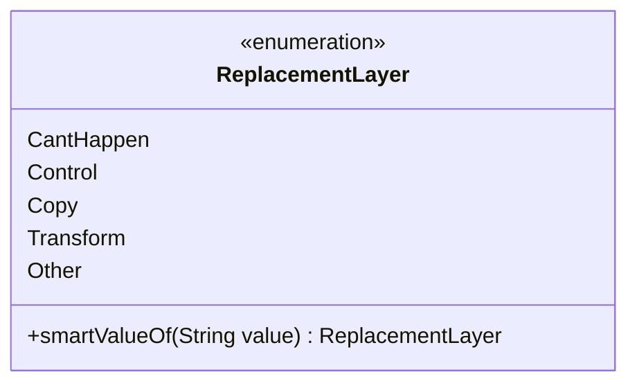

---
aliases:
  - ReplacementLayer
tags:
  - java/enum
  - module/forge-game
  - pkg/forge/game/replacement
fqn: forge.game.replacement.ReplacementLayer
package: forge.game.replacement
module: forge-game
kind: Enum
---

# ReplacementLayer

**Package:** `forge.game.replacement`   **Module:** `forge-game`   **Kind:** Enum



## Design Description

The ReplacementLayer enum classifies replacement effects according to the order in which they are applied, following the Magic: The Gathering comprehensive rules (the inline comments cite rule numbers such as 614.17 and 616.1b–d). Its constants—CantHappen, Control, Copy, Transform, and Other—define the layering sequence used to resolve interactions among competing replacement effects. The sole behavioral member, the static smartValueOf factory, performs a null-safe, case-insensitive, whitespace-trimmed lookup of a constant by name, returning null for null input and throwing IllegalArgumentException when no match exists. This lenient parsing reflects the enum's role as a deserialization target for card-script text, decoupling external string data from the strict naming required by the built-in valueOf.

## Source
`forge-game/src/main/java/forge/game/replacement/ReplacementLayer.java`

```java
package forge.game.replacement;


/** 
 * TODO: Write javadoc for this type.
 *
 */
public enum ReplacementLayer {
    CantHappen, // 614.17
    Control, // 616.1b
    Copy, // 616.1c
    Transform, // 616.1d
    Other;

    /**
     * TODO: Write javadoc for this method.
     * @param substring
     * @return
     */
    public static ReplacementLayer smartValueOf(String value) {
        if (value == null) {
            return null;
        }
        final String valToCompate = value.trim();
        for (final ReplacementLayer v : ReplacementLayer.values()) {
            if (v.name().compareToIgnoreCase(valToCompate) == 0) {
                return v;
            }
        }
        throw new IllegalArgumentException("No element named " + value + " in enum ReplacementLayer");
    }
}
```

## Python
`forge/game/replacement/ReplacementLayer.py`

```python
from enum import Enum


class ReplacementLayer(Enum):
    CantHappen = 1  # 614.17
    Control = 2  # 616.1b
    Copy = 3  # 616.1c
    Transform = 4  # 616.1d
    Other = 5

    # TODO: Write javadoc for this method.
    @staticmethod
    def smartValueOf(value: str) -> "ReplacementLayer":
        if value is None:
            return None
        valToCompate = value.strip()
        for v in ReplacementLayer:
            if v.name.lower() == valToCompate.lower():
                return v
        raise ValueError("No element named " + value + " in enum ReplacementLayer")
```
