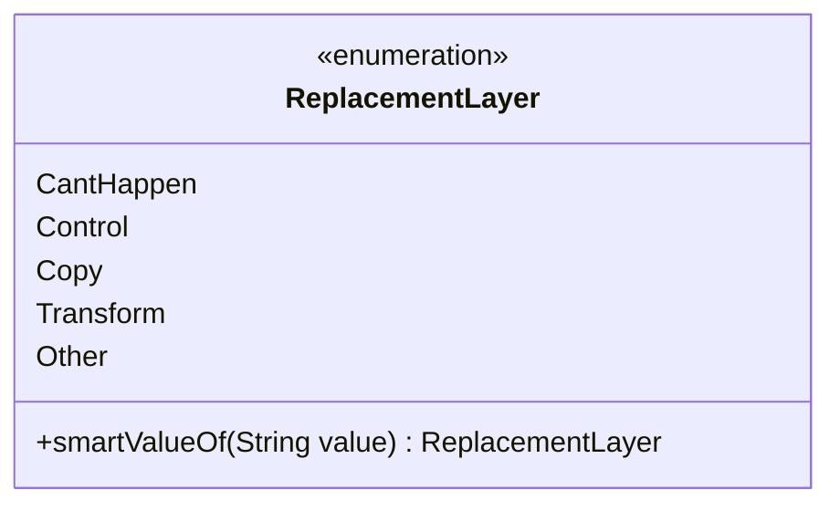

---
aliases:
  - ReplacementLayer
tags:
  - java/enum
  - module/forge-game
  - pkg/forge/game/replacement
fqn: forge.game.replacement.ReplacementLayer
package: forge.game.replacement
module: forge-game
kind: Enum
---

# ReplacementLayer

**Package:** `forge.game.replacement` &nbsp; **Module:** `forge-game` &nbsp; **Kind:** Enum



## Source
`forge-game/src/main/java/forge/game/replacement/ReplacementLayer.java`

```java
package forge.game.replacement;


/** 
 * TODO: Write javadoc for this type.
 *
 */
public enum ReplacementLayer {
    CantHappen, // 614.17
    Control, // 616.1b
    Copy, // 616.1c
    Transform, // 616.1d
    Other;

    /**
     * TODO: Write javadoc for this method.
     * @param substring
     * @return
     */
    public static ReplacementLayer smartValueOf(String value) {
        if (value == null) {
            return null;
        }
        final String valToCompate = value.trim();
        for (final ReplacementLayer v : ReplacementLayer.values()) {
            if (v.name().compareToIgnoreCase(valToCompate) == 0) {
                return v;
            }
        }
        throw new IllegalArgumentException("No element named " + value + " in enum ReplacementLayer");
    }
}
```
