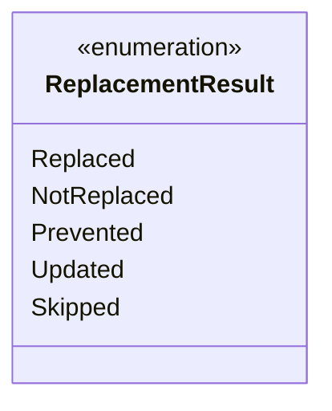

---
aliases:
  - ReplacementResult
tags:
  - java/enum
  - module/forge-game
  - pkg/forge/game/replacement
fqn: forge.game.replacement.ReplacementResult
package: forge.game.replacement
module: forge-game
kind: Enum
---

# ReplacementResult

**Package:** `forge.game.replacement`   **Module:** `forge-game`   **Kind:** Enum



## Design Description

ReplacementResult is an enumeration that classifies the outcome of applying a replacement effect within Forge's game-rules engine. Each constant—Replaced, NotReplaced, Prevented, Updated, and Skipped—names a distinct disposition that the replacement subsystem returns after evaluating whether and how a game event was intercepted and altered.

As a simple, value-typed enum in the `forge.game.replacement` package, it carries no behavior or state of its own; its responsibility is purely to communicate status between the replacement-handling machinery and its callers. Collaborating code in the package branches on these values to decide whether to suppress the original event, continue processing, or re-evaluate an updated event, keeping outcome signaling explicit and type-safe rather than relying on booleans or magic values.

## Source
`forge-game/src/main/java/forge/game/replacement/ReplacementResult.java`

```java
package forge.game.replacement;

/** 
 * TODO: Write javadoc for this type.
 *
 */
public enum ReplacementResult {
    Replaced,
    NotReplaced,
    Prevented,
    Updated,
    Skipped
}
```

## Python
`forge/game/replacement/ReplacementResult.py`

```python
from enum import Enum, auto


class ReplacementResult(Enum):
    Replaced = auto()
    NotReplaced = auto()
    Prevented = auto()
    Updated = auto()
    Skipped = auto()
```
