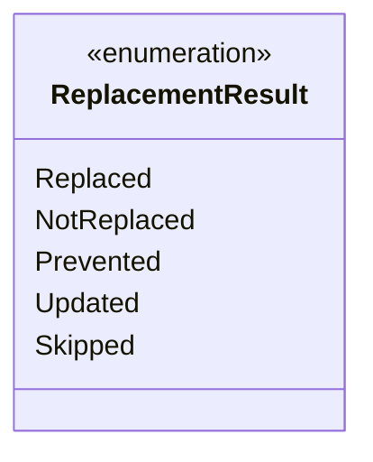

---
aliases:
  - ReplacementResult
tags:
  - java/enum
  - module/forge-game
  - pkg/forge/game/replacement
fqn: forge.game.replacement.ReplacementResult
package: forge.game.replacement
module: forge-game
kind: Enum
---

# ReplacementResult

**Package:** `forge.game.replacement` &nbsp; **Module:** `forge-game` &nbsp; **Kind:** Enum



## Source
`forge-game/src/main/java/forge/game/replacement/ReplacementResult.java`

```java
package forge.game.replacement;

/** 
 * TODO: Write javadoc for this type.
 *
 */
public enum ReplacementResult {
    Replaced,
    NotReplaced,
    Prevented,
    Updated,
    Skipped
}
```
