---
aliases:
  - ReplacementType
tags:
  - java/enum
  - module/forge-game
  - pkg/forge/game/replacement
fqn: forge.game.replacement.ReplacementType
package: forge.game.replacement
module: forge-game
kind: Enum
---

# ReplacementType

**Package:** `forge.game.replacement` &nbsp; **Module:** `forge-game` &nbsp; **Kind:** Enum

```mermaid
classDiagram
    class ReplacementType {
        <<enumeration>>
        AddCounter
        AssembleContraption
        AssignDealDamage
        Attached
        BeginPhase
        BeginTurn
        Cascade
        Counter
        CopySpell
        CreateToken
        DamageDone
        DealtDamage
        DeclareBlocker
        Destroy
        Draw
        DrawCards
        Explore
        GainLife
        GameLoss
        GameWin
        Learn
        LifeReduced
        LoseMana
        Mill
        Moved
        PayLife
        PlanarDiceResult
        Planeswalk
        ProduceMana
        Proliferate
        RemoveCounter
        RollDice
        RollPlanarDice
        Scry
        SetInMotion
        Tap
        Transform
        TurnFaceUp
        Untap
        ~Class~ReplacementEffect~ clasz
        +smartValueOf(String value) ReplacementType
        +createReplacement(Map~String,String~ mapParams, Card host, boolean intrinsic) ReplacementEffect
        ~ReplacementType(Class~ReplacementEffect~ cls)
    }
    ReplacementType ..> Card : uses
    ReplacementType ..> ReplaceAddCounter : uses
    ReplacementType ..> ReplaceAssembleContraption : uses
    ReplacementType ..> ReplaceAssignDealDamage : uses
    ReplacementType ..> ReplaceAttached : uses
    ReplacementType ..> ReplaceBeginPhase : uses
    ReplacementType ..> ReplaceBeginTurn : uses
    ReplacementType ..> ReplaceCascade : uses
    ReplacementType ..> ReplaceCopySpell : uses
    ReplacementType ..> ReplaceCounter : uses
    ReplacementType ..> ReplaceDamage : uses
    ReplacementType ..> ReplaceDealtDamage : uses
    ReplacementType ..> ReplaceDeclareBlocker : uses
    ReplacementType ..> ReplaceDestroy : uses
    ReplacementType ..> ReplaceDraw : uses
    ReplacementType ..> ReplaceDrawCards : uses
    ReplacementType ..> ReplaceExplore : uses
    ReplacementType ..> ReplaceGainLife : uses
    ReplacementType ..> ReplaceGameLoss : uses
    ReplacementType ..> ReplaceGameWin : uses
    ReplacementType ..> ReplaceLearn : uses
    ReplacementType ..> ReplaceLifeReduced : uses
    ReplacementType ..> ReplaceLoseMana : uses
    ReplacementType ..> ReplaceMill : uses
    ReplacementType ..> ReplaceMoved : uses
    ReplacementType ..> ReplacePayLife : uses
    ReplacementType ..> ReplacePlanarDiceResult : uses
    ReplacementType ..> ReplacePlaneswalk : uses
    ReplacementType ..> ReplaceProduceMana : uses
    ReplacementType ..> ReplaceProliferate : uses
    ReplacementType ..> ReplaceRemoveCounter : uses
    ReplacementType ..> ReplaceRollDice : uses
    ReplacementType ..> ReplaceRollPlanarDice : uses
    ReplacementType ..> ReplaceScry : uses
    ReplacementType ..> ReplaceSetInMotion : uses
    ReplacementType ..> ReplaceTap : uses
    ReplacementType ..> ReplaceToken : uses
    ReplacementType ..> ReplaceTransform : uses
    ReplacementType ..> ReplaceTurnFaceUp : uses
    ReplacementType ..> ReplaceUntap : uses
    ReplacementType ..> ReplacementEffect : uses
```



## Relationships
**Uses:**
- [[forge.game.card.Card|Card]]
- [[forge.game.replacement.ReplaceAddCounter|ReplaceAddCounter]]
- [[forge.game.replacement.ReplaceAssembleContraption|ReplaceAssembleContraption]]
- [[forge.game.replacement.ReplaceAssignDealDamage|ReplaceAssignDealDamage]]
- [[forge.game.replacement.ReplaceAttached|ReplaceAttached]]
- [[forge.game.replacement.ReplaceBeginPhase|ReplaceBeginPhase]]
- [[forge.game.replacement.ReplaceBeginTurn|ReplaceBeginTurn]]
- [[forge.game.replacement.ReplaceCascade|ReplaceCascade]]
- [[forge.game.replacement.ReplaceCopySpell|ReplaceCopySpell]]
- [[forge.game.replacement.ReplaceCounter|ReplaceCounter]]
- [[forge.game.replacement.ReplaceDamage|ReplaceDamage]]
- [[forge.game.replacement.ReplaceDealtDamage|ReplaceDealtDamage]]
- [[forge.game.replacement.ReplaceDeclareBlocker|ReplaceDeclareBlocker]]
- [[forge.game.replacement.ReplaceDestroy|ReplaceDestroy]]
- [[forge.game.replacement.ReplaceDraw|ReplaceDraw]]
- [[forge.game.replacement.ReplaceDrawCards|ReplaceDrawCards]]
- [[forge.game.replacement.ReplaceExplore|ReplaceExplore]]
- [[forge.game.replacement.ReplaceGainLife|ReplaceGainLife]]
- [[forge.game.replacement.ReplaceGameLoss|ReplaceGameLoss]]
- [[forge.game.replacement.ReplaceGameWin|ReplaceGameWin]]
- [[forge.game.replacement.ReplaceLearn|ReplaceLearn]]
- [[forge.game.replacement.ReplaceLifeReduced|ReplaceLifeReduced]]
- [[forge.game.replacement.ReplaceLoseMana|ReplaceLoseMana]]
- [[forge.game.replacement.ReplaceMill|ReplaceMill]]
- [[forge.game.replacement.ReplaceMoved|ReplaceMoved]]
- [[forge.game.replacement.ReplacePayLife|ReplacePayLife]]
- [[forge.game.replacement.ReplacePlanarDiceResult|ReplacePlanarDiceResult]]
- [[forge.game.replacement.ReplacePlaneswalk|ReplacePlaneswalk]]
- [[forge.game.replacement.ReplaceProduceMana|ReplaceProduceMana]]
- [[forge.game.replacement.ReplaceProliferate|ReplaceProliferate]]
- [[forge.game.replacement.ReplaceRemoveCounter|ReplaceRemoveCounter]]
- [[forge.game.replacement.ReplaceRollDice|ReplaceRollDice]]
- [[forge.game.replacement.ReplaceRollPlanarDice|ReplaceRollPlanarDice]]
- [[forge.game.replacement.ReplaceScry|ReplaceScry]]
- [[forge.game.replacement.ReplaceSetInMotion|ReplaceSetInMotion]]
- [[forge.game.replacement.ReplaceTap|ReplaceTap]]
- [[forge.game.replacement.ReplaceToken|ReplaceToken]]
- [[forge.game.replacement.ReplaceTransform|ReplaceTransform]]
- [[forge.game.replacement.ReplaceTurnFaceUp|ReplaceTurnFaceUp]]
- [[forge.game.replacement.ReplaceUntap|ReplaceUntap]]
- [[forge.game.replacement.ReplacementEffect|ReplacementEffect]]

## Source
`forge-game/src/main/java/forge/game/replacement/ReplacementType.java`

```java
package forge.game.replacement;

import java.lang.reflect.Constructor;
import java.lang.reflect.InvocationTargetException;
import java.util.Map;

import forge.game.card.Card;

/**
 * TODO: Write javadoc for this type.
 *
 */
public enum ReplacementType {
    AddCounter(ReplaceAddCounter.class),
    AssembleContraption(ReplaceAssembleContraption.class),
    AssignDealDamage(ReplaceAssignDealDamage.class),
    Attached(ReplaceAttached.class),
    BeginPhase(ReplaceBeginPhase.class),
    BeginTurn(ReplaceBeginTurn.class),
    Cascade(ReplaceCascade.class),
    Counter(ReplaceCounter.class),
    CopySpell(ReplaceCopySpell.class),
    CreateToken(ReplaceToken.class),
    DamageDone(ReplaceDamage.class),
    DealtDamage(ReplaceDealtDamage.class),
    DeclareBlocker(ReplaceDeclareBlocker.class),
    Destroy(ReplaceDestroy.class),
    Draw(ReplaceDraw.class),
    DrawCards(ReplaceDrawCards.class),
    Explore(ReplaceExplore.class),
    GainLife(ReplaceGainLife.class),
    GameLoss(ReplaceGameLoss.class),
    GameWin(ReplaceGameWin.class),
    Learn(ReplaceLearn.class),
    LifeReduced(ReplaceLifeReduced.class),
    LoseMana(ReplaceLoseMana.class),
    Mill(ReplaceMill.class),
    Moved(ReplaceMoved.class),
    PayLife(ReplacePayLife.class),
    PlanarDiceResult(ReplacePlanarDiceResult.class),
    Planeswalk(ReplacePlaneswalk.class),
    ProduceMana(ReplaceProduceMana.class),
    Proliferate(ReplaceProliferate.class),
    RemoveCounter(ReplaceRemoveCounter.class),
    RollDice(ReplaceRollDice.class),
    RollPlanarDice(ReplaceRollPlanarDice.class),
    Scry(ReplaceScry.class),
    SetInMotion(ReplaceSetInMotion.class),
    Tap(ReplaceTap.class),
    Transform(ReplaceTransform.class),
    TurnFaceUp(ReplaceTurnFaceUp.class),
    Untap(ReplaceUntap.class);

    Class<? extends ReplacementEffect> clasz;
    ReplacementType(Class<? extends ReplacementEffect> cls) {
        clasz = cls;
    }

    public static ReplacementType smartValueOf(String value) {
        final String valToCompate = value.trim();
        for (final ReplacementType v : ReplacementType.values()) {
            if (v.name().compareToIgnoreCase(valToCompate) == 0) {
                return v;
            }
        }
        throw new RuntimeException("Element " + value + " not found in ReplacementType enum");
    }

    /**
     * TODO: Write javadoc for this method.
     * @param mapParams
     * @param host
     * @param intrinsic
     * @return
     */
    public ReplacementEffect createReplacement(Map<String, String> mapParams, Card host, boolean intrinsic) {
        @SuppressWarnings("unchecked")
        Constructor<? extends ReplacementEffect>[] cc = (Constructor<? extends ReplacementEffect>[]) clasz.getDeclaredConstructors();
        for (Constructor<? extends ReplacementEffect> c : cc) {
            Class<?>[] pp = c.getParameterTypes();
            if (pp[0].isAssignableFrom(Map.class)) {
                try {
                    ReplacementEffect res = c.newInstance(mapParams, host, intrinsic);
                    res.setMode(this);
                    return res;
                } catch (IllegalArgumentException | InstantiationException | IllegalAccessException |
                         InvocationTargetException e) {
                    // TODO Auto-generated catch block ignores the exception, but sends it to System.err and probably forge.log.
                    e.printStackTrace();
                }
            }
        }
        throw new RuntimeException("No constructor found that would take Map as 1st parameter in class " + clasz.getName());
    }
}
```
