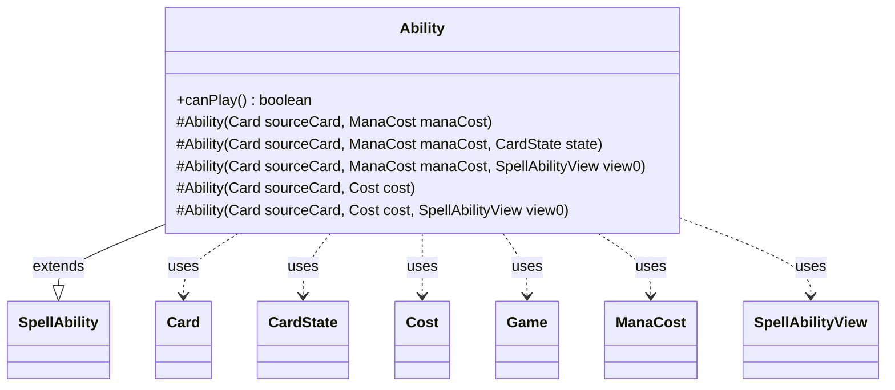

---
aliases:
  - Ability
tags:
  - java/class
  - module/forge-game
  - pkg/forge/game/spellability
fqn: forge.game.spellability.Ability
package: forge.game.spellability
module: forge-game
kind: Class
---

# Ability

**Package:** `forge.game.spellability` &nbsp; **Module:** `forge-game` &nbsp; **Kind:** Class



## Relationships
**Extends:**
- [[forge.game.spellability.SpellAbility|SpellAbility]]
**Uses:**
- [[forge.card.mana.ManaCost|ManaCost]]
- [[forge.game.Game|Game]]
- [[forge.game.card.Card|Card]]
- [[forge.game.card.CardState|CardState]]
- [[forge.game.cost.Cost|Cost]]
- [[forge.game.spellability.SpellAbilityView|SpellAbilityView]]

## Source
`forge-game/src/main/java/forge/game/spellability/Ability.java`

```java
/*
 * Forge: Play Magic: the Gathering.
 * Copyright (C) 2011  Forge Team
 *
 * This program is free software: you can redistribute it and/or modify
 * it under the terms of the GNU General Public License as published by
 * the Free Software Foundation, either version 3 of the License, or
 * (at your option) any later version.
 * 
 * This program is distributed in the hope that it will be useful,
 * but WITHOUT ANY WARRANTY; without even the implied warranty of
 * MERCHANTABILITY or FITNESS FOR A PARTICULAR PURPOSE.  See the
 * GNU General Public License for more details.
 * 
 * You should have received a copy of the GNU General Public License
 * along with this program.  If not, see <http://www.gnu.org/licenses/>.
 */
package forge.game.spellability;

import forge.card.mana.ManaCost;
import forge.game.Game;
import forge.game.card.Card;
import forge.game.card.CardState;
import forge.game.cost.Cost;

/**
 * <p>
 * Abstract Ability class.
 * </p>
 * 
 * @author Forge
 * @version $Id$
 */
public abstract class Ability extends SpellAbility {

    protected Ability(final Card sourceCard, final ManaCost manaCost) {
        this(sourceCard, new Cost(manaCost, true), null);
    }
    protected Ability(final Card sourceCard, final ManaCost manaCost, final CardState state) {
        super(sourceCard, new Cost(manaCost, true), null, state);
    }
    protected Ability(final Card sourceCard, final ManaCost manaCost, SpellAbilityView view0) {
        this(sourceCard, new Cost(manaCost, true), view0);
    }
    protected Ability(final Card sourceCard, final Cost cost) {
        this(sourceCard, cost, null);
    }
    protected Ability(final Card sourceCard, final Cost cost, SpellAbilityView view0) {
        super(sourceCard, cost, view0);
    }

    /** {@inheritDoc} */
    @Override
    public boolean canPlay() {
        final Game game = getActivatingPlayer().getGame();
        if (game.getStack().isSplitSecondOnStack() && !this.isManaAbility()) {
            return false;
        }

        return this.getHostCard().isInPlay() && !this.getHostCard().isFaceDown();
    }

}
```
