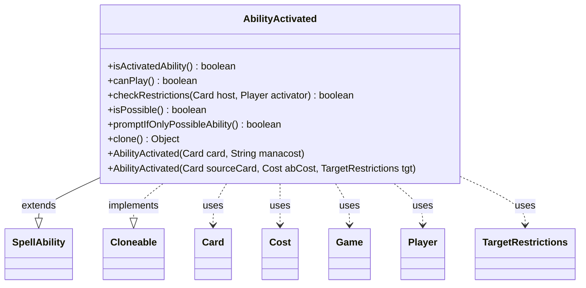

---
aliases:
  - AbilityActivated
tags:
  - java/class
  - module/forge-game
  - pkg/forge/game/spellability
fqn: forge.game.spellability.AbilityActivated
package: forge.game.spellability
module: forge-game
kind: Class
---

# AbilityActivated

**Package:** `forge.game.spellability` &nbsp; **Module:** `forge-game` &nbsp; **Kind:** Class



## Relationships
**Extends:**
- [[forge.game.spellability.SpellAbility|SpellAbility]]
**Uses:**
- [[forge.game.Game|Game]]
- [[forge.game.card.Card|Card]]
- [[forge.game.cost.Cost|Cost]]
- [[forge.game.player.Player|Player]]
- [[forge.game.spellability.TargetRestrictions|TargetRestrictions]]

## Design Description

AbilityActivated is an abstract base class for activated abilities in Forge's spell-ability subsystem, sitting between the generic SpellAbility supertype and concrete ability implementations. Extending SpellAbility and implementing Cloneable, it specializes that hierarchy by distinguishing activated abilities from triggers (isActivatedAbility) and by enforcing the rules governing when such an ability may be used. Its convenience constructors build a Cost from either a raw mana-cost string or an explicit Cost plus TargetRestrictions, delegating to the superclass.

Its core responsibility is play-legality checking: canPlay collaborates with Card, Player, and Game to verify mana payability (CR 118.6), split-second, detention, suppression, restriction, and additional-cost constraints, while checkRestrictions consults static cant-be-activated effects and isPossible enforces zone and activator restrictions. The design intentionally treats abilities as always "possible" but conditionally playable, and overrides clone() as final to guarantee safe copying.

## Source
`forge-game/src/main/java/forge/game/spellability/AbilityActivated.java`

```java
/*
 * Forge: Play Magic: the Gathering.
 * Copyright (C) 2011  Forge Team
 *
 * This program is free software: you can redistribute it and/or modify
 * it under the terms of the GNU General Public License as published by
 * the Free Software Foundation, either version 3 of the License, or
 * (at your option) any later version.
 * 
 * This program is distributed in the hope that it will be useful,
 * but WITHOUT ANY WARRANTY; without even the implied warranty of
 * MERCHANTABILITY or FITNESS FOR A PARTICULAR PURPOSE.  See the
 * GNU General Public License for more details.
 * 
 * You should have received a copy of the GNU General Public License
 * along with this program.  If not, see <http://www.gnu.org/licenses/>.
 */
package forge.game.spellability;

import forge.game.Game;
import forge.game.card.Card;
import forge.game.cost.Cost;
import forge.game.cost.CostPayment;
import forge.game.player.Player;
import forge.game.player.PlayerController.FullControlFlag;
import forge.game.staticability.StaticAbilityCantBeCast;

/**
 * <p>
 * Abstract Ability_Activated class.
 * </p>
 * 
 * @author Forge
 * @version $Id$
 */
public abstract class AbilityActivated extends SpellAbility implements Cloneable {

    /**
     * <p>
     * Constructor for Ability_Activated.
     * </p>
     * 
     * @param card
     *            a {@link forge.game.card.Card} object.
     * @param manacost
     *            a {@link java.lang.String} object.
     */
    public AbilityActivated(final Card card, final String manacost) {
        this(card, new Cost(manacost, true), null);
    }

    /**
     * <p>
     * Constructor for Ability_Activated.
     * </p>
     * 
     * @param sourceCard
     *            a {@link forge.game.card.Card} object.
     * @param abCost
     *            a {@link forge.game.cost.Cost} object.
     * @param tgt
     *            a {@link forge.game.spellability.TargetRestrictions} object.
     */
    public AbilityActivated(final Card sourceCard, final Cost abCost, final TargetRestrictions tgt) {
        super(sourceCard, abCost);
        this.setTargetRestrictions(tgt);
    }

    public boolean isActivatedAbility() { return !isTrigger(); }

    /** {@inheritDoc} */
    @Override
    public boolean canPlay() {
        // CR 118.6 cost is unpayable
        if (getPayCosts().hasManaCost() && getPayCosts().getCostMana().getManaCostFor(this).isNoCost()) {
            return false;
        }

        Player player = getActivatingPlayer();
        if (player == null) {
            player = this.getHostCard().getController();
        }
        
        final Game game = player.getGame();
        if (game.getStack().isSplitSecondOnStack() && !this.isManaAbility()) {
            return false;
        }

        final Card c = this.getHostCard();

        if (isSuppressed()) {
            return false;
        }
        if (c.isDetained()) {
            return false;
        }

        if (!getRestrictions().canPlay(c, this)) {
            return false;
        }

        return player.getController().isFullControl(FullControlFlag.AllowPaymentStartWithMissingResources)
                || CostPayment.canPayAdditionalCosts(this.getPayCosts(), this, false);
    }

    /** {@inheritDoc} */
    @Override
    public boolean checkRestrictions(Card host, Player activator) {
        return !StaticAbilityCantBeCast.cantBeActivatedAbility(this, host, activator);
    }

    /** {@inheritDoc} */
    @Override
    public boolean isPossible() {
    	//consider activated abilities possible always and simply disable if not currently playable
    	//the exception is to consider them not possible if there's a zone or activator restriction that's not met

        // FIXME: Something is potentially leading to hard-to-reproduce conditions where this method is getting called
        // with no activator set for the SA (by the AI). Most likely deserves a better fix in the future.
        if (this.getActivatingPlayer() == null) {
            this.setActivatingPlayer(this.getHostCard().getController());
            System.out.println(this.getHostCard().getName() + " Did not have activator set in AbilityActivated.isPossible");
        }

    	return this.getRestrictions().checkZoneRestrictions(this.getHostCard(), this) &&
    		   this.getRestrictions().checkActivatorRestrictions(this.getHostCard(), this);
    }
    
    /** {@inheritDoc} */
    @Override
    public boolean promptIfOnlyPossibleAbility() {
    	return false; //TODO: allow showing prompt based on whether ability has cost that requires user input and possible "misclick protection" setting
    	//return !this.isManaAbility(); //prompt user for non-mana activated abilities even is only possible ability
    }

    /** {@inheritDoc} */
    @Override
    public final Object clone() {
        try {
            return super.clone();
        } catch (final Exception ex) {
            throw new RuntimeException("AbilityActivated : clone() error, " + ex);
        }
    }
}
```

## Python
`forge/game/spellability/AbilityActivated.py`

```python
from forge.game.Game import Game
from forge.game.card.Card import Card
from forge.game.cost.Cost import Cost
from forge.game.cost.CostPayment import CostPayment
from forge.game.player.Player import Player
from forge.game.player.PlayerController.FullControlFlag import FullControlFlag
from forge.game.spellability.SpellAbility import SpellAbility
from forge.game.spellability.TargetRestrictions import TargetRestrictions
from forge.game.staticability.StaticAbilityCantBeCast import StaticAbilityCantBeCast


class AbilityActivated(SpellAbility):
    """
    Abstract Ability_Activated class.

    @author Forge
    @version $Id$
    """

    def __init__(self, *args):
        # Constructor for Ability_Activated.
        #
        # Overload 1: (Card card, String manacost)
        # Overload 2: (Card sourceCard, Cost abCost, TargetRestrictions tgt)
        if len(args) == 2:
            card, manacost = args
            self.__init__(card, Cost(manacost, True), None)
            return

        sourceCard, abCost, tgt = args
        super().__init__(sourceCard, abCost)
        self.setTargetRestrictions(tgt)

    def isActivatedAbility(self) -> bool:
        return not self.isTrigger()

    def canPlay(self) -> bool:
        # CR 118.6 cost is unpayable
        if self.getPayCosts().hasManaCost() and self.getPayCosts().getCostMana().getManaCostFor(self).isNoCost():
            return False

        player = self.getActivatingPlayer()
        if player is None:
            player = self.getHostCard().getController()

        game = player.getGame()
        if game.getStack().isSplitSecondOnStack() and not self.isManaAbility():
            return False

        c = self.getHostCard()

        if self.isSuppressed():
            return False
        if c.isDetained():
            return False

        if not self.getRestrictions().canPlay(c, self):
            return False

        return player.getController().isFullControl(FullControlFlag.AllowPaymentStartWithMissingResources) \
            or CostPayment.canPayAdditionalCosts(self.getPayCosts(), self, False)

    def checkRestrictions(self, host: Card, activator: Player) -> bool:
        return not StaticAbilityCantBeCast.cantBeActivatedAbility(self, host, activator)

    def isPossible(self) -> bool:
        # consider activated abilities possible always and simply disable if not currently playable
        # the exception is to consider them not possible if there's a zone or activator restriction that's not met

        # FIXME: Something is potentially leading to hard-to-reproduce conditions where this method is getting called
        # with no activator set for the SA (by the AI). Most likely deserves a better fix in the future.
        if self.getActivatingPlayer() is None:
            self.setActivatingPlayer(self.getHostCard().getController())
            print(self.getHostCard().getName() + " Did not have activator set in AbilityActivated.isPossible")

        return self.getRestrictions().checkZoneRestrictions(self.getHostCard(), self) and \
               self.getRestrictions().checkActivatorRestrictions(self.getHostCard(), self)

    def promptIfOnlyPossibleAbility(self) -> bool:
        return False  # TODO: allow showing prompt based on whether ability has cost that requires user input and possible "misclick protection" setting
        # return not self.isManaAbility()  # prompt user for non-mana activated abilities even is only possible ability

    def clone(self):
        try:
            return super().clone()
        except Exception as ex:
            raise RuntimeError("AbilityActivated : clone() error, " + str(ex))
```
