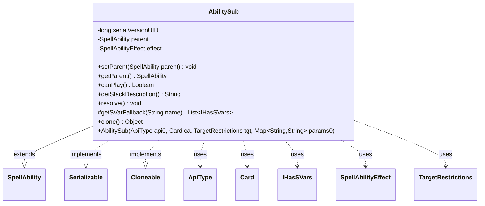

---
aliases:
  - AbilitySub
tags:
  - java/class
  - module/forge-game
  - pkg/forge/game/spellability
fqn: forge.game.spellability.AbilitySub
package: forge.game.spellability
module: forge-game
kind: Class
---

# AbilitySub

**Package:** `forge.game.spellability`   **Module:** `forge-game`   **Kind:** Class



## Relationships
**Extends:**
- [[forge.game.spellability.SpellAbility|SpellAbility]]
**Uses:**
- [[forge.game.IHasSVars|IHasSVars]]
- [[forge.game.ability.ApiType|ApiType]]
- [[forge.game.ability.SpellAbilityEffect|SpellAbilityEffect]]
- [[forge.game.card.Card|Card]]
- [[forge.game.spellability.TargetRestrictions|TargetRestrictions]]

## Design Description

Forge MTG: Java/PowerShell.

`AbilitySub` is a final subclass of `SpellAbility` representing a sub-ability — a follow-on effect chained to a parent ability rather than an independently playable spell. It holds a back-reference to its `parent` and an immutable `SpellAbilityEffect` resolved from an `ApiType`, which it builds against itself at construction and delegates to for both stack description (`getStackDescriptionWithSubs`) and resolution. Overriding `canPlay()` to always return `false` enforces that it can never sit on the stack on its own.

As a `SpellAbility` it collaborates with `Card`, `TargetRestrictions`, and `ApiType` during construction, and implements `Serializable` and `Cloneable` for state persistence and copying. The `getSVarFallback` override reflects deliberate handling of fused or spliced spells, redirecting SVar lookups to the current card state when it diverges from the root ability's, while `clone()` wraps failures as runtime exceptions to satisfy the `Cloneable` contract.

## Source
`forge-game/src/main/java/forge/game/spellability/AbilitySub.java`

```java
/*
 * Forge: Play Magic: the Gathering.
 * Copyright (C) 2011  Forge Team
 *
 * This program is free software: you can redistribute it and/or modify
 * it under the terms of the GNU General Public License as published by
 * the Free Software Foundation, either version 3 of the License, or
 * (at your option) any later version.
 * 
 * This program is distributed in the hope that it will be useful,
 * but WITHOUT ANY WARRANTY; without even the implied warranty of
 * MERCHANTABILITY or FITNESS FOR A PARTICULAR PURPOSE.  See the
 * GNU General Public License for more details.
 * 
 * You should have received a copy of the GNU General Public License
 * along with this program.  If not, see <http://www.gnu.org/licenses/>.
 */
package forge.game.spellability;

import java.util.Map;
import java.util.List;
import com.google.common.collect.Lists;

import forge.game.IHasSVars;
import forge.game.ability.ApiType;
import forge.game.ability.SpellAbilityEffect;
import forge.game.card.Card;
import forge.game.cost.Cost;

/**
 * <p>
 * Abstract Ability_Sub class.
 * </p>
 * 
 * @author Forge
 * @version $Id$
 */
public final class AbilitySub extends SpellAbility implements java.io.Serializable, Cloneable {
    /** Constant <code>serialVersionUID=4650634415821733134L</code>. */
    private static final long serialVersionUID = 4650634415821733134L;

    private SpellAbility parent;

    /**
     * <p>
     * Setter for the field <code>parent</code>.
     * </p>
     * 
     * @param parent
     *            a {@link forge.game.spellability.SpellAbility} object.
     */
    public void setParent(final SpellAbility parent) {
        this.parent = parent;
    }

    /**
     * <p>
     * Getter for the field <code>parent</code>.
     * </p>
     * 
     * @return a {@link forge.game.spellability.SpellAbility} object.
     */
    @Override
    public SpellAbility getParent() {
        return this.parent;
    }

    /** {@inheritDoc} */
    @Override
    public boolean canPlay() {
        // this should never be on the Stack by itself
        return false;
    }

    private final SpellAbilityEffect effect;

    public AbilitySub(ApiType api0, final Card ca, final TargetRestrictions tgt, Map<String, String> params0) {
        super(ca, Cost.Zero);
        this.setTargetRestrictions(tgt);

        api = api0;
        if (params0 != null) {
            mapParams.putAll(params0);
        }

        effect = api.getSpellEffect();

        effect.buildSpellAbility(this);
        originalMapParams.putAll(mapParams);
    }

    @Override
    public String getStackDescription() {
        return effect.getStackDescriptionWithSubs(mapParams, this);
    }

    @Override
    public void resolve() {
        effect.resolve(this);
    }

    @Override
    protected List<IHasSVars> getSVarFallback(final String name) {
        // fused or spliced
        if (getRootAbility().getCardState() != getCardState()) {
            return Lists.newArrayList(getCardState());
        }
        return super.getSVarFallback(name);
    }

    /** {@inheritDoc} */
    @Override
    public Object clone() {
        try {
            return super.clone();
        } catch (final Exception ex) {
            throw new RuntimeException("AbilitySub : clone() error, " + ex);
        }
    }
}
```

## Python
`forge/game/spellability/AbilitySub.py`

```python
from typing import List, Optional, Dict

from forge.game.spellability.SpellAbility import SpellAbility
from forge.game.IHasSVars import IHasSVars
from forge.game.ability.ApiType import ApiType
from forge.game.ability.SpellAbilityEffect import SpellAbilityEffect
from forge.game.card.Card import Card
from forge.game.spellability.TargetRestrictions import TargetRestrictions
from forge.game.cost.Cost import Cost


class AbilitySub(SpellAbility):
    serialVersionUID = 4650634415821733134

    def __init__(self, api0: ApiType, ca: Card, tgt: TargetRestrictions, params0: Dict[str, str]):
        super().__init__(ca, Cost.Zero)
        self.parent: Optional[SpellAbility] = None
        self.setTargetRestrictions(tgt)

        self.api = api0
        if params0 is not None:
            self.mapParams.update(params0)

        self.effect: SpellAbilityEffect = self.api.getSpellEffect()

        self.effect.buildSpellAbility(self)
        self.originalMapParams.update(self.mapParams)

    def setParent(self, parent: SpellAbility) -> None:
        self.parent = parent

    def getParent(self) -> SpellAbility:
        return self.parent

    def canPlay(self) -> bool:
        # this should never be on the Stack by itself
        return False

    def getStackDescription(self) -> str:
        return self.effect.getStackDescriptionWithSubs(self.mapParams, self)

    def resolve(self) -> None:
        self.effect.resolve(self)

    def getSVarFallback(self, name: str) -> List[IHasSVars]:
        # fused or spliced
        if self.getRootAbility().getCardState() != self.getCardState():
            return [self.getCardState()]
        return super().getSVarFallback(name)

    def clone(self) -> object:
        try:
            return super().clone()
        except Exception as ex:
            raise RuntimeError("AbilitySub : clone() error, " + str(ex))
```
