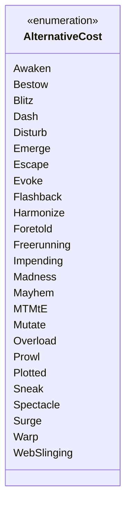

---
aliases:
  - AlternativeCost
tags:
  - java/enum
  - module/forge-game
  - pkg/forge/game/spellability
fqn: forge.game.spellability.AlternativeCost
package: forge.game.spellability
module: forge-game
kind: Enum
---

# AlternativeCost

**Package:** `forge.game.spellability` &nbsp; **Module:** `forge-game` &nbsp; **Kind:** Enum



## Design Description

AlternativeCost enumerates the alternative casting mechanisms a spell can use in place of its normal mana cost, with one constant per Magic keyword ability (Bestow, Flashback, Madness, Mutate, Overload, and so on). As a simple type-safe enum in the `forge.game.spellability` package, it provides a fixed vocabulary that SpellAbility and cost-handling logic reference to identify and apply the correct alternative-cost rules, replacing error-prone string or integer flags. The design intent is minimal and declarative: it holds no fields, constructors, or behavior, serving purely as a stable set of named tokens. Inline comments clarify obscure constants such as MTMtE ("More Than Meets the Eye"), and the constants are extended over time as new sets introduce additional alternative-cost keywords.

## Source
`forge-game/src/main/java/forge/game/spellability/AlternativeCost.java`

```java
package forge.game.spellability;

public enum AlternativeCost {
    Awaken,
    Bestow,
    Blitz,
    Dash,
    Disturb,
    Emerge,
    Escape,
    Evoke,
    Flashback,
    Harmonize,
    Foretold,
    Freerunning,
    Impending,
    Madness,
    Mayhem,
    MTMtE, // More Than Meets the Eye (Transformers Universes Beyond)
    Mutate,
    Overload,
    Prowl,
    Plotted,
    Sneak,
    Spectacle,
    Surge,
    Warp,
    WebSlinging
    ;

}
```

## Python
`forge/game/spellability/AlternativeCost.py`

```python
from enum import Enum, auto


class AlternativeCost(Enum):
    Awaken = auto()
    Bestow = auto()
    Blitz = auto()
    Dash = auto()
    Disturb = auto()
    Emerge = auto()
    Escape = auto()
    Evoke = auto()
    Flashback = auto()
    Harmonize = auto()
    Foretold = auto()
    Freerunning = auto()
    Impending = auto()
    Madness = auto()
    Mayhem = auto()
    MTMtE = auto()  # More Than Meets the Eye (Transformers Universes Beyond)
    Mutate = auto()
    Overload = auto()
    Prowl = auto()
    Plotted = auto()
    Sneak = auto()
    Spectacle = auto()
    Surge = auto()
    Warp = auto()
    WebSlinging = auto()
```
