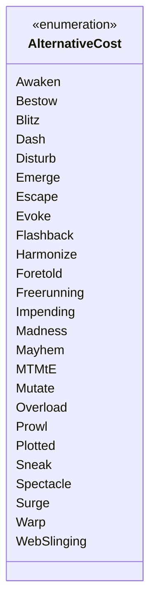

---
aliases:
  - AlternativeCost
tags:
  - java/enum
  - module/forge-game
  - pkg/forge/game/spellability
fqn: forge.game.spellability.AlternativeCost
package: forge.game.spellability
module: forge-game
kind: Enum
---

# AlternativeCost

**Package:** `forge.game.spellability` &nbsp; **Module:** `forge-game` &nbsp; **Kind:** Enum



## Source
`forge-game/src/main/java/forge/game/spellability/AlternativeCost.java`

```java
package forge.game.spellability;

public enum AlternativeCost {
    Awaken,
    Bestow,
    Blitz,
    Dash,
    Disturb,
    Emerge,
    Escape,
    Evoke,
    Flashback,
    Harmonize,
    Foretold,
    Freerunning,
    Impending,
    Madness,
    Mayhem,
    MTMtE, // More Than Meets the Eye (Transformers Universes Beyond)
    Mutate,
    Overload,
    Prowl,
    Plotted,
    Sneak,
    Spectacle,
    Surge,
    Warp,
    WebSlinging
    ;

}
```
