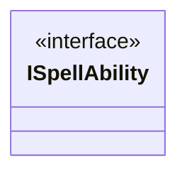

---
aliases:
  - ISpellAbility
tags:
  - java/interface
  - module/forge-game
  - pkg/forge/game/spellability
fqn: forge.game.spellability.ISpellAbility
package: forge.game.spellability
module: forge-game
kind: Interface
---

# ISpellAbility

**Package:** `forge.game.spellability` &nbsp; **Module:** `forge-game` &nbsp; **Kind:** Interface



## Source
`forge-game/src/main/java/forge/game/spellability/ISpellAbility.java`

```java
package forge.game.spellability;

/** 
 * Will collect here essential methods needed to hold ability on stack and resolve.
 *
 */
public interface ISpellAbility {

}
```
