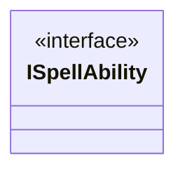

---
aliases:
  - ISpellAbility
tags:
  - java/interface
  - module/forge-game
  - pkg/forge/game/spellability
fqn: forge.game.spellability.ISpellAbility
package: forge.game.spellability
module: forge-game
kind: Interface
---

# ISpellAbility

**Package:** `forge.game.spellability`   **Module:** `forge-game`   **Kind:** Interface



## Design Description

The interface ISpellAbility is a marker/capability interface in the `forge.game.spellability` package of the forge-game module. Its declared purpose, per the source comment, is to collect the essential methods required to hold an ability on the stack and resolve it.

Currently it is an empty interface, defining no methods. It serves as a type abstraction—a common supertype intended to unify the various spell-ability representations that the stack and resolution machinery operate on, decoupling those subsystems from concrete implementations. The accompanying Javadoc signals clear design intent: the contract is a placeholder slated to accumulate the stack-holding and resolution methods as the abstraction matures, allowing callers to depend on the interface rather than concrete classes once those methods are consolidated here.

## Source
`forge-game/src/main/java/forge/game/spellability/ISpellAbility.java`

```java
package forge.game.spellability;

/** 
 * Will collect here essential methods needed to hold ability on stack and resolve.
 *
 */
public interface ISpellAbility {

}
```

## Python
`forge/game/spellability/ISpellAbility.py`

````python
package = None
```

Wait, I need to output Python source only.
````
