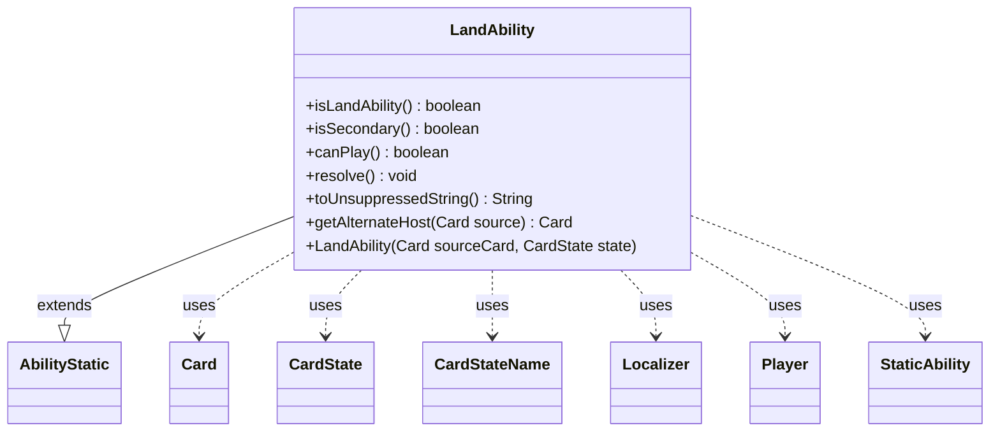

---
aliases:
  - LandAbility
tags:
  - java/class
  - module/forge-game
  - pkg/forge/game/spellability
fqn: forge.game.spellability.LandAbility
package: forge.game.spellability
module: forge-game
kind: Class
---

# LandAbility

**Package:** `forge.game.spellability` &nbsp; **Module:** `forge-game` &nbsp; **Kind:** Class



## Relationships
**Extends:**
- [[forge.game.spellability.AbilityStatic|AbilityStatic]]
**Uses:**
- [[forge.card.CardStateName|CardStateName]]
- [[forge.game.card.Card|Card]]
- [[forge.game.card.CardState|CardState]]
- [[forge.game.player.Player|Player]]
- [[forge.game.staticability.StaticAbility|StaticAbility]]
- [[forge.util.Localizer|Localizer]]

## Source
`forge-game/src/main/java/forge/game/spellability/LandAbility.java`

```java
/*
 * Forge: Play Magic: the Gathering.
 * Copyright (C) 2011  Forge Team
 *
 * This program is free software: you can redistribute it and/or modify
 * it under the terms of the GNU General Public License as published by
 * the Free Software Foundation, either version 3 of the License, or
 * (at your option) any later version.
 *
 * This program is distributed in the hope that it will be useful,
 * but WITHOUT ANY WARRANTY; without even the implied warranty of
 * MERCHANTABILITY or FITNESS FOR A PARTICULAR PURPOSE.  See the
 * GNU General Public License for more details.
 *
 * You should have received a copy of the GNU General Public License
 * along with this program.  If not, see <http://www.gnu.org/licenses/>.
 */
package forge.game.spellability;

import forge.card.CardStateName;
import forge.card.mana.ManaCost;
import forge.game.card.Card;
import forge.game.card.CardCopyService;
import forge.game.card.CardState;
import forge.game.player.Player;
import forge.game.staticability.StaticAbility;
import forge.game.zone.ZoneType;
import forge.util.CardTranslation;
import forge.util.Localizer;
import org.apache.commons.lang3.StringUtils;

import java.util.Objects;

public class LandAbility extends AbilityStatic {

    public LandAbility(Card sourceCard, CardState state) {
        super(sourceCard, ManaCost.NO_COST, state);

        getRestrictions().setZone(ZoneType.Hand);
    }

    @Override
    public boolean isLandAbility() { return true; }

    @Override
    public boolean isSecondary() {
        return true;
    }

    @Override
    public boolean canPlay() {
        Card land = this.getHostCard();
        final Player p = this.getActivatingPlayer();
        if (p == null || land.isInZone(ZoneType.Battlefield)) {
            return false;
        }
 
        land = Objects.requireNonNullElse(getAlternateHost(land), land);

        return p.canPlayLand(land, false, this);
    }

    @Override
    public void resolve() {
        getHostCard().setSplitStateToPlayAbility(this);
        final Card result = getActivatingPlayer().playLand(getHostCard(), this);

        // increase mayplay used
        if (getMayPlay() != null) {
            getMayPlay().incMayPlayTurn();
        }
        // if land isn't in battlefield try to reset the card state
        if (result != null && !result.isInPlay()) {
            result.setState(CardStateName.Original, true);
        }
    }

    @Override
    public String toUnsuppressedString() {
        Localizer localizer = Localizer.getInstance();
        StringBuilder sb = new StringBuilder(StringUtils.capitalize(localizer.getMessage("lblPlayLand")));

        if (getHostCard().isModal()) {
            sb.append(" (").append(CardTranslation.getTranslatedName(getCardState().getName())).append(")");
        }

        StaticAbility sta = getMayPlay();
        if (sta != null) {
            Card source = sta.getHostCard();
            if (!source.equals(getHostCard())) {
                sb.append(" by ");
                if (source.isImmutable() && source.getEffectSource() != null) {
                    sb.append(source.getEffectSource());
                } else {
                    sb.append(source);
                }
                if (sta.hasParam("MayPlayText")) {
                    sb.append(" (").append(sta.getParam("MayPlayText")).append(")");
                }
            }
        }
        return sb.toString();
    }

    @Override
    public Card getAlternateHost(Card source) {
        boolean lkicheck = false;

        if (source.isFaceDown() && source.isInZone(ZoneType.Exile)) {
            if (!source.isLKI()) {
                source = CardCopyService.getLKICopy(source);
            }

            source.forceTurnFaceUp();
            lkicheck = true;
        }

        if (getCardState() != null && source.getCurrentStateName() != getCardStateName()) {
            if (!source.isLKI()) {
                source = CardCopyService.getLKICopy(source);
            }
            CardStateName stateName = getCardState().getStateName();
            if (!source.hasState(stateName)) {
                source.addAlternateState(stateName, false);
                source.getState(stateName).copyFrom(getHostCard().getState(stateName), true);
            }

            source.setState(stateName, false);
            if (getHostCard().isDoubleFaced()) {
                source.setBackSide(getHostCard().getRules().getSplitType().getChangedStateName().equals(stateName));
            }

            // need to reset CMC
            source.setLKICMC(-1);
            source.setLKICMC(source.getCMC());
            lkicheck = true;
        }

        return lkicheck ? source : null;
    }
}
```
