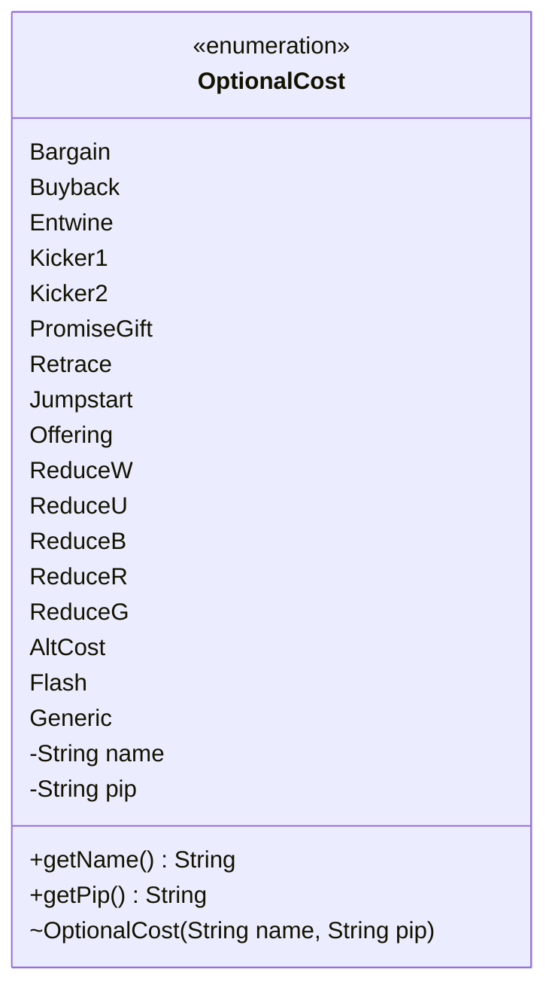

---
aliases:
  - OptionalCost
tags:
  - java/enum
  - module/forge-game
  - pkg/forge/game/spellability
fqn: forge.game.spellability.OptionalCost
package: forge.game.spellability
module: forge-game
kind: Enum
---

# OptionalCost

**Package:** `forge.game.spellability` &nbsp; **Module:** `forge-game` &nbsp; **Kind:** Enum



## Source
`forge-game/src/main/java/forge/game/spellability/OptionalCost.java`

```java
package forge.game.spellability;

/** 
 * TODO: Write javadoc for this type.
 *
 */
public enum OptionalCost {
    Bargain("Bargain", ""),
    Buyback("Buyback", ""),
    Entwine("Entwine", ""),
    Kicker1("Kicker", ""),
    Kicker2("Kicker", ""),
    PromiseGift("Promise Gift", ""),
    Retrace("Retrace", ""),
    Jumpstart("Jump-start", ""),
    Offering("Offering", ""),
    ReduceW("(to reduce white mana)", "W"),
    ReduceU("(to reduce blue mana)", "U"),
    ReduceB("(to reduce black mana)", "B"),
    ReduceR("(to reduce red mana)", "R"),
    ReduceG("(to reduce green mana)", "G"),
    AltCost("", ""),
    Flash("Flash", ""), // used for Pay Extra for Flash
    Generic("Generic", ""); // used by "Dragon Presence" and pseudo-kicker cards

    private String name;
    private String pip;
    
    OptionalCost(String name, String pip) {
        this.name = name;
        this.pip = pip;
    }

    /**
     * @return the name
     */
    public String getName() {
        return name;
    }

    /**
     * @return the pip
     */
    public String getPip() {
        return pip;
    }
}
```
