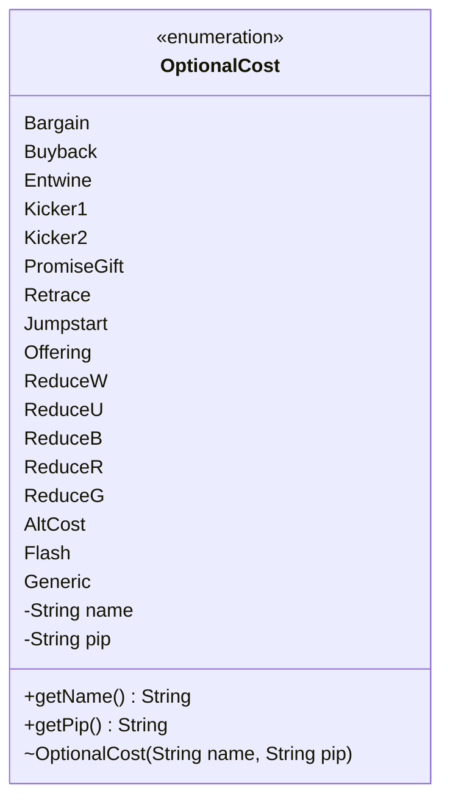

---
aliases:
  - OptionalCost
tags:
  - java/enum
  - module/forge-game
  - pkg/forge/game/spellability
fqn: forge.game.spellability.OptionalCost
package: forge.game.spellability
module: forge-game
kind: Enum
---

# OptionalCost

**Package:** `forge.game.spellability`   **Module:** `forge-game`   **Kind:** Enum



## Design Description

Forge's `OptionalCost` is an enumeration in the `forge.game.spellability` package that catalogs the optional costs a player may choose to pay when casting a spell or activating an ability — alternative and additional cost mechanics such as Bargain, Buyback, Kicker, Entwine, Retrace, Jump-start, Offering, and Flash, plus the colored mana-reduction variants (ReduceW/U/B/R/G) and generic catch-all entries (AltCost, Generic).

Each constant carries two immutable fields set through the package-private constructor: a human-readable `name` for display and a `pip` denoting an associated mana symbol (populated only for the mana-reduction members), exposed via the read-only accessors `getName()` and `getPip()`. As a self-contained value type with no supertype beyond `Enum`, it serves as a fixed vocabulary that collaborates with the spell-ability and cost-handling machinery, letting those classes identify and present optional-cost choices by stable enum identity rather than by string matching.

## Source
`forge-game/src/main/java/forge/game/spellability/OptionalCost.java`

```java
package forge.game.spellability;

/** 
 * TODO: Write javadoc for this type.
 *
 */
public enum OptionalCost {
    Bargain("Bargain", ""),
    Buyback("Buyback", ""),
    Entwine("Entwine", ""),
    Kicker1("Kicker", ""),
    Kicker2("Kicker", ""),
    PromiseGift("Promise Gift", ""),
    Retrace("Retrace", ""),
    Jumpstart("Jump-start", ""),
    Offering("Offering", ""),
    ReduceW("(to reduce white mana)", "W"),
    ReduceU("(to reduce blue mana)", "U"),
    ReduceB("(to reduce black mana)", "B"),
    ReduceR("(to reduce red mana)", "R"),
    ReduceG("(to reduce green mana)", "G"),
    AltCost("", ""),
    Flash("Flash", ""), // used for Pay Extra for Flash
    Generic("Generic", ""); // used by "Dragon Presence" and pseudo-kicker cards

    private String name;
    private String pip;
    
    OptionalCost(String name, String pip) {
        this.name = name;
        this.pip = pip;
    }

    /**
     * @return the name
     */
    public String getName() {
        return name;
    }

    /**
     * @return the pip
     */
    public String getPip() {
        return pip;
    }
}
```

## Python
`forge/game/spellability/OptionalCost.py`

```python
from enum import Enum


class OptionalCost(Enum):
    Bargain = ("Bargain", "")
    Buyback = ("Buyback", "")
    Entwine = ("Entwine", "")
    Kicker1 = ("Kicker", "")
    Kicker2 = ("Kicker", "")
    PromiseGift = ("Promise Gift", "")
    Retrace = ("Retrace", "")
    Jumpstart = ("Jump-start", "")
    Offering = ("Offering", "")
    ReduceW = ("(to reduce white mana)", "W")
    ReduceU = ("(to reduce blue mana)", "U")
    ReduceB = ("(to reduce black mana)", "B")
    ReduceR = ("(to reduce red mana)", "R")
    ReduceG = ("(to reduce green mana)", "G")
    AltCost = ("", "")
    Flash = ("Flash", "")  # used for Pay Extra for Flash
    Generic = ("Generic", "")  # used by "Dragon Presence" and pseudo-kicker cards

    def __init__(self, name, pip):
        self.name = name
        self.pip = pip

    def getName(self):
        return self.name

    def getPip(self):
        return self.pip
```
