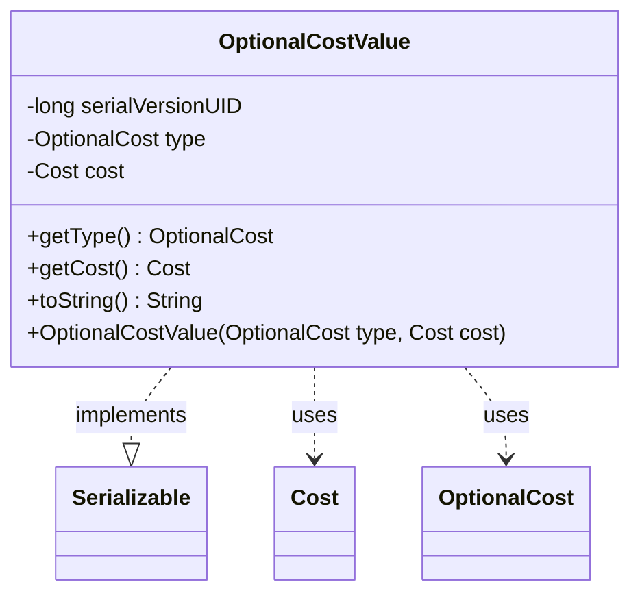

---
aliases:
  - OptionalCostValue
tags:
  - java/class
  - module/forge-game
  - pkg/forge/game/spellability
fqn: forge.game.spellability.OptionalCostValue
package: forge.game.spellability
module: forge-game
kind: Class
---

# OptionalCostValue

**Package:** `forge.game.spellability`   **Module:** `forge-game`   **Kind:** Class



## Relationships
**Uses:**
- [[forge.game.cost.Cost|Cost]]
- [[forge.game.spellability.OptionalCost|OptionalCost]]

## Design Description

OptionalCostValue is a small, immutable value object in the `forge.game.spellability` package that pairs an `OptionalCost` enumeration with its associated `Cost`, representing a single optional cost a player may choose to pay when casting a spell or activating an ability. It exposes only read accessors (`getType`, `getCost`) and a constructor, with no mutators, reflecting a deliberately simple data-holder design.

As a `Serializable` implementation, it carries an explicit `serialVersionUID` so instances can be persisted or transmitted as part of game state. It collaborates with its two component types purely by composition, delegating cost rendering to `Cost.toSimpleString()`. The overridden `toString()` encodes display intent: it suppresses the label for `OptionalCost.Generic`, and detects tag-style names (those beginning with `(`) to position the type name after the cost rather than before, producing human-readable cost descriptions for the UI.

## Source
`forge-game/src/main/java/forge/game/spellability/OptionalCostValue.java`

```java
package forge.game.spellability;

import java.io.Serializable;

import forge.game.cost.Cost;

public class OptionalCostValue implements Serializable {
    /**
     * Serializables need a version ID.
     */
    private static final long serialVersionUID = 1L;
    private OptionalCost type;
    private Cost cost;

    public OptionalCostValue(OptionalCost type, Cost cost) {
        this.type = type;
        this.cost = cost;
    }

    /**
     * @return the type
     */
    public OptionalCost getType() {
        return type;
    }

    /**
     * @return the cost
     */
    public Cost getCost() {
        return cost;
    }

    /* (non-Javadoc)
     * @see java.lang.Object#toString()
     */
    @Override
    public String toString() {
        StringBuilder sb = new StringBuilder();
        boolean isTag = type.getName().startsWith("(");
        if (type != OptionalCost.Generic && !isTag) {
            sb.append(type.getName());
            sb.append(" – ");
        }
        sb.append(cost.toSimpleString());
        sb.append(isTag ? " " + type.getName() : "");
        return sb.toString();
    }
}
```

## Python
`forge/game/spellability/OptionalCostValue.py`

```python
import typing

from forge.game.cost.Cost import Cost
from forge.game.spellability.OptionalCost import OptionalCost


class OptionalCostValue:
    """
    Serializables need a version ID.
    """
    serialVersionUID: int = 1

    def __init__(self, type: OptionalCost, cost: Cost):
        self.type = type
        self.cost = cost

    def getType(self) -> OptionalCost:
        """
        @return the type
        """
        return self.type

    def getCost(self) -> Cost:
        """
        @return the cost
        """
        return self.cost

    def toString(self) -> str:
        sb = []
        isTag = self.type.getName().startswith("(")
        if self.type != OptionalCost.Generic and not isTag:
            sb.append(self.type.getName())
            sb.append(" ???????? ")
        sb.append(self.cost.toSimpleString())
        sb.append(" " + self.type.getName() if isTag else "")
        return "".join(sb)

    def __str__(self) -> str:
        return self.toString()
```
