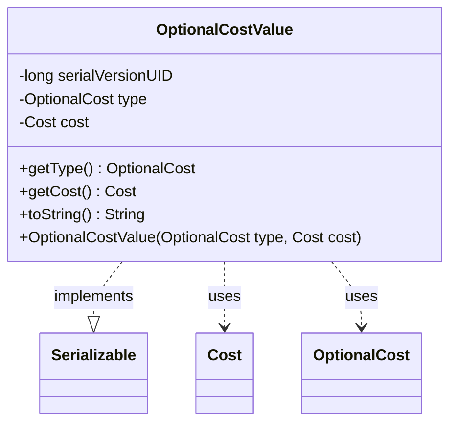

---
aliases:
  - OptionalCostValue
tags:
  - java/class
  - module/forge-game
  - pkg/forge/game/spellability
fqn: forge.game.spellability.OptionalCostValue
package: forge.game.spellability
module: forge-game
kind: Class
---

# OptionalCostValue

**Package:** `forge.game.spellability` &nbsp; **Module:** `forge-game` &nbsp; **Kind:** Class



## Relationships
**Uses:**
- [[forge.game.cost.Cost|Cost]]
- [[forge.game.spellability.OptionalCost|OptionalCost]]

## Source
`forge-game/src/main/java/forge/game/spellability/OptionalCostValue.java`

```java
package forge.game.spellability;

import java.io.Serializable;

import forge.game.cost.Cost;

public class OptionalCostValue implements Serializable {
    /**
     * Serializables need a version ID.
     */
    private static final long serialVersionUID = 1L;
    private OptionalCost type;
    private Cost cost;

    public OptionalCostValue(OptionalCost type, Cost cost) {
        this.type = type;
        this.cost = cost;
    }

    /**
     * @return the type
     */
    public OptionalCost getType() {
        return type;
    }

    /**
     * @return the cost
     */
    public Cost getCost() {
        return cost;
    }

    /* (non-Javadoc)
     * @see java.lang.Object#toString()
     */
    @Override
    public String toString() {
        StringBuilder sb = new StringBuilder();
        boolean isTag = type.getName().startsWith("(");
        if (type != OptionalCost.Generic && !isTag) {
            sb.append(type.getName());
            sb.append(" – ");
        }
        sb.append(cost.toSimpleString());
        sb.append(isTag ? " " + type.getName() : "");
        return sb.toString();
    }
}
```
