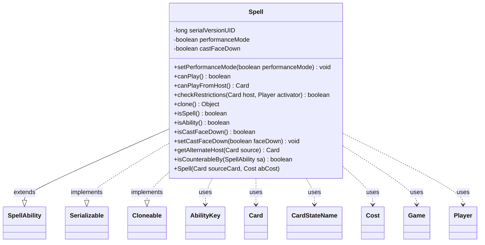

---
aliases:
  - Spell
tags:
  - java/class
  - module/forge-game
  - pkg/forge/game/spellability
fqn: forge.game.spellability.Spell
package: forge.game.spellability
module: forge-game
kind: Class
---

# Spell

**Package:** `forge.game.spellability`   **Module:** `forge-game`   **Kind:** Class



## Relationships
**Extends:**
- [[forge.game.spellability.SpellAbility|SpellAbility]]
**Uses:**
- [[forge.card.CardStateName|CardStateName]]
- [[forge.game.Game|Game]]
- [[forge.game.ability.AbilityKey|AbilityKey]]
- [[forge.game.card.Card|Card]]
- [[forge.game.cost.Cost|Cost]]
- [[forge.game.player.Player|Player]]

## Design Description

Spell is an abstract specialization of `SpellAbility` representing a castable spell rather than an activated ability, fixing its origin to the Hand zone and overriding `isSpell()`/`isAbility()` to identify itself accordingly. Its core responsibility is determining castability: `canPlay()` delegates to `canPlayFromHost()`, which enforces comprehensive-rules constraints (unpayable costs, split-second on the stack, restrictions, and additional cost payment) against the host `Card`, activating `Player`, and `Game` state. It implements `Serializable` and `Cloneable`, providing a defensive `clone()` and a static `performanceMode` flag that toggles last-known-information copying when controller and activator differ. The notable design intent is heavy reliance on `CardCopyService` LKI copies in `getAlternateHost()` to evaluate alternative cast modes—bestow, face-down, double-faced states, and prototype—without mutating or triggering effects on the real card. `isCounterableBy()` routes counterability through the replacement handler.

## Source
`forge-game/src/main/java/forge/game/spellability/Spell.java`

```java
/*
 * Forge: Play Magic: the Gathering.
 * Copyright (C) 2011  Forge Team
 *
 * This program is free software: you can redistribute it and/or modify
 * it under the terms of the GNU General Public License as published by
 * the Free Software Foundation, either version 3 of the License, or
 * (at your option) any later version.
 * 
 * This program is distributed in the hope that it will be useful,
 * but WITHOUT ANY WARRANTY; without even the implied warranty of
 * MERCHANTABILITY or FITNESS FOR A PARTICULAR PURPOSE.  See the
 * GNU General Public License for more details.
 * 
 * You should have received a copy of the GNU General Public License
 * along with this program.  If not, see <http://www.gnu.org/licenses/>.
 */
package forge.game.spellability;

import java.util.Map;
import java.util.Objects;

import forge.game.card.CardCopyService;

import forge.card.CardStateName;
import forge.game.Game;
import forge.game.ability.AbilityKey;
import forge.game.card.Card;
import forge.game.card.CardFactory;
import forge.game.cost.Cost;
import forge.game.cost.CostPayment;
import forge.game.player.Player;
import forge.game.player.PlayerController.FullControlFlag;
import forge.game.replacement.ReplacementType;
import forge.game.staticability.StaticAbilityCantBeCast;
import forge.game.zone.ZoneType;

/**
 * <p>
 * Abstract Spell class.
 * </p>
 * 
 * @author Forge
 * @version $Id$
 */
public abstract class Spell extends SpellAbility implements java.io.Serializable, Cloneable {

    /** Constant <code>serialVersionUID=-7930920571482203460L</code>. */
    private static final long serialVersionUID = -7930920571482203460L;

    private static boolean performanceMode = false;

    public static void setPerformanceMode(boolean performanceMode){
        Spell.performanceMode=performanceMode;
    }

    private boolean castFaceDown = false;

    public Spell(final Card sourceCard, final Cost abCost) {
        super(sourceCard, abCost);

        this.setStackDescription(sourceCard.getSpellText());
        this.getRestrictions().setZone(ZoneType.Hand);
    }

    /** {@inheritDoc} */
    @Override
    public boolean canPlay() {
        return canPlayFromHost() != null;
    }

    public Card canPlayFromHost() {
        Card card = this.getHostCard();
        if (card.isInPlay()) {
            return null;
        }

        // CR 118.6 cost is unpayable
        if (!isCastFromPlayEffect() && getPayCosts().hasManaCost() && getPayCosts().getCostMana().getMana().isNoCost()) {
            return null;
        }

        Player activator = this.getActivatingPlayer();
        if (activator == null) {
            activator = card.getController();
            if (activator == null) {
            	return null;
            }
        }

        final Game game = activator.getGame();
        if (game.getStack().isSplitSecondOnStack()) {
            return null;
        }

        // do performanceMode only for cases where the activator is different than controller
        if (!Spell.performanceMode && !card.getController().equals(activator)) {
            // always make a lki copy in this case?
            card = CardCopyService.getLKICopy(card);
            card.setController(activator, 0);
        }

        card = Objects.requireNonNullElse(getAlternateHost(card), card);

        if (!this.getRestrictions().canPlay(card, this)) {
            return null;
        }

        if (!activator.getController().isFullControl(FullControlFlag.AllowPaymentStartWithMissingResources) &&
                !CostPayment.canPayAdditionalCosts(this.getPayCosts(), this, false)) {
            return null;
        }

        return card;
    }

    /** {@inheritDoc} */
    @Override
    public boolean checkRestrictions(Card host, Player activator) {
        return !StaticAbilityCantBeCast.cantBeCastAbility(this, host, activator);
    }

    /** {@inheritDoc} */
    @Override
    public final Object clone() {
        try {
            return super.clone();
        } catch (final Exception ex) {
            throw new RuntimeException("Spell : clone() error, " + ex);
        }
    }

    @Override
    public boolean isSpell() { return true; }
    @Override
    public boolean isAbility() { return false; }

    /**
     * @return the castFaceDown
     */
    @Override
    public boolean isCastFaceDown() {
        return castFaceDown;
    }

    /**
     * @param faceDown the castFaceDown to set
     */
    public void setCastFaceDown(boolean faceDown) {
        this.castFaceDown = faceDown;
    }

    @Override
    public Card getAlternateHost(Card source) {
        boolean lkicheck = false;

        // need to be done before so it works with Vivien and Zoetic Cavern
        if (source.isFaceDown() && source.isInZone(ZoneType.Exile)) {
            if (!source.isLKI()) {
                source = CardCopyService.getLKICopy(source);
            }

            source.forceTurnFaceUp();
            lkicheck = true;
        }

        if (isBestow() && !source.isBestowed()) {
            if (!source.isLKI()) {
                source = CardCopyService.getLKICopy(source);
            }

            source.animateBestow();
            lkicheck = true;
        } else if (isCastFaceDown()) {
            // need a copy of the card to turn facedown without trigger anything
            if (!source.isLKI()) {
                source = CardCopyService.getLKICopy(source);
            }
            source.turnFaceDownNoUpdate();
            lkicheck = true;
        } else if (getCardState() != null && source.getCurrentStateName() != getCardStateName() && getHostCard().getState(getCardStateName()) != null) {
            if (!source.isLKI()) {
                source = CardCopyService.getLKICopy(source);
            }
            CardStateName stateName = getCardStateName();
            if (!source.hasState(stateName)) {
                source.addAlternateState(stateName, false);
                source.getState(stateName).copyFrom(getHostCard().getState(stateName), true);
            }

            source.setState(stateName, false);
            if (getHostCard().isDoubleFaced()) {
                source.setBackSide(getHostCard().getRules().getSplitType().getChangedStateName().equals(stateName));
            }

            // need to reset CMC
            source.setLKICMC(-1);
            source.setLKICMC(source.getCMC());
            lkicheck = true;
        } else if (hasParam("Prototype") && source.getPrototypeTimestamp() == -1) {
            if (!source.isLKI()) {
                source = CardCopyService.getLKICopy(source);
            }
            long next = source.getGame().getNextTimestamp();
            source.addCloneState(CardFactory.getCloneStates(source, source, this), next);
            lkicheck = true;
        }

        return lkicheck ? source : null;
    }

    public boolean isCounterableBy(final SpellAbility sa) {
        final Map<AbilityKey, Object> repParams = AbilityKey.mapFromAffected(getHostCard());
        repParams.put(AbilityKey.SpellAbility, this);
        repParams.put(AbilityKey.Cause, sa);
        return !getHostCard().getGame().getReplacementHandler().cantHappenCheck(ReplacementType.Counter, repParams);
    }
}
```

## Python
`forge/game/spellability/Spell.py`

```python
from __future__ import annotations

from typing import Map, Object  # noqa
import typing

from forge.game.spellability.SpellAbility import SpellAbility
from forge.card.CardStateName import CardStateName
from forge.game.Game import Game
from forge.game.ability.AbilityKey import AbilityKey
from forge.game.card.Card import Card
from forge.game.cost.Cost import Cost
from forge.game.player.Player import Player

from forge.game.card.CardCopyService import CardCopyService
from forge.game.card.CardFactory import CardFactory
from forge.game.cost.CostPayment import CostPayment
from forge.game.player.PlayerController import FullControlFlag
from forge.game.replacement.ReplacementType import ReplacementType
from forge.game.staticability.StaticAbilityCantBeCast import StaticAbilityCantBeCast
from forge.game.zone.ZoneType import ZoneType


class Spell(SpellAbility):
    """
    Abstract Spell class.

    @author Forge
    """

    serialVersionUID = -7930920571482203460

    performanceMode = False

    @staticmethod
    def setPerformanceMode(performanceMode: bool) -> None:
        Spell.performanceMode = performanceMode

    def __init__(self, sourceCard: Card, abCost: Cost):
        super().__init__(sourceCard, abCost)

        self.castFaceDown = False

        self.setStackDescription(sourceCard.getSpellText())
        self.getRestrictions().setZone(ZoneType.Hand)

    def canPlay(self) -> bool:
        return self.canPlayFromHost() is not None

    def canPlayFromHost(self) -> Card:
        card = self.getHostCard()
        if card.isInPlay():
            return None

        # CR 118.6 cost is unpayable
        if (not self.isCastFromPlayEffect() and self.getPayCosts().hasManaCost()
                and self.getPayCosts().getCostMana().getMana().isNoCost()):
            return None

        activator = self.getActivatingPlayer()
        if activator is None:
            activator = card.getController()
            if activator is None:
                return None

        game = activator.getGame()
        if game.getStack().isSplitSecondOnStack():
            return None

        # do performanceMode only for cases where the activator is different than controller
        if not Spell.performanceMode and not card.getController().equals(activator):
            # always make a lki copy in this case?
            card = CardCopyService.getLKICopy(card)
            card.setController(activator, 0)

        alternateHost = self.getAlternateHost(card)
        card = alternateHost if alternateHost is not None else card

        if not self.getRestrictions().canPlay(card, self):
            return None

        if (not activator.getController().isFullControl(FullControlFlag.AllowPaymentStartWithMissingResources)
                and not CostPayment.canPayAdditionalCosts(self.getPayCosts(), self, False)):
            return None

        return card

    def checkRestrictions(self, host: Card, activator: Player) -> bool:
        return not StaticAbilityCantBeCast.cantBeCastAbility(self, host, activator)

    def clone(self) -> object:
        try:
            return super().clone()
        except Exception as ex:
            raise RuntimeError("Spell : clone() error, " + str(ex))

    def isSpell(self) -> bool:
        return True

    def isAbility(self) -> bool:
        return False

    def isCastFaceDown(self) -> bool:
        return self.castFaceDown

    def setCastFaceDown(self, faceDown: bool) -> None:
        self.castFaceDown = faceDown

    def getAlternateHost(self, source: Card) -> Card:
        lkicheck = False

        # need to be done before so it works with Vivien and Zoetic Cavern
        if source.isFaceDown() and source.isInZone(ZoneType.Exile):
            if not source.isLKI():
                source = CardCopyService.getLKICopy(source)

            source.forceTurnFaceUp()
            lkicheck = True

        if self.isBestow() and not source.isBestowed():
            if not source.isLKI():
                source = CardCopyService.getLKICopy(source)

            source.animateBestow()
            lkicheck = True
        elif self.isCastFaceDown():
            # need a copy of the card to turn facedown without trigger anything
            if not source.isLKI():
                source = CardCopyService.getLKICopy(source)
            source.turnFaceDownNoUpdate()
            lkicheck = True
        elif (self.getCardState() is not None and source.getCurrentStateName() != self.getCardStateName()
                and self.getHostCard().getState(self.getCardStateName()) is not None):
            if not source.isLKI():
                source = CardCopyService.getLKICopy(source)
            stateName = self.getCardStateName()
            if not source.hasState(stateName):
                source.addAlternateState(stateName, False)
                source.getState(stateName).copyFrom(self.getHostCard().getState(stateName), True)

            source.setState(stateName, False)
            if self.getHostCard().isDoubleFaced():
                source.setBackSide(self.getHostCard().getRules().getSplitType().getChangedStateName().equals(stateName))

            # need to reset CMC
            source.setLKICMC(-1)
            source.setLKICMC(source.getCMC())
            lkicheck = True
        elif self.hasParam("Prototype") and source.getPrototypeTimestamp() == -1:
            if not source.isLKI():
                source = CardCopyService.getLKICopy(source)
            next = source.getGame().getNextTimestamp()
            source.addCloneState(CardFactory.getCloneStates(source, source, self), next)
            lkicheck = True

        return source if lkicheck else None

    def isCounterableBy(self, sa: SpellAbility) -> bool:
        repParams: dict[AbilityKey, object] = AbilityKey.mapFromAffected(self.getHostCard())
        repParams[AbilityKey.SpellAbility] = self
        repParams[AbilityKey.Cause] = sa
        return not self.getHostCard().getGame().getReplacementHandler().cantHappenCheck(ReplacementType.Counter, repParams)
```
